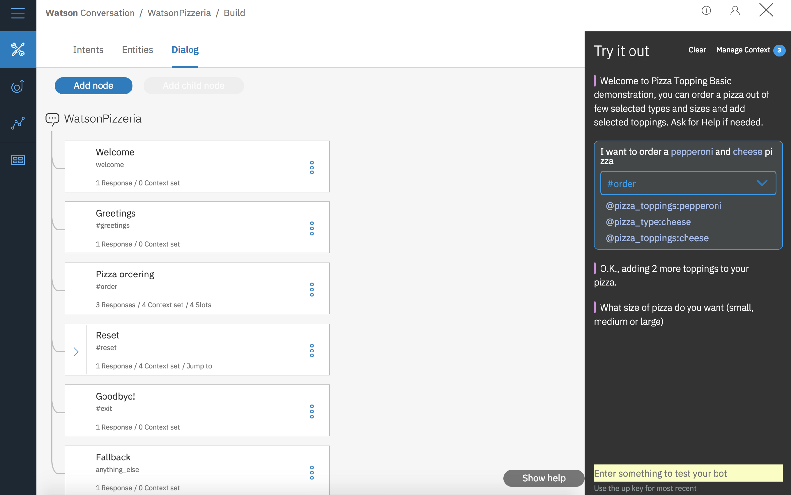
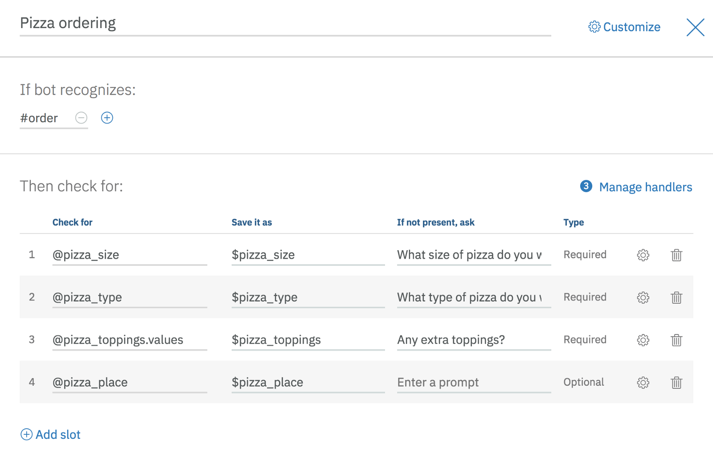
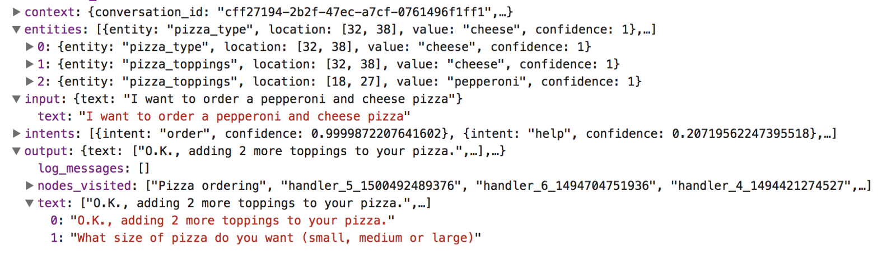
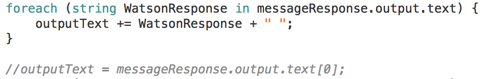

## 2 Hours Later

When working with Watson Conversation, like any conversational bot builder, there are a few gotchas.

For example, one of the less obvious but most annoying ones is placing a node below the Fallback/anything\_else node will result in the node basically not existing.

Another example I spent roughly 2 hours trying to remember; now I’m writing this blog so you don’t make the same mistake.

Your life can get slightly more challenging if you forget Watson’s expected behavior. Slots prompt the user for valuable information within one node to complete a given task. In the [Watson Conversation Slots Code Pattern](https://developer.ibm.com/code/patterns/assemble-a-pizza-ordering-chatbot-dialog/), you’ll see a pizza ordering bot with a slots for, you guess it, pizza ordering.

If you are a “power user”, or maybe a “power pizza orderer” in this case, you may know all the information necessary to complete this task or this node. So instead of walking through the process slot-by-slot, you may lump all the information together and let Watson parse it out, which Watson is very happy to do!

So I say to my consuming app, I say — “I want to order a pepperoni and cheese pizza”. It responds, as it should, “O.K., adding 2 more toppings to your pizza.” and then goes silent. As it should not.

Umm. What about the prompt for size? Hello? Watson??

…

_Crickets._

…

Well actually its the sound of lawn mowers in my case. But if I wrote _Lawnmowers_ people might get confused.

…

So silly me forgot how a message response comes back — in that massive JSON with an **array** of text.

Should there be more than one response, I’ll need to use both responses. Which means instead of writing \`output.text\[0\]\` like I had running for 2 hours (actually more, I’ve been piecing this together for a little more than that), I’ll need to use that entire array should its length be greater than 1.

Trailing space doesn’t matter in this case. Now I get one or more than one responses back in my consuming app.

But I’m still out 2 hours of silly debugging. :(
