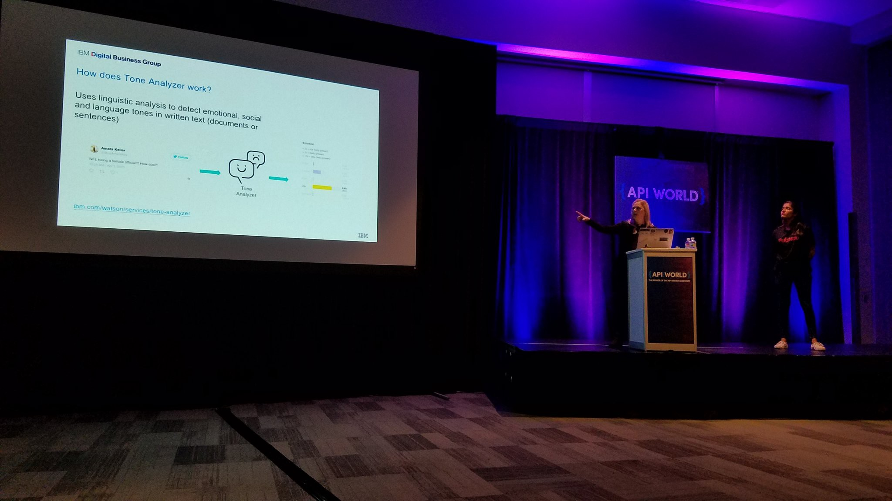

I could not have timed this any better. Shortly after delivering my talk at API World with [Bhavana Srinivas](https://medium.com/@bana.srini) of [PubNub](https://medium.com/@PubNub), I saw this fly by in my Twitter feed:

[https://twitter.com/IBMWatson/status/913110703908823050](https://twitter.com/IBMWatson/status/913110703908823050?ref_src=twsrc%5Etfw)

Which is the perfect segue to give a little follow on to our talk.

---

### Recap

I covered the [Watson Tone Analyzer](https://www.ibm.com/watson/services/tone-analyzer/) service in my talk, which doesn’t always look as flashy in a demo as Visual Recognition, for example. Personally I think its one of the easiest ways to explain the cognitive insights you get from a Watson Service and the technical bits. You can do a bit of handwaving by saying it involves Natural Language Processing (NLP) which sounds a lot less like voodoo magic than what goes into computer vision or image recognition. Sort of.

[PubNub Functions](https://www.pubnub.com/products/functions/) was my first step into the serverless, realtime landscape and it really fits what I’ve been looking for. I don’t really want to have to scale my infrastructure manually, but I also don’t want to over or underestimate my needs. I also want to do more with realtime, streaming data but its intimidating because of the sheer amount of data and processing. Not a sales pitch, but serverless is very compelling and I’m excited to do more with it.

### Surprise Updates to Tone Analyzer

I’ve been incredibly busy with near back-to-back events, learning new tech, putting together new content for talks and workshops, and trying to balance my personal life too. All of this to say, when I saw there were updates to the Watson Tone Analyzer service, I shouldn’t have been as surprised as I was. To read more of the details, here’s the link: [https://www.ibm.com/blogs/watson/2017/09/new-service-changes-and-updates-to-watson-tone-analyzer](https://www.ibm.com/blogs/watson/2017/09/new-service-changes-and-updates-to-watson-tone-analyzer).

### On Cognitive

I spent a good portion of my talk setting the stage for “cognitive”. Prior to joining IBM, if you mentioned “cognitive” I assumed you were talking about IBM’s AI offerings. But it looks like Microsoft has also adopted the cognitive terminology to describe their API offerings as well, distinguishing them for other data science geared platforms as something you can use without data science expertise. More importantly it looks like they were busy doing some updates too: [https://azure.microsoft.com/en-us/blog/at-ignite-microsoft-is-updating-its-cognitive-services-collection-of-intelligent-apis](https://azure.microsoft.com/en-us/blog/at-ignite-microsoft-is-updating-its-cognitive-services-collection-of-intelligent-apis).

---

Looking for more ways to use IBM and PubNub together? Checkout our some of our [Bluemix blogs](https://www.ibm.com/blogs/bluemix/?s=pubnub).

Did you miss our session at API World? We’ll be doing an encore presentation via Webinar next week (Oct 10th @ 9:30am PDT)! [Sign up](http://bit.ly/2z1jxH6)!
