## Then Deploy to iOS So You Can Impress Your Friends

---

**_Jan 7, 2018 UPDATE: Conversation was rebranded to “Assistant”. Workspaces will eventually become “Skills”. You may have a_** [**_username/password or API Key_**](https://medium.com/@MissAmaraKay/watson-services-username-password-vs-api-key-1806698316be)**_, depending on the age and region your services are in. Never fear, a code update is here!_**

_Aug 21, 2018 UPDATE: I have updated the code!_

_Aug 10, 2018 UPDATE: Many breaking changes have been introduced to the IBM Watson SDK for Unity and this code no longer works. It is on my list of todo items._

---

I’ve been busy trying to make a demo that incorporates Watson API Services on Unity for workshops in early 2018. Naturally most of my time has been sunk into making it as overly complicated for myself as possible.

Here’s my exact thought process, spread across about 4 working days:

> I need to refresh my C# skills and learn the Unity Editor. I want to build an AR app in Unity. Are there any plugins or packages I can use? Yes! Vuforia looks interesting let me do something with ImageTargets and see if I can play with some free assets. I’ll use Watson Conversation, but also Watson Speech-to-Text and Text-to-Speech, and the Conversation Slots Code Pattern because its prebuilt and I like pizza. Then I’m going to deploy it to my iPhone, mostly so I can run around and talk to Watson in real life, but also so I can eventually use Smart Terrain and put whatever asset I’m using to help me build my pizza literally everywhere. Now how do I attach a script to a GameObject?

That’s a literal window into my brain, and often why I say I cant come up with a creative demo idea because I get too busy making it huge. Why didn’t I just stop at any point? Doesn’t matter now, let’s dive into it.

### Some Assumptions/Pre-requisites

-   I’m running a MacBook Pro and an iPhone on iOS9+ so that’s going to be how this is written.
-   You will need an [**IBM Cloud account**](http://bluemix.net) and credentials for **Watson Conversation (now Assistant), Speech-to-Text, and Text-to-Speech**. Step-by-step instructions [available](https://github.com/akeller/Unity-AI-AR/blob/master/README.md).
-   **Download Unity, check box for iOS Build Support and Vuforia Augmented Reality Support**. I’m running 2017.3.Of3 Personal, the free version, on High Sierra. I started this app on 2017.2.Of3 and converted it over which wasn’t terrible, but because I pulled in a bunch of free assets to play around with it took some time to reimport them.
-   **Download Xcode.** You won’t need it immediately (Unity will download with MonoDevelop) but you will need it to deploy your app.

### Getting Started in Unity

Open Unity and create a new 3D Project. Name your project something interesting and put it somewhere that makes sense for you. In the process of downloading Unity and getting a personal license, you should have created an account. Login to the using “My Account” if you haven’t already.

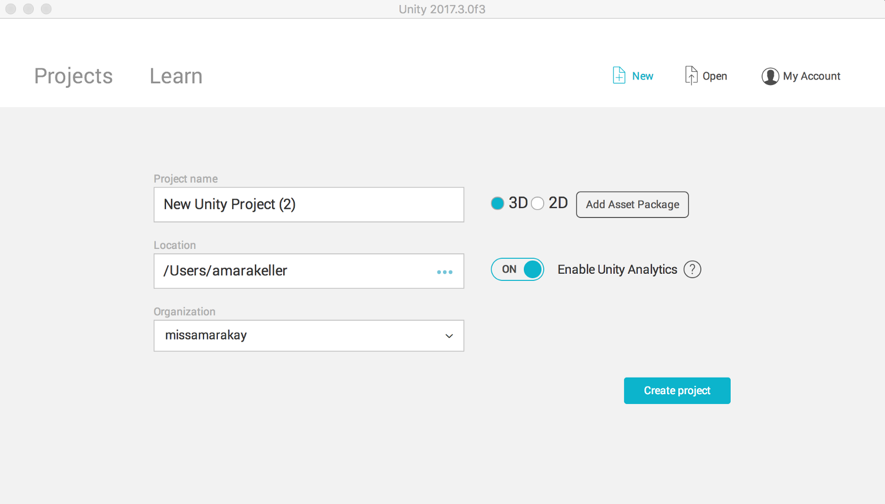

Click “Create project”.

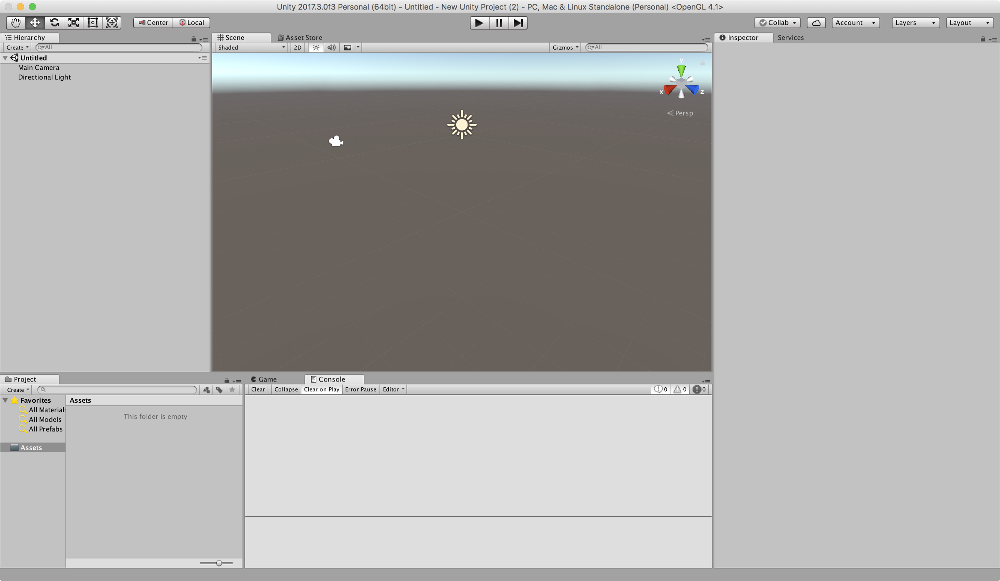

A shiny new project with nothing in it will load before your very eyes. The layout may not look like mine, but see if you can find the tabs and sections and put them in a similar layout. This was helpful when I followed my first video on the Unity Editor.

Notice in the Hierarchy you have something Untitled (a scene) that looks like it contains a Main Camera and a Directional Light. In subsequent screenshots you’ll notice I eventually delete the Main Camera since the ARCamera handles all the camera work, but I’ll remind you later when it makes more sense. Let’s rename the scene by going to File > Save Scene As… and name it something.

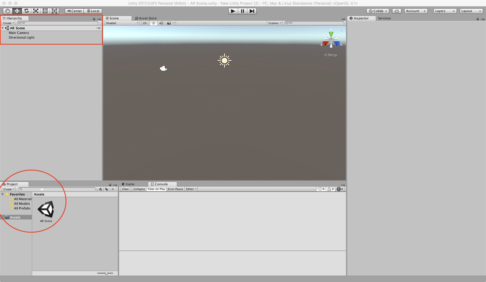

I named my scene “AR Scene” which you can see in both the Hierarchy at the top and the Project at the bottom.

A best practice includes creating a folder to hold your scenes so its not sitting at the root of your Assets folder. This project isn’t going to be huge, so I’ll create a new folder for my scene later when I’m adding other assets in. For now, let’s watch how the Assets folder of our Project gets populated as we build out our scene.

### Add the Watson Unity SDK

Head over to GitHub and grab the [Watson Unity SDK](https://github.com/watson-developer-cloud/unity-sdk) (either clone or download the .zip and unzip). Place it in your Project’s Assets folder by either going to the location in your terminal or Finder and copying it in, or just drag-and-drop it onto the Unity Project area.

### Add/Enable Vuforia

Vuforia comes packaged with recent versions of Unity (since 2017.2), but does require a few checkboxes to get it working. Make sure when installing or updating Unity to check the box for Vuforia Augmented Reality support.

A good sanity check to make sure you have Vuforia included in your Unity setup is by selecting “GameObject” in the menu. You should see Vuforia as an option. You still need to enable it.

Start by going to File > Build Settings > Player Settings. On the right-side of your Unity Editor (Inspector panel) you will see a number of different setting menus. Click “XR Settings” to expand. Check the box for “Vuforia Augmented Reality Supported”.

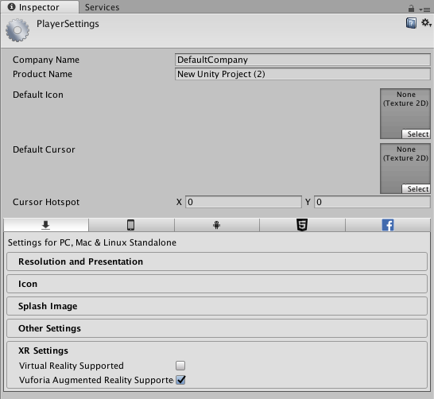

You may see warnings appear in your console depending on what you included in your Unity build. Not all platforms will be compatible with Vuforia.

You are now ready to build your AR app!

### Add CyberSoldier Asset

You can access the Unity Asset Store within the Unity Editor. In the center of the Unity Editor, click the “Asset Store” tab. This will open the Asset Store in the center area where your scene was. Click the “Scene” tab to navigate back to it.

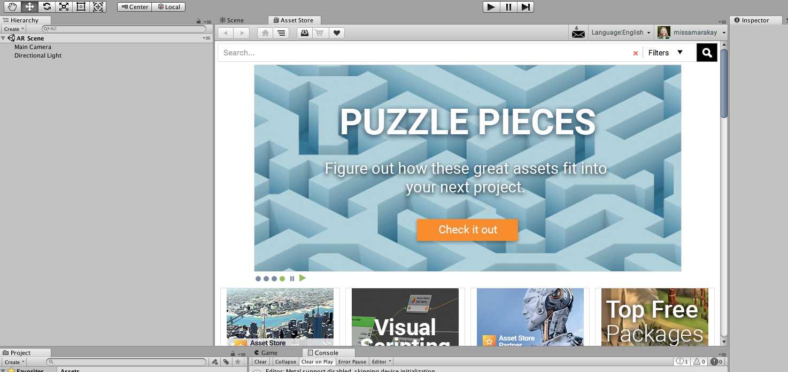

Using the search bar, search for “Cyber Soldier”, a free 3D model asset. Click the name and then click the Import button. This may take a few minutes to download the asset.

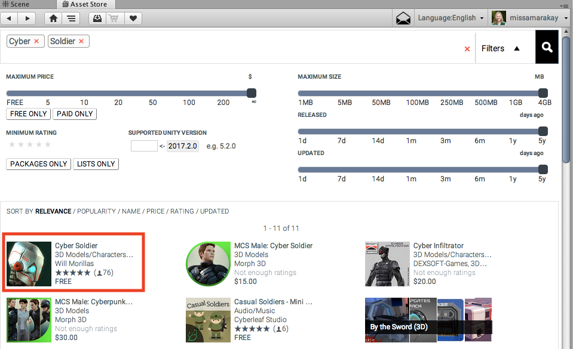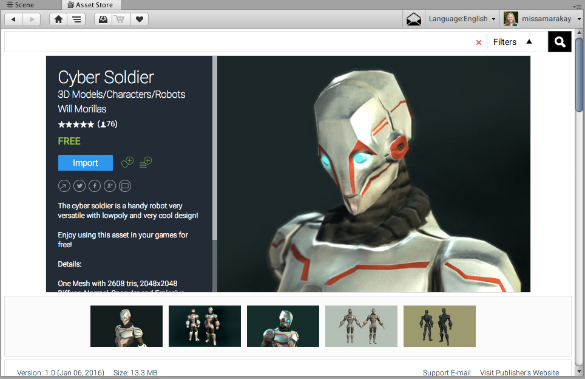

This model is not animated, but does look pretty cool. One of my initial goals was to not fall down a design hole and start modeling all sorts of things. Based on reviews, it also looks like this model is easy to animate based on the rigging. Maybe something to add to your future to do list!

Let’s put our Cyber Soldier into our Scene so visually we feel like we’ve accomplished something shiny. There are a couple ways to do this, like just about everything with Unity, but I’ll walk through just one.

From the Project Assets folder, click into MyAssets > CyberSoldier. Drag the only item that looks like a model of a Cyber Soldier. You’ll see a GameObject is created in the Hierarchy and a Cyber Soldier appears on the scene.

This is a great time to point out the Transform section in the GameObject Inspector. Make sure the position and rotation are zero’d out. This sets your Cyber Soldier in the middle of the screen.

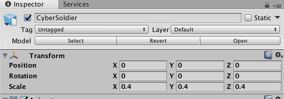

### Configure Vuforia Image Database (ImageTarget)

_Disclaimer:_ In this section, _y_ou are going to be working in the Unity Editor and a browser, flipping back and forth between the two. I think this makes the most sense for learning, even if it feels a little annoying.

Head over the [Vuforia Developer Portal](https://developer.vuforia.com). Create an account if you haven’t already and log in. You should see the License Manager after you login. Click “Get Development Key” and name it something interesting (perhaps the same interesting thing you named your app!)

Click your license in the License Manager and copy your license key.

Go back to the Unity Editor and add an ARCamera. Click Create (just underneath Hierarchy) or go to GameObject > Vuforia. Select ARCamera and watch it appear on your Hierarchy. (Feel free to delete your Main Camera now.) Click the ARCamera and open the inspector. Find the Vuforia Behaviour (Script) section and click the button “Open Vuforia configuration”.

Paste your license key into the “App License Key” input.

Go back to your Vuforia Developer Portal and click Target Manager. Click the “Add Database” button. As usual, name your database something interesting and select “Device” for the type. Click Create.

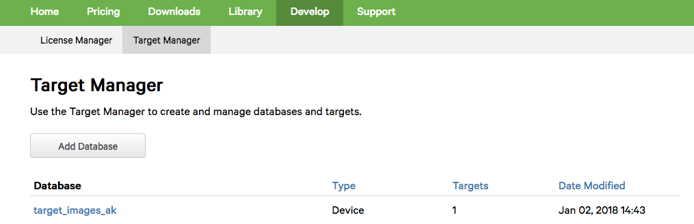

Click on the name of your new database. This allows your to add images to project your Cyber Soldier onto. These are called “[TargetImages](https://library.vuforia.com/articles/Training/Image-Target-Guide.html)” and they need to be highly random (no patterns). Vuforia has a number of examples using rocks, so I went ahead and stuck with the rocks. Get the rocks by a quick Google search for “Vuforia stones”.

Download your stones or rocks (what’s the difference, really?). Print it (B&W or color, doesn’t matter). Click “Add Target”. We are adding a Target of type Single Image. Choose your rocks in the file chooser, give it a width of 50, and make sure the name is unique but not so unique you forget what it is. Click Add.

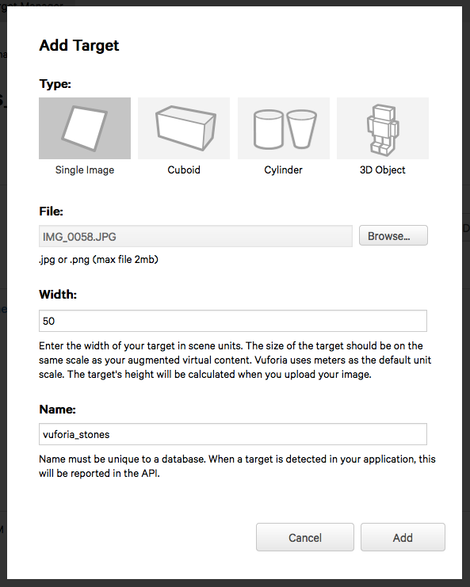

Vuforia will do some processing so you’ll see the status flip to Active when its done. Your star rating depends on the randomness of your image and how good a TargetImage it is. Notice the rocks gives a 5 star rating. I took a picture of the fake wood grain of my office desk and it got a solid 0 star rating.

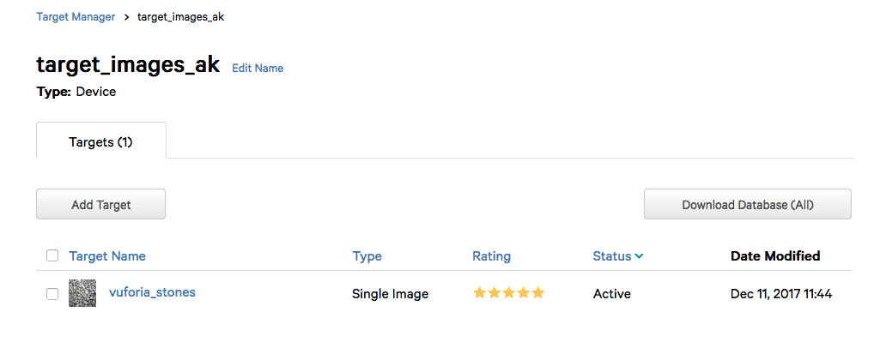

Click “Download Database (All).

Go back to your Unity Editor (isn’t this flipping back and forth fun?!) and while still in your Vuforia Configuration find the section for Databases and check the boxes to load and activate your database.

Create an ImageTarget by clicking GameObject > Vuforia > Image. In the Image Target Behaviour (Script), make sure the database is set to the one you just created and the Image Target is set to your stones.

Move your CyberSolider into the ImageTarget so it becomes a child of that GameObject.

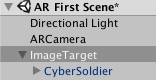

You should now see your Cyber Soldier standing on some rocks. You could be an overachiever like me and your Cyber Soldier is also holding a pizza slice. Because, why not?

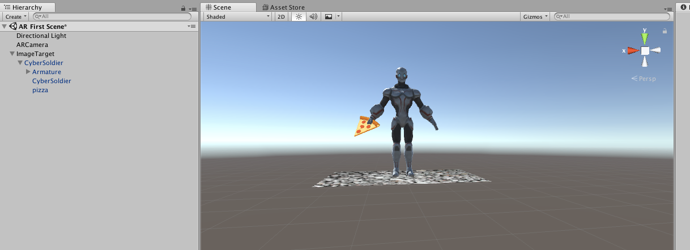

As a future item, I’d like to convert this to using Smart Terrain or Ground Planes instead of ImageTargets. As fun as ImageTargets are, I think they might limit inspiration of other interesting ways to use VR.

### Add C# Script & Watson Credentials

I did most of the hard work for you. Is it production worthy code? I mean, probably not. Does it get you inspired to write production code? Of course!

[**akeller/Unity-AI-AR**  
_Contribute to Unity-AI-AR development by creating an account on GitHub._github.com](https://github.com/akeller/Unity-AI-AR "https://github.com/akeller/Unity-AI-AR")

The repo linked above contains a single C# file you can copy over. I recommend opening it (or copying it into) your favorite IDE or text editor and make the changes below.

If you need step-by-step instructions for creating the Watson Services, checkout the [README](https://github.com/akeller/Unity-AI-AR/blob/master/README.md) before proceeding.

In Unity under hierarchy, click your CyberSolider (remember its a child of ImageTarget which may be collapsed). In the Inspector click the “Add Component” button and scroll to the bottom of the list for “New Script”. Call it “SoldierConvo” unless you want to call it something different in which case you will need to update the C# code. Make sure the language is C sharp and hit the “Create and add” button. This will attach a new C# file to your CyberSoldier GameObject and give it the ability to speak and listen.

Copy and paste the C# code from your text editor or IDE. If you named the file something different, make sure the code reflects that.

At this point, you should be able to save and build your C# file. Make sure there are no errors.

If everything went well, you should be able to go back to Unity and watch it figure out that you updated a script with items that change the editor slightly. In your Inspector you should see a ton of fields that just magically appeared! Make sure to add your credentials (either username/password OR api key) for each service.

If the build is successful, you should now be able to hit the play button on your Unity Editor and hear Watson! Look for output in the console too. Speak back and notice Watson is listening too.

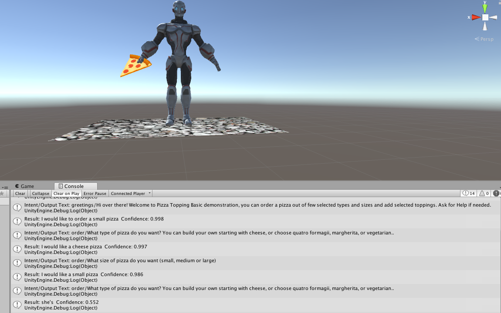

Feel free to stop here and do a little searching to steps to deploy to Android. Or deploy nowhere and happily run it on your laptop! Up to you.

### Add Apple ID to Xcode

You need an [Apple ID](https://appleid.apple.com/#!&page=signin) if you don’t already have one. If you are a member of the Apple Developer Program I think you follow a slightly different method so good luck.

Open Xcode. In the top menu bar go to Xcode > Preferences. When the window opens, go to the Account tab. Click the “+” button and “Add Apple ID” to add your account. Enter your Apple ID and password, your name will be added to the list followed by (Personal Team). Unless you are a part of the Apple Developer Program, in which case you should have skipped this section.

### Deploy to iOS

_Disclaimer:_ In this section, _y_ou are going to be working in the Unity Editor and Xcode. You may see warnings appear in Xcode that did not appear in the Unity Editor console.

In the Unity Editor go to File > Build Settings. Click the “Add Open Scenes” button. Then select “iOS” as the platform.

Click “Player Settings” and make your Company Name and Product Name something unique to you and your app. Expand “Other Settings” and provide a Bundler Identifier in the form of _com.CompanyName.ProductName_ with the same names you provided above.

This app will use the camera and microphone, so under the Configuration section you need to make sure the Camera Usage Description and Microphone Usage Description are set. I recommend something similar to the following:

> Camera Usage Description: Camera access required for target detection and tracking

> Microphone Usage Description: Microphone access required for speech-to-text service

If you do not set the Microphone Usage Description, your app will crash immediately after the camera loads, and may not throw an obvious error message.

Additionally I checked the following boxes, show in the image, and set my target device to iPhone Only with a minimum version of 9.0.

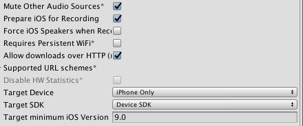

I expanded the XR Settings section to make sure the Vuforia Augmented Reality Support box was checked as well. Which was really more of a sanity check than anything else.

Reopen the Build Settings modal if you closed it (I did, it was in the way). Click the “Build” button. You’ll see a prompt appear to save your Build somewhere. You may want to create a Builds folder and save it in there if you want to keep your Builds nice and tidy.

If you did what I did the first time around, you added like every cool free asset you could get your hands on and didn’t remove it. So my build took a fair amount of time. Get up, make yourself some tea, check the mail, and maybe it will be done when you get back. I doubt yours will take that long unless you went asset crazy too.

Once your build is complete, Finder should pop up showing the folder containing your build files. Open it and click the .xcodeproj file.

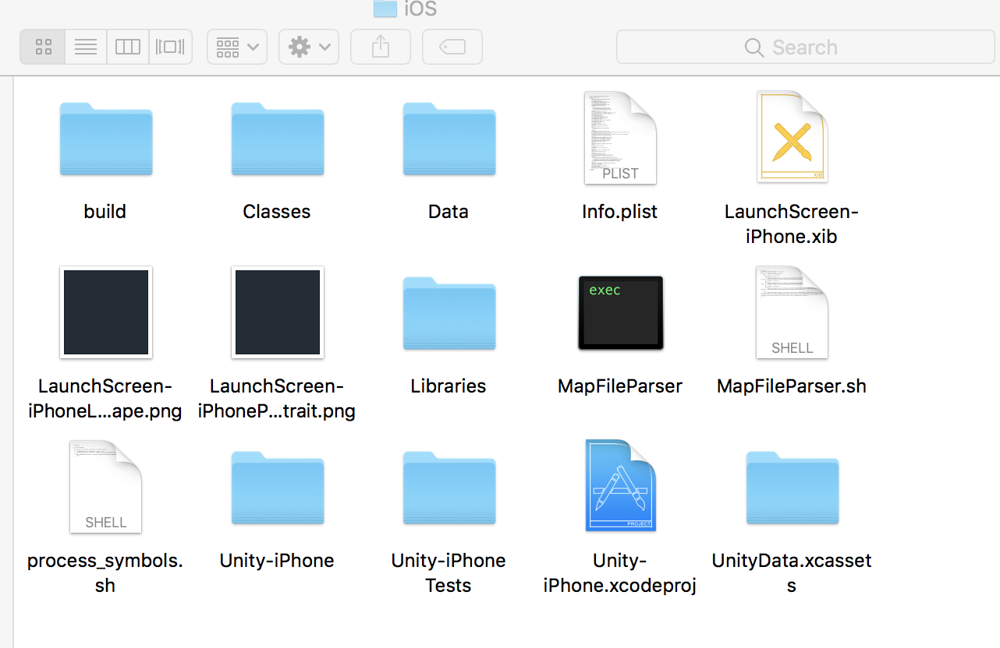

This will load your Unity project in Xcode. Don’t panic when you see a whole mess of warnings, it’s fine.

Click Unity-iPhone in the file tree to open up the General settings of this project. You’ll see under the Signing sections that you need a provisioning profile.

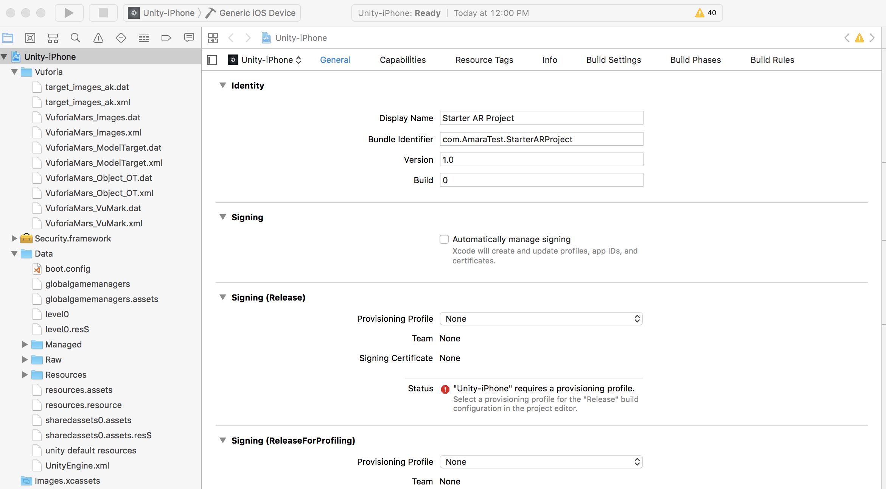

Under the Signing section, check the box for “Automatically manage signing” and click the button to Enable. Your screen’s options will change a bit.

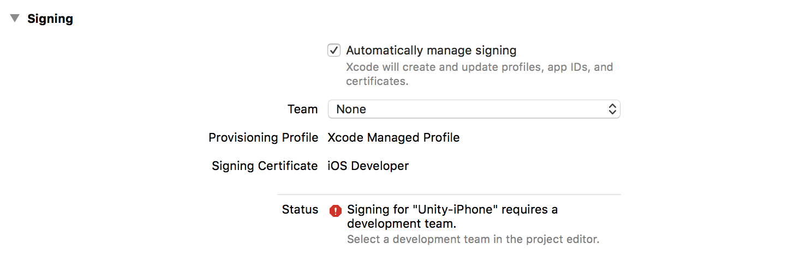

If you added your Apple ID to Xcode in the section above, the Team dropdown should include your name. Select it and your options change again.

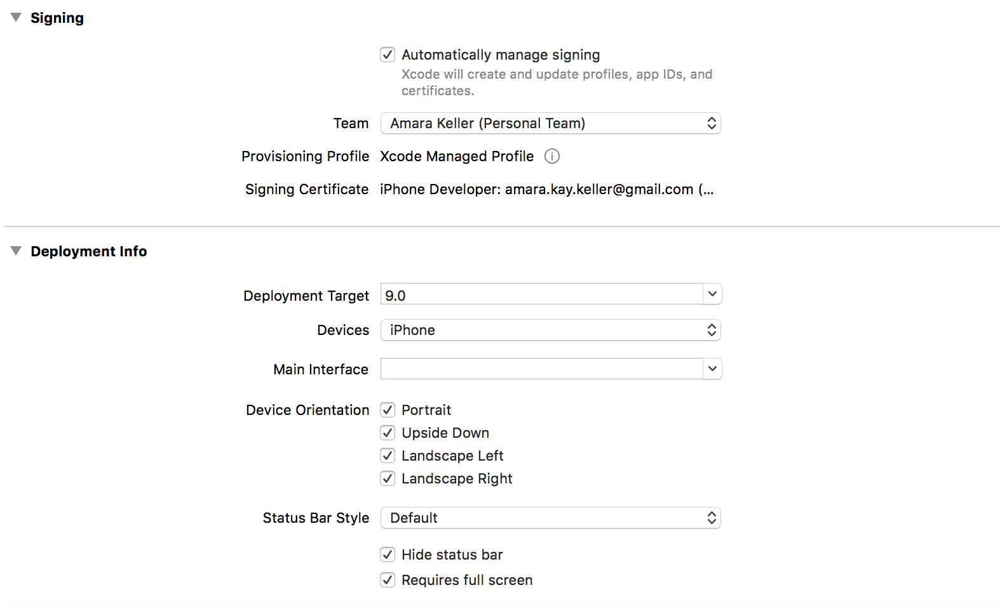

It’s important that your Deployment Target and Devices match what you specified in Unity. If you chose a higher deployment target or devices, make sure it’s reflected here. Otherwise, it should have carried over and don’t touch it!

Plug in your iPhone, make sure it is unlocked and glowing. Depending on how you have things setup, you need to make sure you let your iPhone trust the computer (typically a popup on the phone).

Hit that play button! You’ll see Xcode do a build and compile, which may take a bit. When its successfully completed, the app will appear on your phone. But you may see the following popup in Xcode.

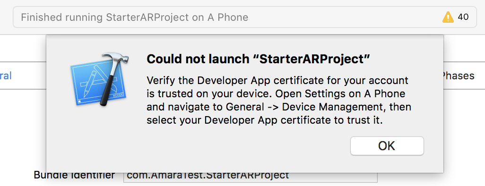

On your phone, you will need to go to Settings > General > Device Management if your phone prompts you and allow your developer profile.

Tap the app to start it. You should allow the camera and microphone for the app to work.

Can you hear Watson? Does Watson hear you? **Congrats! You are done!**

### Finished!

At this point, you can go back to your Unity Editor and add additional assets or script new functionality. Remember you’ll need to rebuild your project in Unity, and then of course rebuild and compile in Xcode, plug your phone in a redeploy. But the sky is the limit! Let me know what you do in the comments.

---

### Troubleshooting & Gotchas

High Sierra had some issues playing nice with my external monitor setup. I had to download a special version of MonoDevelop for Unity to load my project.

Unity does some serious work, so your computer’s battery life is going to suffer, even if you aren’t running the project/game. I recommend sitting close to an outlet.

Watson \*may\* hear itself when testing on a laptop, so use headphones. My iPhone experience didn’t require headphones, which was super cool.

I turned off multithreading to get my app to crash with a runtime error. Prior to that it was just barfing up some registry information that wasn’t helpful in troubleshooting. I didn’t turn it back on.

Watson Speech-to-Text doesn’t work well in loud rooms so I’d recommend headphones with a mic in this case.

As hard as I try to keep this tutorial updated, sometimes it gets put on the back burner. Feel free to submit a PR or check out my other [repos](https://github.com/akeller?tab=repositories).
