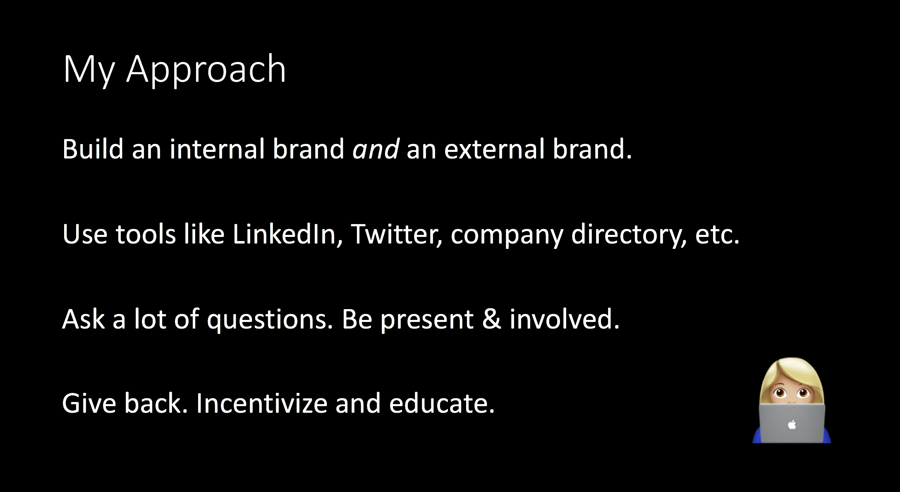
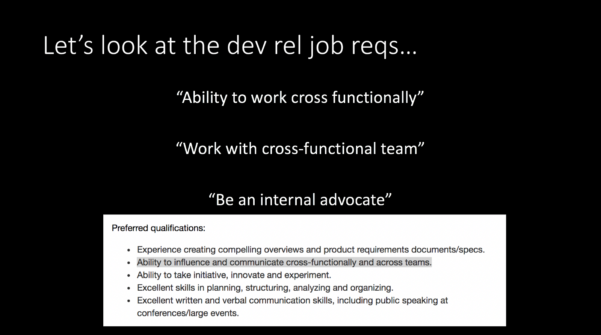
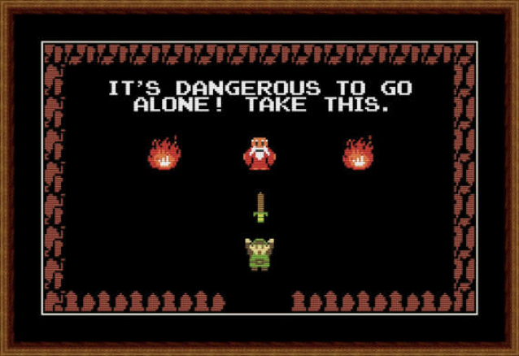

This year I was lucky enough to give a [talk at DevRelCon](https://devrel.net/dev-rel/building-internal-army) London which also happened to be my first year attending the conference! Speaking slots were 20 minutes long (no Q&A time at the end, my preference!), a great length for introducing a topic but not really long enough to go deeper. Let me elaborate on some of the material I presented.

#### Why “army”? Why not “allies” or “advocates” or “sponsors”?

It’s army as in an army of ants, not army out to conquer developers. But not “army ants” specifically because those are terrifying. Now I’m itchy.

I mentioned this during my talk, but a few years ago a coworker of mine mentioned that the metaphor “climbing the corporate ladder” was invalid because it implied you were doing it alone. Might have also included that you were trampling people on the way up too.

In reality, you need a huge support system of advocates, allies, mentors, peers, and managers — an army. Not only do I need these folks for my own career development, but I also need them to help with all the cross-functional work expected in advocacy.

#### Roles are not one size fits all.

Just because you worked with someone in the past who did business development does not mean you suddenly know what everyone in business development does. Just like every company is different, every role can be different too. Learn what business development means at your company and learn what the different individuals in the biz dev group do. Same thing with sales, marketing, product, engineering, and all the other orgs you may come across.

Remember, its a two way street and I don’t care what side you drive on. Just because someone has worked or interacted with a developer advocate before doesn’t mean they know how you flavor your developer advocacy activities.

#### Drop this idea that someone is “stealing your leads”.

(I’m going to pick on sales a bit here 😃)

I’m so tired of developer advocates telling me that all sales does is taking your leads.

Yes, there should be a healthy tension here. Not every conversation or engagement requires sales, just like not every developer needs assistance from a developer advocate. Let’s look at these situations, sanitized from recent conference booth work because its fresh in my mind:

1.  Person approaches booth looking for help with an API.
2.  Person approaches booth looking for a sales engagement to use a service OR mentions integrating services into their product.
3.  Person approaches booth and desperately needs development resources.

These are incredibly simplistic and not super comprehensive, but they give us some things to work with.

In situation 1, that’s going to be where a devrel shines. If not devrel, tap someone in engineering, maybe even product if it looks like a feature request is needed. Sales should yield, and you should educate them as this is a great example of devrel in action.

Situation 2 is interesting, because sometimes the person flat out says “is anyone here from sales”. How easy is that? Easier still, someone says “we are already a customer, but we want to evaluate service x too.” But sometimes it’s masked as “I’m so-and-so from big company x and we are looking to integrate this into out product but we need to talk about a pricing tier that works for us”. All of these I’m happy to play dot connector, or possibly even provide a technical overview to the team. I’m not interested in leading this engagement long term, but you know who is? Various members of the sales team.

If we have someone around the conference representing sales, that’s great! If not, I follow up after. **This is not just a throw them over the fence situation, or they are totally, rightfully, going to “steal your lead”.** I typically email or host a meeting (_\* more on this in the next section_) with an account owner or sales rep, explain the situation and the players, and then once we are squared away internally I invite the external parties to a call or email, let them do their thing. Then I joke and say “if this works out, remember my name”. Eventually I follow up with the internal folks and remind them if a hackathon or technical deep dive is necessary that I’m happy to assist. And to tell my manager how delightful I am to work with.

Lastly, situation 3. This happens quite a bit and I’m sure it has something to do with IBM being huge. While I would love to work on every project that crosses my path, I can’t, no matter how much fame and fortune you offer me (seriously, stop that). We do have pay-for consultants and development groups within IBM for customers, but your company may have 3rd party developers or firms you can direct these folks to. This is neither sales nor developer advocacy, but again, I’ll dot connect where I can.

#### Introduce yourself, devrel, your metrics, and your expertise.

No one is going to work with you (organically) if they don’t know who you are and what you do. Now I’m not saying go to every work function and network with everyone always, but I am saying be very thoughtful about interactions.

As mentioned in the section above, I don’t just toss things over to other groups and teams. I’m inherently curious, which is a blessing and a curse.

On multiple occasions I’ve shaken hands with someone and said “nice to meet you, what can I ask you to do for me?” Which is a subtle yet not so subtle way of asking for their elevator pitch. It’s typically followed with a laugh and an informal look into their job description, actual day-to-day activities, and hopefully a memorable imprint of the interaction. They ask me the same question.

If I’m lucky, they already know what dev rel or developer advocacy is. Either way my pitch looks a little like this:

> I’m Amara, a developer advocate focusing on all things AI, Watson, AR/VR, little bit of game dev. My favorite conversations to have are with development teams starting their AI journey. If our products don’t work for them today, I hope they want to talk to us later. <Insert some metrics for the year, quarter> <Insert the current code project, conference talk, or workshop I’m working on>

Now it changes, but sometimes I’ll add that I will discourage developers from using our product if its not a good fit, if that didn’t appear to be understood. That’s part of my personal brand and the trust aspect so crucial to developer advocacy. I’ve been on development teams where our management was sold products that managed to not fix any of our problems, but create even bigger, hairier ones. If I can prevent that, I know I’ve done the right thing for everyone involved. But my cross-functional buddies don’t necessarily understand my baggage and brand until I tell them.

#### Wrap Up

I think this is the point where it clicks, how devrel works when done right with an army to back you up.

Devrel is a bottom up approach, targeting developers first. Picking on sales again, my hope is that the conversations happening top down eventually meet in the middle without kicking and screaming.

But if I don’t stay engaged at the right points in this process, or if I don’t keep my cross-functional team engaged, someone is going to feel less empowered in the decision making process and that’s lame. At a minimum that ruins someones day.

---

Yes, the talk was recorded. No, I don’t have it yet. When I get a link it will be here. **_Edit 1/7 — its here!_**  [_https://devrel.net/dev-rel/building-internal-army_](https://devrel.net/dev-rel/building-internal-army)

Who is in your army? 🐜 🐜 🐜 🐜
