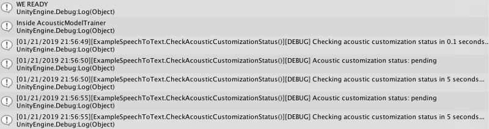

Is Speech to Text in realtime possible with substantial background noise?

I’ve done it again, but this time it was more like an epiphany. I’ve gone headfirst into what is sure to be a way bigger project than I anticipated.

We have so many issues with speech to text if the conditions aren’t perfect — crisp and clear enunciation in the sterile environment of a recording booth. I don’t know what kind of life you live, but this level of noise is rare. In fact, even sitting at my desk today as I type this, the yard maintenance guys are leaf blowing in my apartment building breezeway and I’ve all but given up trying to do anything with voice for the moment.

### The Setup

With a serious amount of regularity, I’ve been attending studio cycling classes at FlyWheel. I hate sounding pitchy, but what sets them apart from the other studio spins of the world (SoulCycle, StarCycle, BurnCycle, etc) is its a metrics driven workout. 

Your stationary bike has what me and my nerd friends like to describe as “something that looks like a RaspberryPi in waterproof housing”. It’s super neat and shows you your speed in RPMs (revolutions per minute), resistance in “Torq”, and some additional numbers like current power and total power that describe how hard you are working. This is awesome because I love numbers, technology, and sweating enough to eat and drink without worrying too much. 

#### The Problem

Now I can almost hear you saying, “ok so what’s this got to do with anything”.

FlyWheel instructors coach you through class and will tell you at the start of class that you will ride on and off the beat of the music. The loud, sometimes almost deafening, beat heavy music. The studio even offers earplugs. I’ve taken over 100 classes and I rarely hear anyone around me breathing heavy. Sometimes I can’t even hear myself, which is great for focus.

The problem is the music can be so loud it can distort my brain’s ability to understand the instructor. Or alternatively the instructor can be soft spoken on the mic. Either way, my hearing stuffers immensely in this environment and I’m completely able bodied! What about the low, limited, or no hearing folks? 

Now before everyone jumps to the comments and tries to “well, actually…” me, I went to a school with a deaf program growing up. You crank that bass up loud enough, you can FEEL music. In fact, school dances were almost hard to recover from because your body was on a bass rollercoaster. 

Back to the problem — these low to no hearing athletes can probably feel the beat, even on a bike, but what do they do when we ride off the rhythm? Or when we are coached into a standing or upright position? 

#### The (Possible) Solution

Would it be possible to live caption or deliver realtime speech to text in this environment? Could I build something with app like functionality that didn’t require a custom microphone or splicing the mic audio? I wanted something non-invasive, something that used what every rider probably has sitting in their locker.

Is speech to text on any cloud capable of helping athletes read what they can’t hear? 

### The Tech

I decided to (possibly, probably?) over-engineer a solution in Unity because I told myself I might be able to do some things with sound via a game engine that I couldn’t do in like Node.js or something. I also told myself I wanted to do some kind of animation to help riders know what position they should be riding in. I’m calling it early and saying I’ll probably end up doing neither and using Unity to write a C# iOS app. 

#### Watson Speech to Text

I knew this meant using the Watson SDK for Unity and the Speech to Text service. I started looking at keyword detection and custom language models. Having built a custom language model before, I focused on keyword detection. 

With keyword detection I wanted to see if the basic speech to text model would even hear “torq”, “torque”, or “twerk” (lol, wat) for Torq. It could understand me sitting here in my office, but when I tried a sample recording on of my instructors graciously allowed me to take, it failed to hear just about anything. I’m not surprised, AI is really good at what humans do repetitively, and hearing isn’t one of those things. So for now, this won’t work.

Later on down the line I’ll look at custom acoustic models.

I split my recording into a 15 min training chunk (m4a, as that’s what iPhone’s voice memo app captures in, to wav, a mime type compatible with the service), just one because apparently the service needs a minimum 10 min (to a maximum 100 hours!) to train an acoustic model. I’ll keep the 30ish minutes of the rest of class for testing. If need be I can also train the entire class worth of audio and just capture more in the 3–4x a week I’m riding. 

I’m not sure what I was expecting because I’ve watching deep learning models train and this 15 minutes worth of audio trained for HOURS. I started it around 11:30am on Monday and every hour or so I’ve called the service to check the customization status, only to see “pending”.

  

#### AWS Transcribe

At one point I looked to Twitter for some suggestions. AWS came up as a good candidate for research as my former coworker said something to the effect of “Alexa is pretty good at hearing me when my kids are screaming and music is playing”. Although we both realized that maybe this had some assistance from the hardware of the Echo product line and we weren’t sure if Amazon would let its best speech to text models be available through their API.

I did find AWS Transcribe, and abandon it after losing an entire day trying to read through documentation, only to realize streaming was considered an entirely separate service, not just a flag, and not available in any SDK I wanted to use. It was also somewhat recently announced and the clear focus of this service was for running batch transcription jobs, not something that would assist me realtime. 

Microsoft Service

Google?
