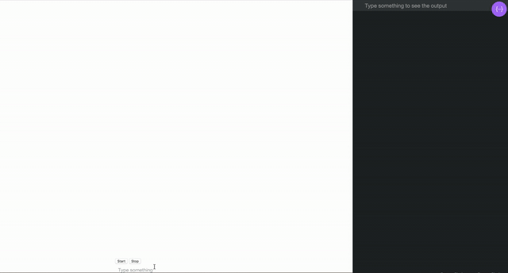

## Using Watson Speech to Text, Assistant, and MediaStream Recording API for a browser based Wake Word Demo

_I know what you are thinking. “Amara, if you are working in the browser why didn’t you just npm install one of the 6+ different packages available for Node based applications?” Because I didn’t want to make a bigger mess and I needed to specify the audio format. And I needed to feel comfortable._

_So now that you know this is not going to be a “how to npm install my favorite audio package” let’s set the scene._

 on [Unsplash](https://unsplash.com/search/photos/alexa?utm_source=unsplash&utm_medium=referral&utm_content=creditCopyText)](./asset-1)

<Embed src="https://bingewith.com/article/::_Generate_Audio" aspectRatio={undefined} caption="" />

### Wake Word Use Case

Personal assistant devices are one of the main use cases for Speech to Text technology for main stream users, not including accessibility tools like screen readers. “Wake words” engage devices to process what they hear, like “Hey Google” or “Alexa”, often sending it to the cloud if a connection has been established. Watson Speech to Text can be used somewhat similarly, depending on how you write your client application.

Please note, this kind of functionality is designed to be “always listening”, but only sends specific commands to the cloud when it hears “Watson”. For testing purposes, I implemented html buttons for starting and stopping the transfer of audio data to the cloud because no one wants to see logs of me cursing while I code.

While I won’t provide a full tutorial level post, we are working on publishing a cleaner implementation should you want to build something similar with Watson Speech to Text.

 on [Unsplash](https://unsplash.com/search/photos/google-home?utm_source=unsplash&utm_medium=referral&utm_content=creditCopyText)](./asset-2)

### Handling Audio (via the Browser)

I’m not a sound engineer, but I have worked with Speech to Text quite a bit recently so I know that encodings and audio formats can make or break accuracy and performance of speech services. I knew I wanted something very flexible that clearly showed me what audio format I was using to make sure I could pass one in that was acceptable for the service. I looked at a few npm packages, but didn’t like the perceived flexibility of the ones I saw.

I did do some searching about and came across MDN and the Web Audio API.I found a couple examples and sample code for [ScriptProcessorNode](https://developer.mozilla.org/en-US/docs/Web/API/ScriptProcessorNode), a deprecated feature that pointed me to [AudioWorklet](https://webaudio.github.io/web-audio-api/#audioworklet). This put me in the W3C Editor’s Draft of the Audio API which looks like an intimidating college textbook, but online and huge. Immediately ran away from that.

I somehow made it to the [MediaStream Recording API](https://developer.mozilla.org/en-US/docs/Web/API/MediaStream_Recording_API), which offered both audio and video in browser capture, and wasn’t deprecated (yay!). A [sample app](https://developer.mozilla.org/en-US/docs/Web/API/MediaStream_Recording_API/Using_the_MediaStream_Recording_API) right in the docs was more encouraging that the AudioWorklet docs.

Armed with this knowledge, I went to find a pattern in Node.JS.

### Hacking Up a Pattern

I wanted to build off of an [existing pattern](https://ibm.biz/BdzRad) so I didn’t have to build a new UI or think about a dialog to structure in Watson Assistant, and this one worked out perfectly because it was a Node.JS based application to begin with.

#### Index.html

Starting in index.html I added some buttons, like I mentioned earlier, so no one has to hear me cursing while I’m debugging this code. These buttons can go pretty much anywhere, but I placed them in the `scrollingChat` div.

```
<button class="button" onclick="Api.micCue()">Start</button>
<button class="button" onclick="Api.micStop()">Stop</button>
```

As is, they won’t be styled but they will help cue and stop the mic so I don’t run the risk of recording and sending everything to Watson while you get setup.

#### Api.js

At the top of api.js, I added an endpoint for speech to text recognition and a global mediaRecorder variable.

```
var sttEndpoint = '/api/recognize';
var mediaRecorder;
```

Make sure you define your new methods, `micCue()` and `micStop()` as publicly accessible if you are following along at home.

```
// Publicly accessible methods defined
  return {
    sendRequest: sendRequest,
    micCue: micCue,
    micStop: micStop,

    // The request/response getters/setters are defined here to prevent internal methods
    // from calling the methods without any of the callbacks that are added elsewhere.
    getRequestPayload: function() {
      return requestPayload;
    },
    setRequestPayload: function(newPayloadStr) {
      requestPayload = JSON.parse(newPayloadStr);
    },
    getResponsePayload: function() {
      return responsePayload;
    },
    setResponsePayload: function(newPayloadStr) {
      responsePayload = JSON.parse(newPayloadStr);
    }
  };
```

Next, let’s create our `micStop()` method. Really we just need to call mediaRecorder.stop(), but you may want to include some information for debugging like the mimeType, I know I did.

```
function micStop() {
    mediaRecorder.stop();
    console.log("recorder stopped");
    console.log(mediaRecorder.mimeType);
  };
```

I wasn’t sure what mimeType the browser was going to give me (I usually run in Chrome for development, then test in Firefox) so having a little info in the console was going to be important in case each browser decided to give me a different format. Future proofing, ya know?

The next method, `micCue()`, is a little bit more involved.

```
function micCue(){
    console.log("micCue hit");

    var audioCtx = new (window.AudioContext || webkitAudioContext)();

    if (navigator.mediaDevices.getUserMedia) {
      console.log('getUserMedia supported.');

      var constraints = { audio: true };
      var chunks = [];

      var onSuccess = function(stream) {
      mediaRecorder = new MediaRecorder(stream);
      mediaRecorder.start(3000);
      console.log(mediaRecorder.state);
      console.log("recorder started");

      mediaRecorder.onstop = function(e) {
        var blob = new Blob(chunks, { 'type' : 'audio/webm; codecs=opus' });

      // Built http request
      var http = new XMLHttpRequest();
      http.open('POST', sttEndpoint, true);
      http.setRequestHeader('Content-type', 'audio/webm;codecs=opus');
      http.onreadystatechange = function() {
        if (http.readyState === 4 && http.status === 200 && http.responseText) {
          Api.setResponsePayload(http.responseText);
        }
      };

      // Send request
      http.send(blob);
      chunks = [];
      };

      mediaRecorder.ondataavailable = function(e) {
        chunks.push(e.data);
      };

    };

    var onError = function(err) {
      console.log('The following error occured: ' + err);
    }
  
    navigator.mediaDevices.getUserMedia(constraints).then(onSuccess, onError);
  
    } else {
      console.log('getUserMedia not supported on your browser!');
    }

  };
```

---

Build better voice apps. Get more articles & interviews from voice technology experts at [voicetechpodcast.com](https://voicetechpodcast.com/)

---

There is a lot going on here. We need to make sure we are in a browser that can capture media, in this case audio.

I also setup the app to only capture a certain amount of audio by giving the mediaRecorder.start() a parameter. In this case I used 3000 for 3 seconds as we assume short commands based on the dialog in this pattern.

It’s important to make sure the blobs and http request are both set for `audio/webm;codecs=opus` as that's compatible with what type of audio your browser is collecting (surprise!) and what Watson Speech to Text will accept. [Check the docs](https://cloud.ibm.com/docs/services/speech-to-text/audio-formats.html) for more information on what type of audio formats and encoding is accepted.

Finally we need to modify the sendRequest method. This is mostly for the UI, so you can type a message and get the same wake word behavior as you would with audio, something my brain really needs to maintain sanity when testing things. On the backend, everything is text based analysis at some point.

```
// Send a message request to the server
  function sendRequest(text, context) {
    // Build request payload
    var payloadToWatson = {};
    if (text) {

      if(text.search("Watson") == 0 || text.search("watson") == 0){
        text = text.replace("Watson", "");
        console.log("? " + text);

        payloadToWatson.input = {
          text: text
        };
      
      if (context) {
        payloadToWatson.context = context;
      }

      // Built http request
      var http = new XMLHttpRequest();
      http.open('POST', messageEndpoint, true);
      http.setRequestHeader('Content-type', 'application/json');
      http.onreadystatechange = function() {
        if (http.readyState === 4 && http.status === 200 && http.responseText) {
          Api.setResponsePayload(http.responseText);
        }
      };

      var params = JSON.stringify(payloadToWatson);
      // Stored in variable (publicly visible through Api.getRequestPayload)
      // to be used throughout the application
      if (Object.getOwnPropertyNames(payloadToWatson).length !== 0) {
        Api.setRequestPayload(params);
      }

      // Send request
      http.send(params);

    } else {
      text = null;
      console.log("No Wake Word detected");
    }
  }
}
```

#### App.js

Be sure to include your credentials for Speech to Text, knowing that they will be visible in plain text if you leave them in app.js. When deploying your application, you should use environment variables.

Do as I say, not as I’m about to do.

```
const speechToText = new watson.SpeechToTextV1({
  username: '{username}',
  password: '{password}'
});
```

We need to define the endpoint that will be called from the client side. This is where we will handle all the parameters for Speech to Text and the recognize method.

Be sure the content type matches what is capture from your browser and is compatible with the Speech to Text service. I can’t say this enough because this caught me for DAYS.

This example uses the US Broadband model, but there are other models. [Check the documentation](https://cloud.ibm.com/docs/services/speech-to-text?topic=speech-to-text-models#models) for more information.

```
//endpoint to be called from client side
app.post('/api/recognize', function(req, res) {

  var recognizeParams = {
    audio: req,
    objectMode: true,
    content_type: 'audio/webm;codecs=opus',
    model: 'en-US_BroadbandModel',
  };

  speechToText.recognize(recognizeParams, function(error, speechRecognitionResults) {
    var inputText = {};

    if (error) {
      console.log(error);
    } else {
      var receivedText = speechRecognitionResults.results[0].alternatives[0].transcript;
      console.log(JSON.stringify(speechRecognitionResults.results[0].alternatives[0].transcript, null, 2));
      
      if (receivedText){
        if(receivedText.search("Watson") == 0 || receivedText.search("watson") == 0){
          receivedText = receivedText.replace("Watson", "");
          inputText = {
            text: receivedText
          };
        } else {
          console.log("You didn't say the magic word. Empty message sent to Watson");
        }
      }

      var payload = {
        workspace_id: workspaceID,
        context: req.body.context || {},
        input: inputText || {}
      };
      
      // Send the input to the conversation service
      conversation.message(payload, function(err, data) {
        if (err) {
          return res.status(err.code || 500).json(err);
        }
        return res.json(updateMessage(payload, data));
      });
    }
  });

});
```

In the recognize method, we need to handle building the message and make sure it includes the Wake Word — “Watson”. This is what will actually be sent to the Assistant service, but we’ll need to check for the Wake Word first.

Keep in mind, if you send an empty message to Watson with no context it will still respond with the welcome node, that’s just how the service works, which also confused me for a bit.



### Wrapping Up

Is this a really ugly implementation as-is? Absolutely. Does this functionally show you using Wake Words in the browser with audio and text? Absolutely!

I didn’t package this as a full repo, but here is the [link again](http://ibm.biz/BdzRad) to the pattern I hacked to pieces. Hopefully the steps and snippets I provided are easy enough for you to follow should you want to build this small mess yourself. And improve upon it of course!

My coworker published a slightly different take on this that works in the terminal if you prefer something less browser based — check out the [tutorial](https://developer.ibm.com/tutorials/add-a-trigger-word-to-your-watson-conversation/).

Are you interested in browser based Wake Words? Are you building something that captures audio in the browser? How are you doing it? Let me know below!

<Embed src="https://upscri.be/6b7b35?as_embed=true" aspectRatio={undefined} caption="" />
