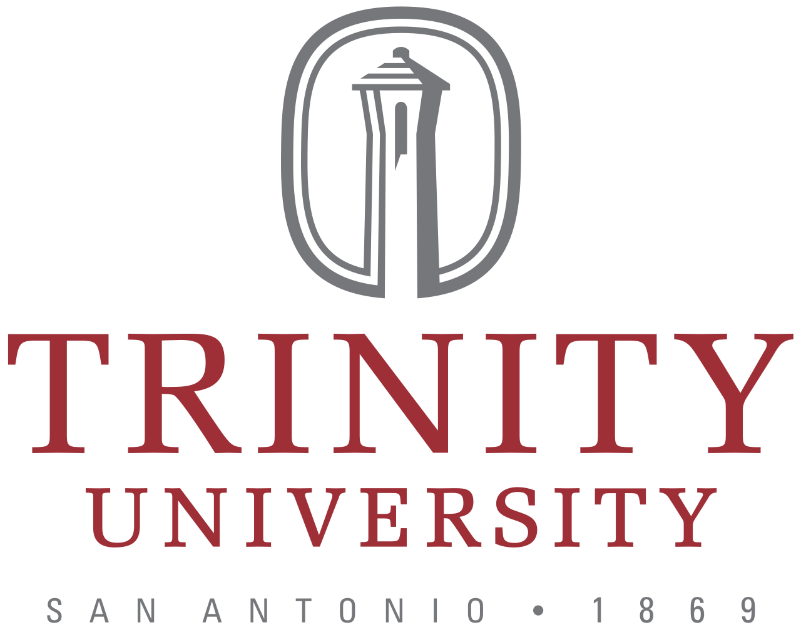
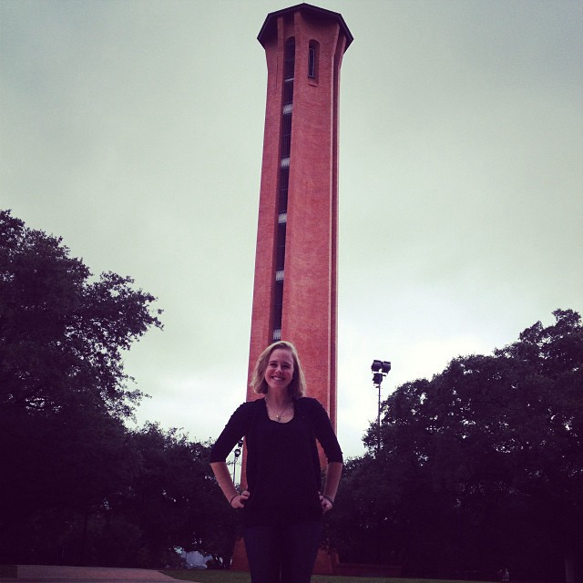

I went to an enormous high school and graduated with 880 people. That’s more people than some small towns. The ceremony was horrendously long as I saw people, I swear, I’ve never seen before walk across the stage to collect their hard earned diplomas. Seriously, the ceremony was in half an American football stadium and took hours to get through just the walking portion.

About 6 months before that, I made the decision to apply to a small university, selecting Trinity University in San Antonio, TX as my number one pick. I didn’t want to be a number anymore. I wanted more personalized attention in class and I wanted to feel like my professors knew slightly more than my name. And most importantly it was a minimum 3 hours from my parents so they probably wouldn’t just show up unannounced. I got in, eventually made the decision to major in Computer Science, and here I am today.

Once a year while the students are off on their Fall Break, some notable Computer Science alumni and the faculty meet for half a day. This group is known as the Trinity University Computer Science Advisory Board and includes founders, VPs, C-suite employees, managers, and regular individual contributors from companies like Microsoft, USAA, Denim Group, Rackspace, and, of course, IBM. I was very lucky to be extended an invitation to join this group shortly after graduating and I’ve been able to attend every year since (minus the one year I decided to run my first, and only, half marathon… never again). I’m sure my invitation had something to do with the fact that I helped hire two professors during the chaotic period where 3 senior professors were retiring all at once while also trying to make sure I was on track to graduate.

So what exactly does this board do, other than allow me to list on my resume and LinkedIn that \*I, Amara Keller, am a Board member\*. How posh!

The day pretty much starts with introductions, then an update from the faculty on class numbers, research updates, funding, and any other interesting things that have happened over the course of the year. Recently the curriculum has been redone across the entire university. Because Trinity is a liberal arts institution, it was good for the board to understand how that might impact computer science curriculum changes for the good, bad, or ugly.

The second part of the day typically includes round table discussions. When the reminder email is sent each attendee is asked if there is a particular topic that should be considered and they in turn get to lead the round table discussion. Three things are always true:

1.  We will inevitably have a discussion around retention of student past the intro classes (in particular women and minorities). We elevated this to its own round table topic this year.
2.  We will inevitably talk about security (San Antonio has a large security presence, no doubt having something to do with the military and NSA presence in the city too).
3.  We will inevitably create more work for the faculty to do, sometime in the form of new electives or new ways to present class content. We kept this somewhat small this year, but we did ask the faculty to pull together a wishlist for the new CIO to tackle.

We had a very healthy discussion on retention of women and minorities in the computer science program at Trinity. One of the professors quoted me from last year saying that I wasn’t really the best person to ask about retention because I made it through, graduated and have a job. Since then he’s changed how he interacts with students to really try to understand why they leave. This is a small but meaningful example of how the Board makes an impact.

This year AI was a hot topic. I’m not super surprised, I asked about Big Data last year and knew we’d probably end up on the AI path. From what it sounded like, most of the hiring managers in the room were not looking for practiced deep learning engineers, but rather someone who had more of a data science background to cleaning and ingestion of existing data. They are also happy to take a risk on employees with only undergraduate degrees in AI. This is a striking contrast to what I hear in Silicon Valley.

Now I can’t speak for everyone in the room, but one major employer of our graduates mentioned training up existing talent in data science and machine learning rather than hiring new. This fits nicely into the narrative of why democratizing AI and creating AI tools for existing developers matters. We pushed to incorporate security across our curriculum, and I see the same happening for AI. They aren’t truly distinct topics in computing, and as we see more and more solutions, apps, and industries bringing AI to their users, the more this will be true.

I am thrilled to continue to be able to give back to my university in this capacity. I want to know that our graduates continue to be sought after by well respected companies and have the education to make impacts once they get there. It’s also a great gut check for me to hear what’s going on outside of Silicon Valley.

But seriously, hire Trinity students if you can. You won’t regret it!

Go Tigers! See you next year!
