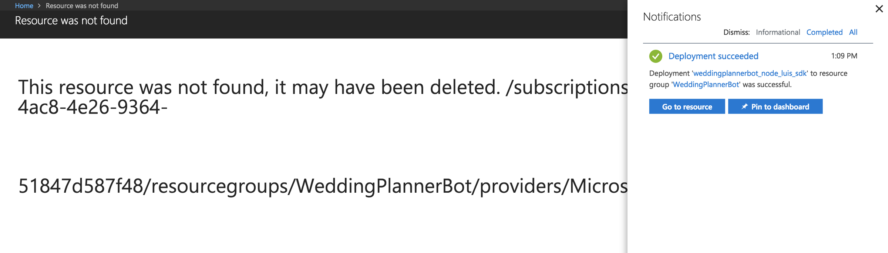
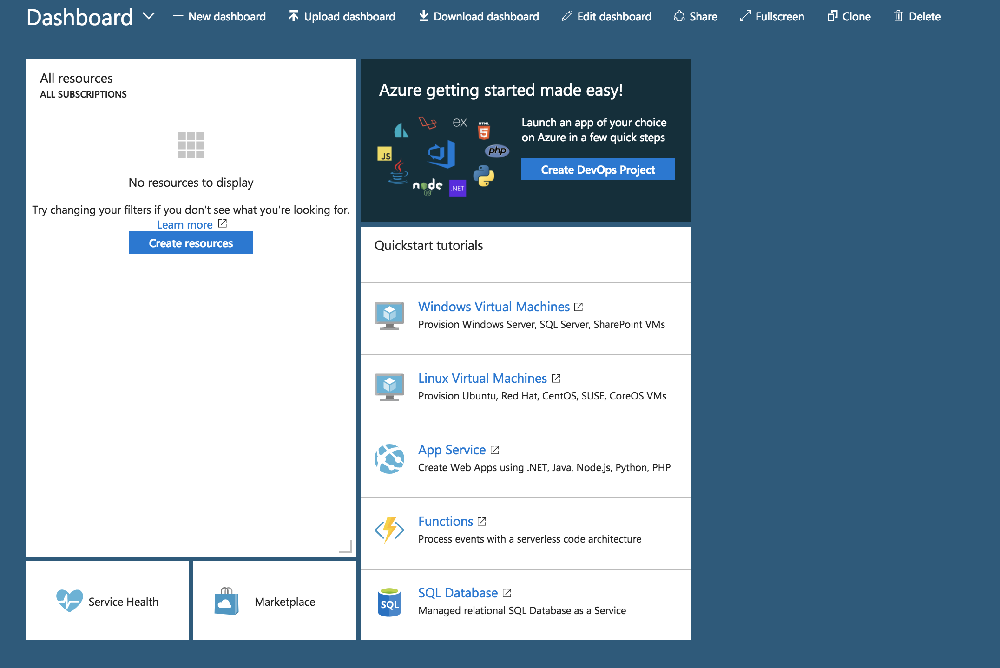
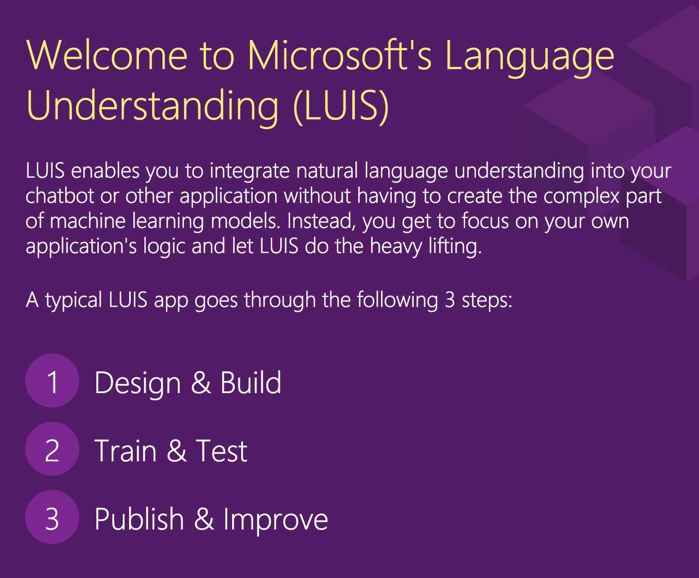
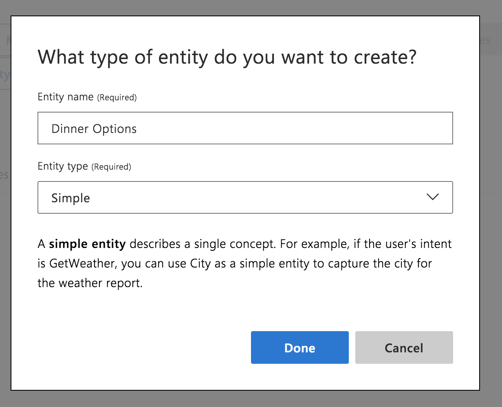

> **UPDATE **— I actually got charged over $60 for this. I hit so many dashboard errors I never saw anything about the invoices until it was months later. So I would highly recommend you not follow anything I’ve done here. Also, I’m having trouble deleting my Azure account without deleting my MSFT account. So… sigh…

Need some context? Check out the [intro](https://medium.com/@MissAmaraKay/a-chatbot-on-every-platform-fe09ebd8e95e) or the [first blog on Dialogflow](https://medium.com/@MissAmaraKay/first-chatbot-experience-with-dialogflow-61c5786c11e4).

Same exercise, different platform. So same goals, but let’s recap:

1.  I want to be able to build my [Wedding Planner Chatbot example](https://github.com/akeller/Chatbots/blob/master/weddingplannerbot.json), with at least one intent to “RSVP”. This is essentially the fundamental task I need to perform on every framework while exploring the terminology for potential inconsistency.
2.  I want to see if there are pre-built domain specific examples I can tweak. This is a bonus, but intriguing for enterprise customers looking for reuse possibilities.
3.  Does it get exposed as an API? Can I use webhooks or call third party services?
4.  How do I deploy it somewhere or use it? One-click deploy?

### Sign Up

I didn’t want to start off negative, but I hit two 404s and a credit card requirement within seconds of signing up for an Azure account. This is a huge bummer. Now, I was on hotel wifi for a portion of this, but let’s ignore the 404s.

I understand that validating humans, particular for free cloud tiers is important. I disagree in requiring a credit card to do that. I vehemently disagree that there may be a hold charge for accessing FREE services. But I begrudgingly input my credit card information because I want to test out Azure. What happens if I didn’t have a credit card?

There is more to this sign up frustration, but I’ll stop here. As of writing this post, you need a credit card to use Azure.

### Finding the Services & Bot Creation

I found the [Bot Framework](https://dev.botframework.com/) and determined that was a good place to start. I’ll go ahead and click the “Create” button.

From there I was sent to a dashboard with three options for creating a bot.

I had a feeling I wanted to create a web app bot to keep it similar to what I did in Dialogflow, although the options for “Bot Channels Registration” also sounded correct. I ultimately decided to create a Web App Bot.

I cutoff the screen shot, but at the bottom of this page was a “Create” button and I clicked that.

Alright.

I click it again. Another panel appears and I was able to fill in some information about my bot.

For more information on how to do that, I’m going to point you to the [docs](https://docs.microsoft.com/en-us/azure/bot-service/bot-service-quickstart). I ended up choosing a Language understanding Node.js bot. You’ll notice some config choices open separate panels, like the bot template.

After walking through the list of items, I hit “Create” at the bottom of that panel.

I was taken to a dashboard page that gave me a notification indicating the deployment was in progress. Excellent!

Narrator: It was not excellent.

Everything looks like its deployed successfully, so I click the “Go to resource” button.

I click it again because I’m a software engineer. Then I click it again because now I expect different results. No surprise, the results are similar.

I end up here, screenshot below by click on my resource group “WeddingPlannerBot”.

Ok, so there is at least something. And a status that says everything has succeeded. But I’m still not seeing anything that might get me to my bot.

I click the Dashboard and sure enough, there are no resources!

Again, because I’m a software engineer, I log out and log back in to suddenly find resources!

Now I’m click around like a crazy person and its getting me no where. So I end up back in the docs.

[**Test a Bot Service in Web Chat - Bot Service**  
_Learn how to test a Bot Service with the webchat control in the Azure portal._docs.microsoft.com](https://docs.microsoft.com/en-us/azure/bot-service/bot-service-manage-test-webchat "https://docs.microsoft.com/en-us/azure/bot-service/bot-service-manage-test-webchat")

[**Manage a bot - Bot Service**  
_In this article This topic explains how to manage a bot using the Azure portal. In the Overview blade, you can find…_docs.microsoft.com](https://docs.microsoft.com/en-us/azure/bot-service/bot-service-manage-overview "https://docs.microsoft.com/en-us/azure/bot-service/bot-service-manage-overview")

I cannot find ANYTHING that remotely gets me anywhere close to the screenshots in the links in my views within Azure. What did I do wrong?

### Try Again - Bot Creation

At this point, I decide I’m going to build a completely new bot. Maybe the account creation errors and errors I experienced during provision and deployment are to blame.

I decide to call this bot “anotherone” (DJ Khaled voice) and the only thing I change is the service tier (F0 to S1). I just want the “don’t charge me tier” but also the tier that works.

The deployment is successful and after clicking the “Go to resource” button I see a screen that looks exactly like what the docs promised.

And then I give up with this for the day because I’ve had enough.

### Back Again

The next day I sit down with renewed optimism. From this point on, I’ve decided to stick with “anotherone” as my bot because it appears to be the most successful.

I click “Test in Web Chat”. And watch it spin.

Everything looks like it’s working. So I greet my robot overlord.

Ok we hit the silly little intent I stuck in. Now can it hit my RSVP intent?

That was a trick question because there is no RSVP intent in my DJ Khaled frustration test bot. Let’s add one!

### Create Intent

Click “Build” under Bot Management in the menu.

An option to code in an online editor? Yes please! Click “Open online code editor”. When it loads, I open app.js because I know that is where the beefy chatbot goodness probably sits in this Node.js app.

Sure enough, I can see all the dialog options that come prebuilt with the bot, including “Greeting” and “Help”. But using the [docs](https://docs.microsoft.com/en-us/azure/bot-service/nodejs/bot-builder-nodejs-recognize-intent-luis), I see there is another link I need to go to to build the intents out on [LUIS](https://www.luis.ai/home). I login with my Azure credentials and this looks like exactly the place I want to be.

I scroll through some great documentation that outlines each step in the bot building process. Terminology appears consistent with Watson Assistant, including the idea of having 5 or more utterances, or user defined examples, to give context to defining the intent. 5 is the magic number it seems.

At the bottom of the page I follow a link over to where I can create intents (Goal #1). I see some prebuilt ones, which is great. I also see the ability to add prebuilt domain intents, and cut off at the bottom of the menu is the ability to preview prebuilt domains (Goal #2).

I click “Create new intent”. I get a popup to name the intent, and immediately move on to the next screen.

This looks very familiar, but I also see I can reassign intents straight from this UI which is convenient if I see anything in the list that is incorrect. I can also see exactly what entities this intent might use.

After adding my utterances, I notice LUIS does not train automatically, which means I cannot test my changes without first training. Both Watson Assistant and Dialogflow trained as things were added. Something to keep in mind for later.

### Define Entities

Moving on to entities, this page looks pretty similar too.

I click “Create new entity” and get a modal window to start building my entity.

Now this is slightly different than what I was expecting. There are different types of entities: simple, hierarchical, composite, list, and regex. Now with my dinner options entity, do I go with “simple” or “list”? As I select each in the list, a description appears below.

Ultimately for this particular entity, I decide to go with a type of list because I have an exact and finite list of items I want in my dinner options entity, but they have synonyms.

As I’m filling in values, I notice I’m given a list of recommendations I can add, which is super helpful! At this point I could almost complete my entity with the recommended values, particularly after refreshing the recommendations.

I continue on with the other entities, finding a prebuilt one for “number” — as in number of people RSVPing as well as play around with this concept of composite types or a set of entities in a single entity.

### Relationship Between Intents and Entities

Unfortunately, this is when I realized I wasn’t going to be able to use entities like I had previously, where I could prompt the user for additional information within a single intent. As far as I can tell, LUIS allows you to identify entities used within utterances of the intent, but not like Dialogflow or Watson Assistant where you can specify entities that need to be defined within an intent and prompt for information.

This realization means we would have to specify multiple intents within our RSVP task which is a little less user friendly. This assumes the user has some sort of knowledge of how to answer this question efficiently and supply all the necessary information, or we need to take care of this at the application side and script out something until the entities are defined.

### API Fun

One of the things that is very obvious in Microsoft documentation is that LUIS can be accessed with an endpoint for not just consumption (goal #3), but for authoring as well. Watson Assistant does allow you to programmatically build your intents and entities, but it feels a little clunky. The entire Azure platform (or maybe I should say Microsoft Ecosystem since LUIS doesn’t seem to sit directly on Azure?) is setup to get you to the code fast, to do seemingly whatever you want or could do with code, including right there in the browser in Azure like we saw earlier.

### Deployment Channels

Under Bot Management on the Azure platform there is an item for “Channels” and sure enough that’s where I can find my options for deployment (Goal #4). The options include the standard messaging platforms I would expect and some Microsoft options like Cortana and (surprisingly?) Bing. Maybe I don’t understand what Bing does anymore for it to be included there. 🤷‍♀

### Microsoft Ecosystem

I did a little digging and found a number of different solution architecture diagrams which I think paint a great picture to folks trying to wrap their brains around chatbots. If nothing else, it shows there are multiple services or pieces that make up a chatbot, even one that just does basic [Q&A](https://azure.microsoft.com/en-us/solutions/architecture/information-chatbot/). This is a great diagram to illustrate that chatbots are indeed bigger beasts than they seem and include multiple layers or pieces.

### Wrapping Up

Now its a bummer that I faced so many initial issues with Azure and creating a chatbot. It looks like my original chatbot never made it through to being a full fledged chatbot, so I’m not sure what happened. I think if I wanted to devote more time to this particular project I could have made something interesting.

---

For reference, I’ve been building chatbots with Watson for about 6 months now, on and off. This adventure in Azure with Bot Framework and LUIS took about 4 days.
