Need some context? Check out the [intro](https://medium.com/@MissAmaraKay/a-chatbot-on-every-platform-fe09ebd8e95e), the [first blog on Dialogflow](https://medium.com/@MissAmaraKay/first-chatbot-experience-with-dialogflow-61c5786c11e4), or the [second blog on Azure](https://medium.com/@MissAmaraKay/first-chatbot-experience-on-azure-abeac3c410f7).

Same exercise, different platform. So same goals, but let’s recap:

1.  I want to be able to build my [Wedding Planner Chatbot example](https://github.com/akeller/Chatbots/blob/master/weddingplannerbot.json), with at least one intent to “RSVP”. This is essentially the fundamental task I need to perform on every framework while exploring the terminology for potential inconsistency.
2.  I want to see if there are pre-built domain specific examples I can tweak. This is a bonus, but intriguing for enterprise customers looking for reuse possibilities.
3.  Does it get exposed as an API? Can I use webhooks or call third party services?
4.  How do I deploy it somewhere or use it? One-click deploy?

### Sign Up

Originally I thought I would just be making an Alexa Skill that happened to be a chatbot, but after a little more research and poking around, I thought Amazon Lex was going to be the most comparable experience to Dialogflow and LUIS.

I started here, and you can too: [https://aws.amazon.com/lex/](https://aws.amazon.com/lex/)

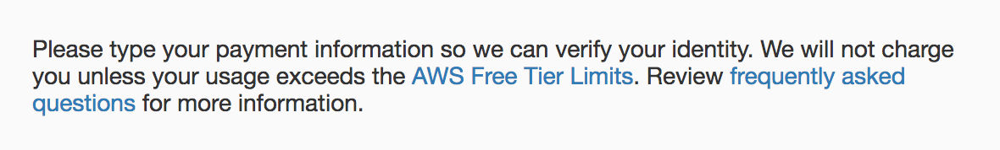

Verifying that I am a person through having a credit card is an interesting choice, but I’m not surprised because that’s what Microsoft Azure did too. I’ll pull out my soapbox and give a slightly briefer rant… not everyone has a credit card!!! Ok, I’m done.

Amazon seemed to do a slightly better job at ushering me straight into the free tier of service with three very clearly marked options. It is still unsettling to enter my credit card information with a digital pinky promise that I wont get charged.

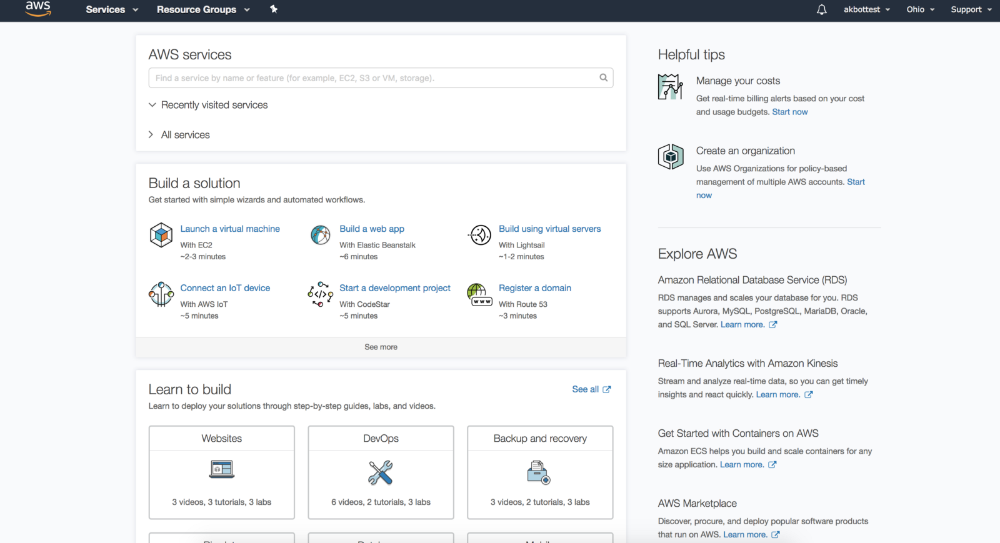

The dashboard looks about what I would expect, and I see familiar terminology like “services” and “resource groups”. I use the drop down to see “All services” and find the Machine Learning section with Amazon Lex.

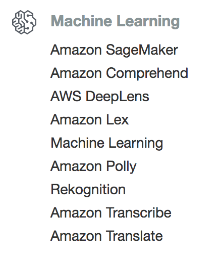

I don’t remember selecting a region, but apparently I selected the incorrect region as it doesn’t support Amazon Lex. This is where I should also point out that Amazon Lex seems to have only a tiny amount of support regions, so take note if you live anywhere other than near Ireland or near Virginia.

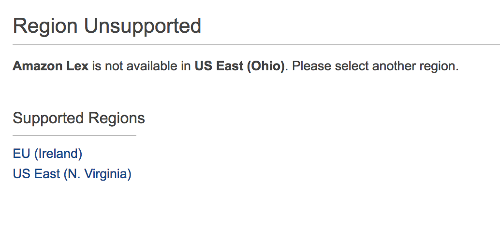

I click “US East (N. Virginia) and appear to have pleased the region police. I’m immediately greeted by a request to use my microphone.

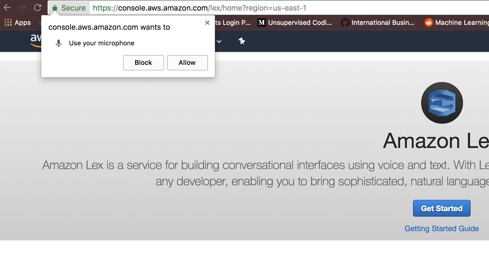

Personally, I think its a bit forward to ask for my microphone before I’ve built anything. In fact, other than click “Amazon Lex” and get into a region that allows it, I’m not even entirely sure I’ve created anything. But I click “Allow” so I don’t have issues testing later. Again, a little unsettling. Then I click the blue “Get Started” button, but not before opening the “Getting Started Guide” in another tab in case things get hairy.

Note — my Chrome tab showed a “recording” circle the entire time I was working on this exercise. I did have to click a microphone on the UI on and off for it to record, but my browser really wanted to me know that that particular tab had microphone access.

### Create Bot

After I click “Get Started” it looks like I’m actual ready to start building my Lex bot.

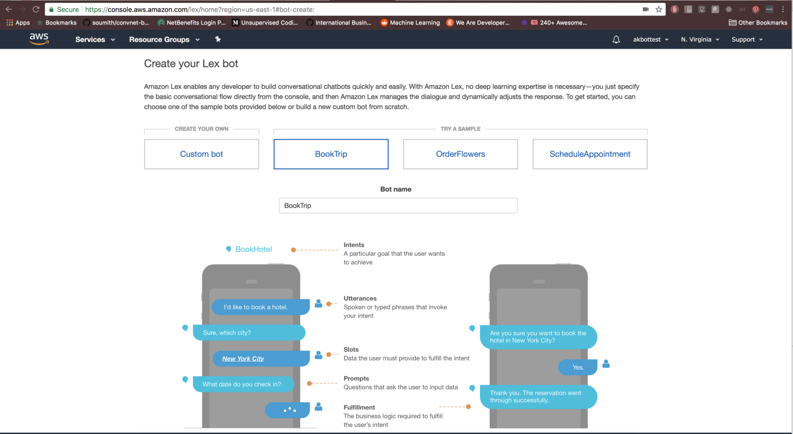

I get options to either create a custom bot, or use one of the samples. As I click each of the samples, I’m able to see the diagram below change based on what needs to happen in the dialog to complete the task (I’ll call this part of goal #2). More importantly, I see terminology like “Intents”, “Utterances”, and “Slots”.

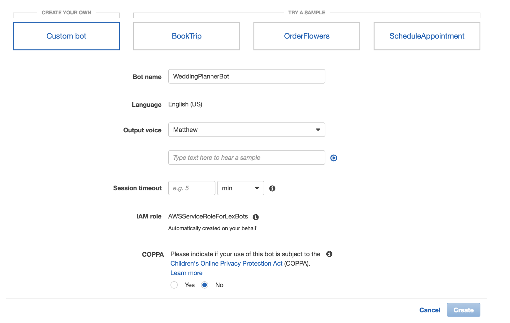

I would assume the little “i” icons out to the side would have given me some additional information on exactly what those items meant, but hovering and clicking did nothing.

Ultimately I choose to make my own by clicking the “Custom bot” box and then “Create” button.

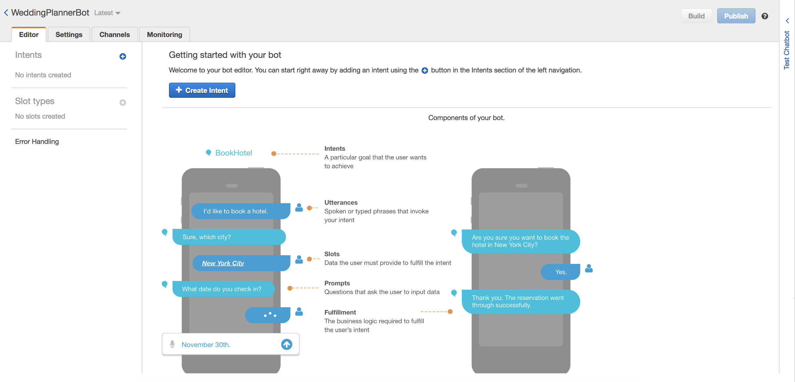

Now, this looks pretty familiar, but I notice on the side menu or view that I can create intents and slot types, no sign of entities. Interesting.

Let’s create an intent by clicking the blue “+ Create Intent” button.

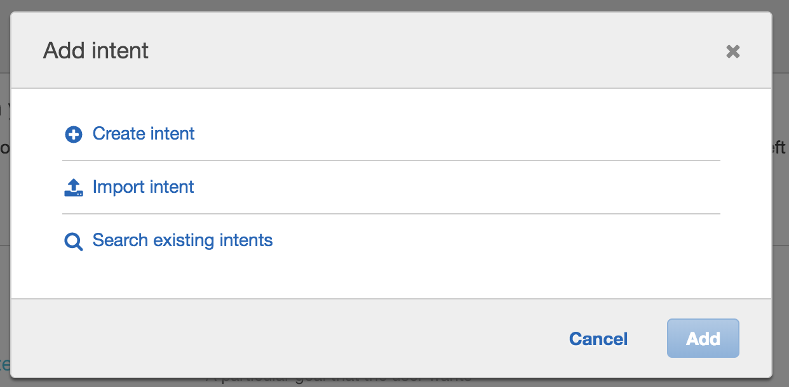

I know I’ll ultimately click “Create intent” but I clicked on each other others just to see what was going on there (Goal #1). “Import intent” is just a file chooser looking for a zip. “Search existing intents” sends me to a UI where I can search pre-built Amazon intents that look a lot like how I want to step the user through my intents in a dialog. I’ll keep that in mind.

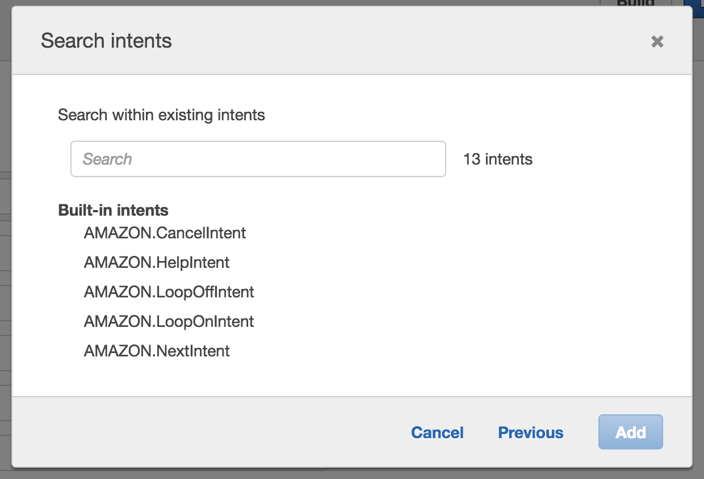

Back to creating my intent. I’m prompted to give it a name. It should not be surprising at this point that I call it “RSVP” and click the add button.

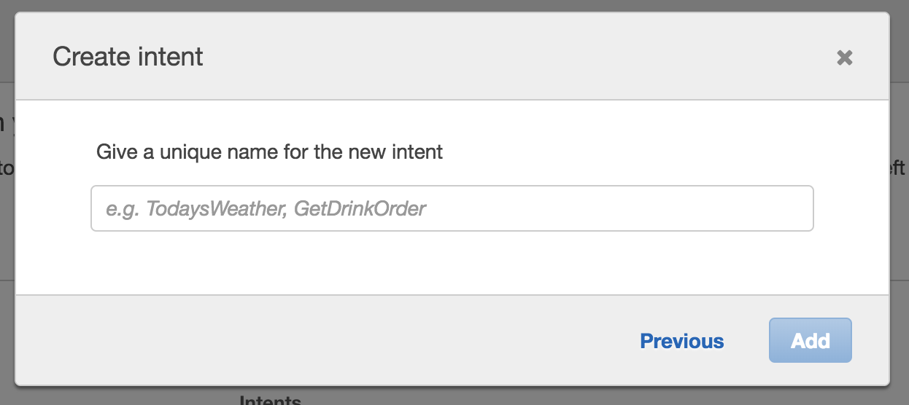

I now have my first intent created. Cool! Let’s make it useful. Again, the screen looks pretty familiar. I add sample utterances, which are the phrases my users will probably say. I don’t see any hints about the number I should add, but previous experience and other UIs tells me 5 or 6.

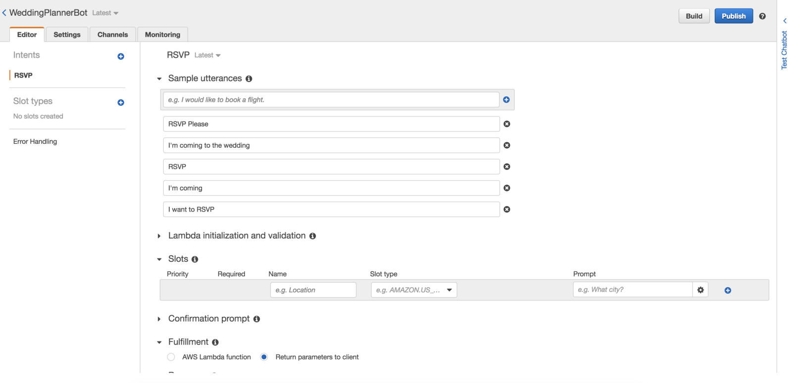

I know I want to leverage slots with my RSVP intent because I cannot expect my users to provide all the necessary information in one statement. This “i” lets me know this is the information the user would need to provide to fulfill this slot, so I know I’m in the right place.

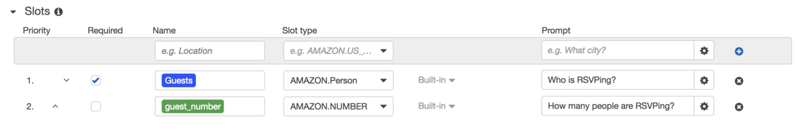

I see some pre-built slot types which I leverage for collecting the number of guests and “AMAZON.Person” which I’m hoping will give me the ability to identify names or pronouns or something useful.

I’ll need to create a slot type for dinner options. Amazon knows a lot about me, but I cannot expect them to know what I might be serving for dinner at my wedding.

Using the menu on the side under “Slot Types” I hit the blue + button.

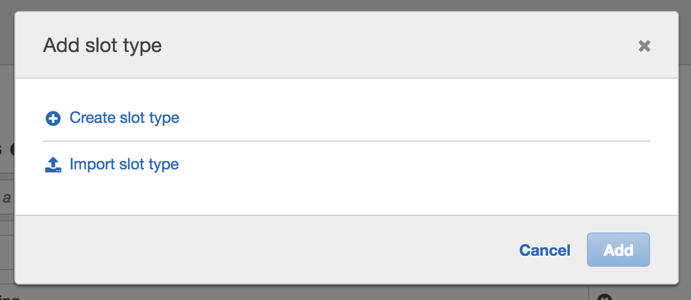

I walk through a set of modals that looks similar to adding intents. What appears to be slightly different is the “Slot Resolution” looks a lot like what other platforms describe as features of entities.

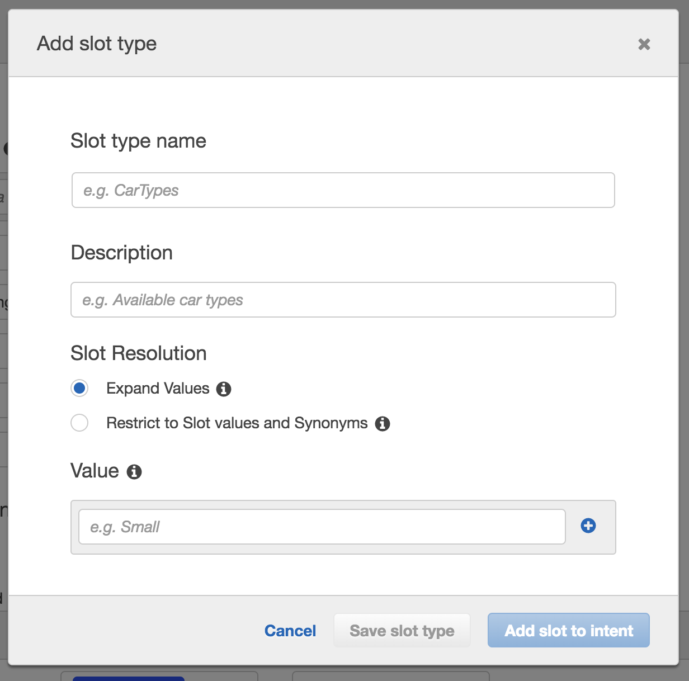

For my “dinner options” slot type, I know I want to restrict the slot values and synonyms because I have a finite number of things I’ll be serving and I’m not really interested in my guests suggestions of other options. Although there are use cases where I could see that being a great way to collect some user feedback!

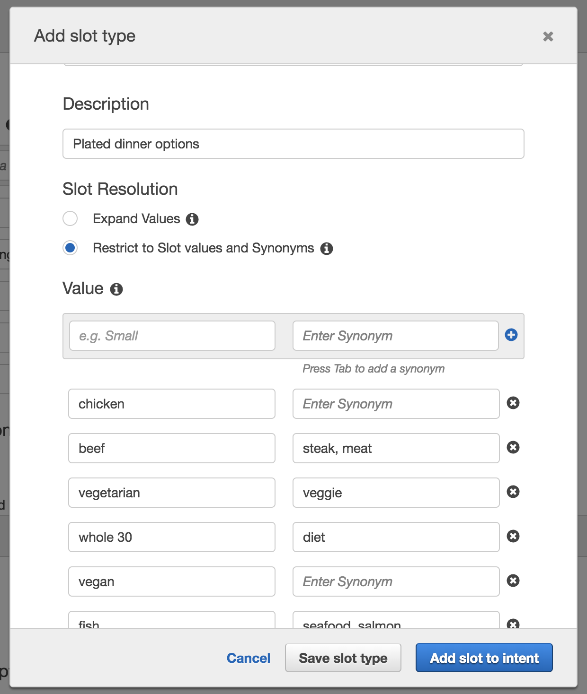

Once I’m done, I make sure to click “Add slot to intent” because I want to add it to my RSVP intent and that’s what I’m currently working with. I had to tweak the name because it auto added it to my slot as “slot three” which is super explanatory. /sarcasm

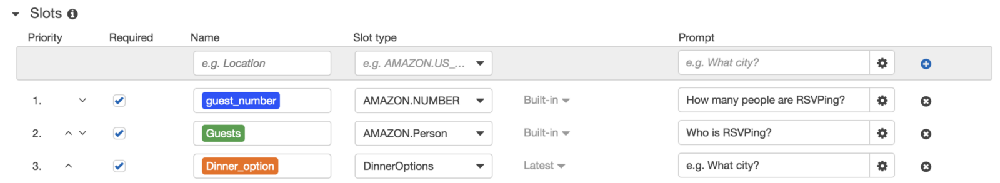

### Build Bot

At this point let’s get the bot ready to test. For Amazon Lex, it looks like we need to click the “Build” button.

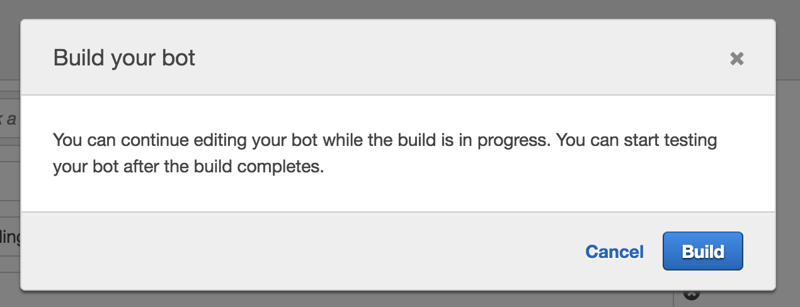

After you build your bot, you can test it in the window with either text or audio input. Click the microphone to turn it on, talk, and then click the microphone again to turn it off.

Which is exactly what I didn’t do initially so there is a rogue “yeah”.

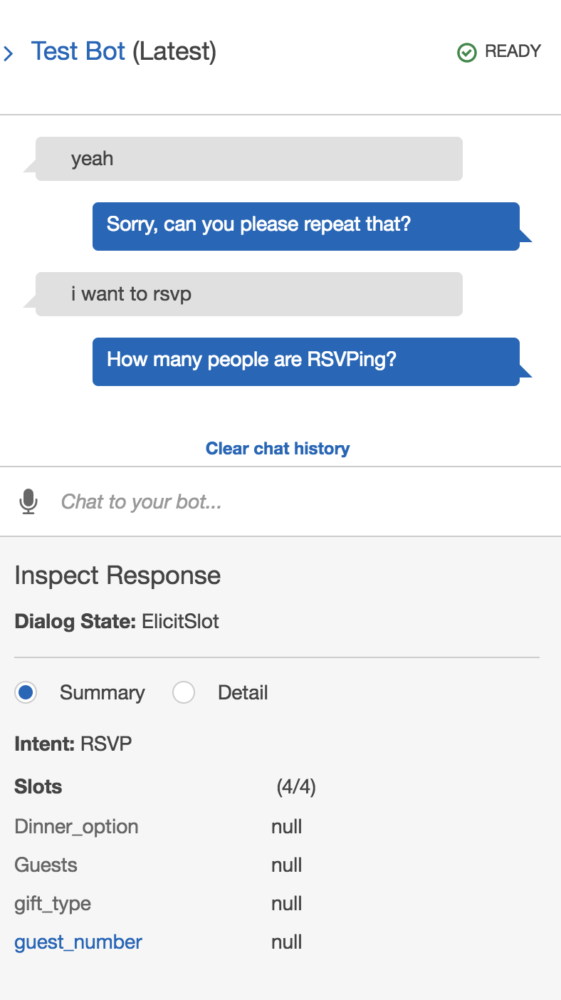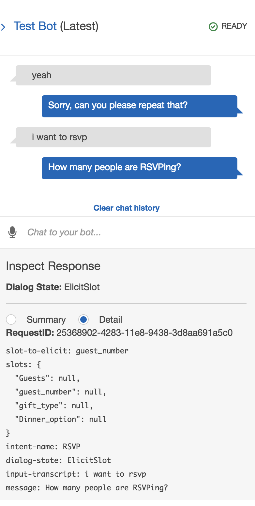

Excellent, it works and I’m able to see a brief summary or the detail (JSON structure).

### Save, Build, Publish

It’s important to note here that Amazon Lex uses save, build, and publish as distinct step in the bot building process. This can be a little confusing if you are iterating and wondering where your changes are!

**_Save_** allows you to save components of the bot (intents and slot types), but doesn’t allow you to test those changes. Saving versions the components, unless they are built-in.

**_Build_** allows you to test the changes made prior to the build button being hit. Before you build your bot for the first time, you will notice you are not able to test it.

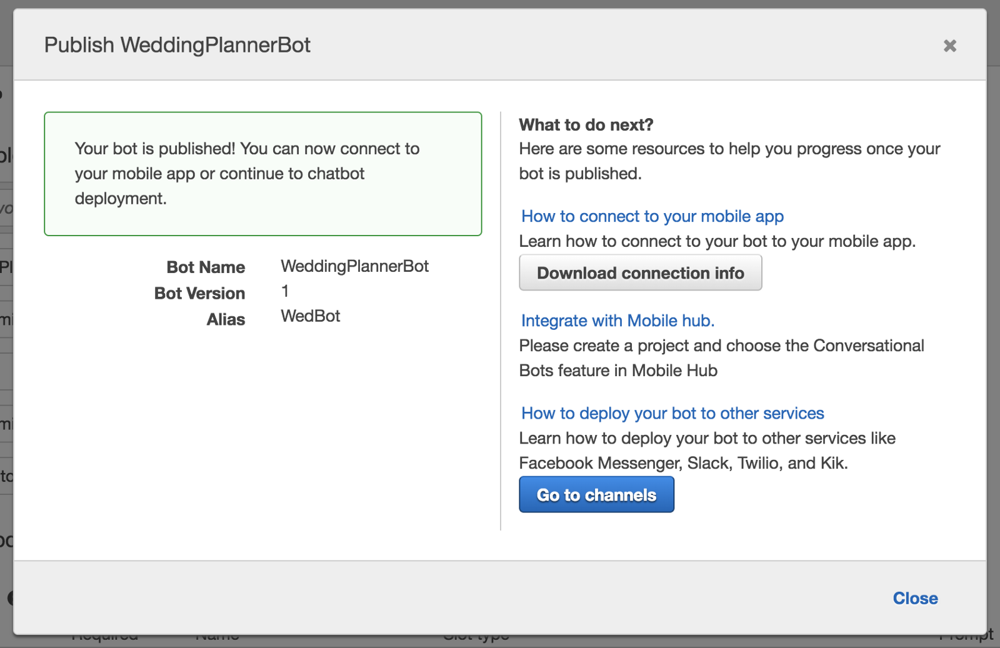

**_Publish_** preps the bot for being ready to use in the wild. From here it looks like we can get to an SDK and the Mobile hub, so goal #3 is met too. I see that we can deploy the chatbot to channels or services like Facebook Messenger and Slack. Let’s take a closer look at that.

### Deploy Channels

Deployment channels appears to require some config, which is goal #4 (ish).

Why did I make this a separate section? Maybe to highlight that the deployment options are available, but the selection is somewhat small compared to the other platforms.

What isn’t explicitly obvious from the UI is how you would tie this into an Alexa Skill. I’m going to leave [this](https://aws.amazon.com/about-aws/whats-new/2017/09/export-your-amazon-lex-chatbot-to-the-alexa-skills-kit/) as a follow on exercise after a quick search.

### Wrap Up

Amazon Lex feels like Dialogflow with a few slight modifications. What is interesting is how it feels somewhat decoupled from the rest of the Amazon ecosystem, at least as far as deployment is concerned.

It also felt a little more programmatic and developer oriented than design oriented, particularly with the buttons to save, build, and publish. Platforms like Watson Assistant save automatically. Dialogflow and Watson Assistant both train when they need to, not when the chatbot builder presses a button.

Again, slightly different than the others but nothing too outrageous that had me waist deep in the docs.

---

For reference, I’ve been building chatbots with Watson for about 6 months now, on and off. I built this agent in Amazon Lex, based on a previously designed bot example, in about 20 minutes.
