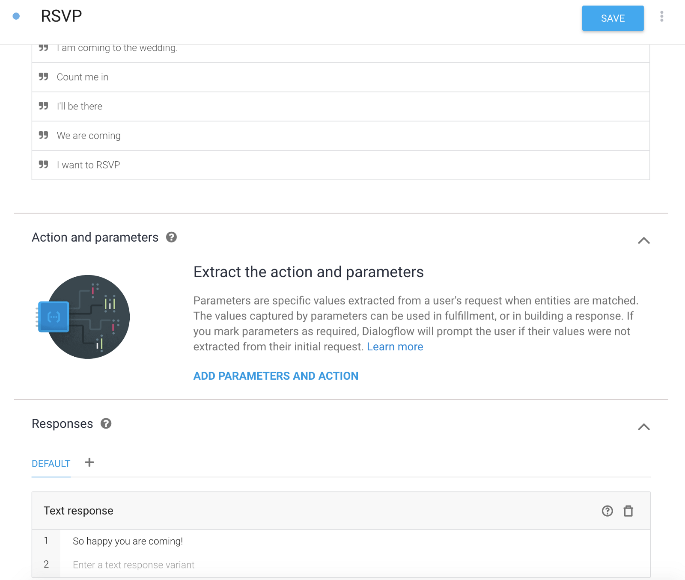
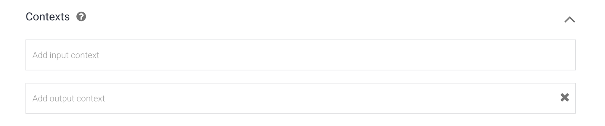

## A Chatbot on Every Platform feat. Dialogflow

In case you missed my first post, I’m building a [Chatbot on Every Platform](https://medium.com/@MissAmaraKay/a-chatbot-on-every-platform-fe09ebd8e95e)! Often I’m asked what the technical differences are between chatbot platforms and frameworks, so here I am embarking on a journey to learn (and share!) exactly that. Dialogflow (formerly known as API.AI and part of the Google family) is on deck.

You will see me make references to previous experience (or my mental model) as I work with each of these platforms and frameworks. I will try my best to not reference one being better than the other, or one having better features than the other. But I will be sure to point out any pain points or issues I have.

If you are hoping the series culminates in me picking a “winner”, you should keep searching. I am not pitting these technologies against each other. My main goal is to see if I can take chatbot knowledge learned on other frameworks and platforms and apply it as I move from one to another. This should help me create future workshops, tutorials, and other material, particularly for developers who have experience with chatbot platforms but maybe not Watson Assistant. It is all about understanding possible pre-existing mental models when developing technical content.

### Let’s dive in!

I realize I should identify a few goals or things I am specifically looking for as I kick off bot building with Dialogflow.

1.  I want to be able to build my [Wedding Planner Chatbot example](https://github.com/akeller/Chatbots/blob/master/weddingplannerbot.json), with at least one intent to “RSVP”. This is essentially the fundamental task I need to perform on every framework while exploring the terminology for potential inconsistency.
2.  I want to see if there are pre-built domain specific examples I can tweak. This is a bonus, but intriguing for enterprise customers looking for reuse possibilities.
3.  Does it get exposed as an API? Can I use webhooks or call third party services?
4.  How do I deploy it somewhere or use it? One-click deploy?

Now that we are mostly on the same page, navigate over to [Dialogflow](https://dialogflow.com/) create an account and go to the console.

Looks like I need to create an agent to get started, but it also looks like I have links to docs and forums in case I get lost or confused. I clicked the blue “Create Agent” button.

### Create Agent

Creating an agent felt pretty standard, fill out the form and hit create — although the form elements were a little confusing. Some where text boxes (just lines) and some where drop downs which I’m sure I would get used to over time.

Cool functionality to point out here is the default languages and the ability to add other languages later.

If you have worked with other Google APIs or platforms, you may see them listed under the Google Project dropdown. In the above screenshot you can see I have two projects, which I know are both from Google Maps based apps I made previously. In this case, I created a new Google project since it made the most sense to not associate if with any of my existing projects.

### Build Intent

A core component of chatbots is intents. Clicking on the Intents item in the menu, you can see any existing intents which in the screenshot above just include the default fallback and welcome intents for now. I get a button and a link to create intents (goal #1), as well as links to more information on intents and **_DING DING DING_** a link to prebuilt agents (goal #2). Two-for-one goal meeting!

Now to actually create an intent — RSVP to help a user respond that they are coming to my wedding!

I figured out how to name it at the top, but I have a number of options I needed to dig into. Since I’ve previously created a bot in Watson Conversation (now Watson Assistant), my mental model had me looking for the ability to specify user examples, or training phrases as indicated by the Dialogflow UI.

Click the link to “Add training phrases” and the section opens. Since I am recreating a bot where I only accept positive RSVPs, you can see all the training phrases are some sort of affirmation.

Now that my bot knows what to expect for this intent, I need to add a response which is another section on the intent. I added a simple, single response at this time, but saw that I had the ability to add more but also set this particular intent as the end of the conversation. This is helpful if I have a dialog with a definite end point.

At this point I have a very basic RSVP intent with a defined response after hitting the blue “Save” button at the top.

### Define Entities

Now in the RSVP process, I want to be able to capture some relevant information like what plated dinner option my guests may want. This is a great example of where you would want to use entities, which is the option just below intents on the menu.

Creating an entity allows you to define expected items, including synonyms. I gave mine the name dinner\_options.

In my screenshot, you can see some items have synonyms and some do not. When I felt like all the options I was looking to capture were defined, I click the blue “Save” button at the top.

### Enhance the RSVP Intent

Using my newly created entity, I want to be able to identify the dinner option the guest chooses during the RSVP intent as well as capture some additional information like number of guests and maybe whether or not they are bringing a physical gift or card.

Between the training phrases and responses there is a section for Action and parameters” which looks like it will handle this nicely. I click the “Add parameters and action” link.

This looks very similar to the Watson Assistant slot functionality, which is what I was expecting to find. I want to be able to complete all the RSVP tasks within the same node or intent. Let’s see if I can do that.

As I was filling in the first parameter, a new field appeared at the end for “prompts” which is exactly what I expected.

I’m able to create required and not required fields, which is how I want to collect this information. If someone without a prompt lets me know about the gift type, I can have the agent response to hopefully influence the user to not bring a physical gift and, rather, send it to my home address.

Syntax for entities is the same as Watson Assistant, using @ to denote an entity value. I was also pleasantly surprised to see system entities, and a number of options for each!

I do want to save the values into a context variable, but I noticed a “context” section in the intent that I may need to define my context variables first. Also, when I’m clicked on a parameter item, a … menu appears and I’m able to specify things like a default value. For dinner\_option I set the default to “chicken”.

### Defining Context

Back to the top of the intent, I see the first section should give me the ability to create some context variables.

I click “Add Context” and a very simple section appears.

But what do I put in here? I think I want to collect input based on my action and parameters, but I also want to output them in case I need to reference them in other portions of the conversation. I find out later, this logic is half correct.

Now if I go back to the action and parameter section, I would expect to be able to add these names to the value column. Note, the number out in front of each output context is a lifespan for the context variable and was autogenerated.

### Testing

I should have been testing the intent as I was building it, but I didn’t. And sure enough, this is where the frustration started. I saved my intent, let the agent train, and then tested it out.

That’s not right. It’s hitting the fallback intent. Now this has happened to me before in Watson Assistant, so I try to find a way to train the agent that this is the incorrect intent. In the menu I find a “Training \[beta\]” item. I go through an specify the RSVP intent for each. I also had to specify that “Hi” should be addressed by the Default Welcome Intent. I click the blue “Approve” button and let the agent train again.

To my utter confusion, the agent continues to respond with the Fallback Intent… and the training UI shows I have a bunch of unmatched again. So I assign them back again.

Testing after the agent trained showed it was continuing to fail. What was going on?

Eventually I opened the [docs](https://dialogflow.com/docs/getting-started/building-your-first-agent).

### Troubleshooting & Changes

Scrolling through the basics of pulling together an agent I gain a few insights.

Context variables need a $ in front of them, so I made changes to the actions and parameters table. (Tested this, still stuck.)

My context variables are output only, not input. I was thinking input as the user input, but really input context is the input from previous intents or previously collected data.

If this is the first thing my user has done regarding anything to do with the RSVP task, they won’t have RSVP based information (unless maybe they are modifying an existing RSVP but that’s a little too complex for this example).

Saving the intent, I tested again. And it worked!

I could also step through the questions and fill in all my parameter values!

Well, even though I tried to give it a list of guest names, it only took the first one, which is not quite right but it is showing up as a list! This is fine for now, so let’s see what we can do now.

### Integrations & Deployment

It looks like we have some options here.

I have a menu option for Integrations that looks like one-click deploy to a variety of platforms, which is pretty neat. (goal #4)

Want a web app demo? Toggle on and POOF!

You can also embed the web demo into another page, and the snippet of code to do it is provided.

I also saw under “Fulfillment” on the intent I created, I have the option to call a third party service straight from the UI (via webhook) which gets me out of building a wrapping application that consumes the chatbot backend. (goal #3)

There are also a number of [SDKs for V1 and V2](https://dialogflow.com/docs/sdks) with more info over in the docs.

### Wrapping Up

Dialogflow meets all the goals I set before I started this journey. Most of the terminology was fairly consistent from Watson Assistant, but the UI didn’t always make it clear what was valid before saving the component. The docs and forums linked directly from the dashboard which ultimately ended up saving me when my RSVP intent didn’t want to work.

I would have appreciated a little more obvious training icon/notification than the spinning cog. As I was troubleshooting my issue with the intent, I was focused on exactly the opposite side of the screen from where the cog was spinning. Sure, there was a toaster pop notification at the bottom of the side when training started and stopped, but depending on the extent of the change I may try to test the agent while it’s training. This is me just being picky.

The account and service is free. I don’t remember putting in a credit card which makes me interested in continuing to play around with Dialogflow. This makes me happy and feel less nervous as a developer that I won’t wake up to a mystery bill.

Lastly, I did see an option to import/export the agent as a zip (hit the cog to access your settings), generating individual json files for each entity and intent.

This is slightly different than I was expecting as Watson Assistant gives you one big json file (or CSVs when working with just intents or entities). So I’m curious to see how other platforms handle this.

I can’t exactly build a bot or agent in Watson Assistant or Dialogflow and move back and forth between the two, but I can use knowledge from either platform to get up and running fairly quickly.

---

For reference, I’ve been building chatbots with Watson for about 6 months now, on and off. I built this agent in Dialogflow, based on a previously designed bot example, in about 30 minutes.
