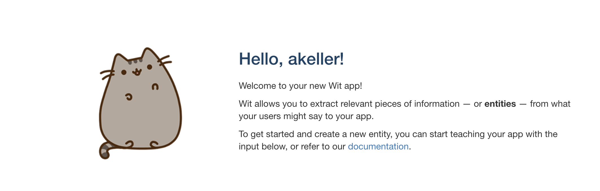
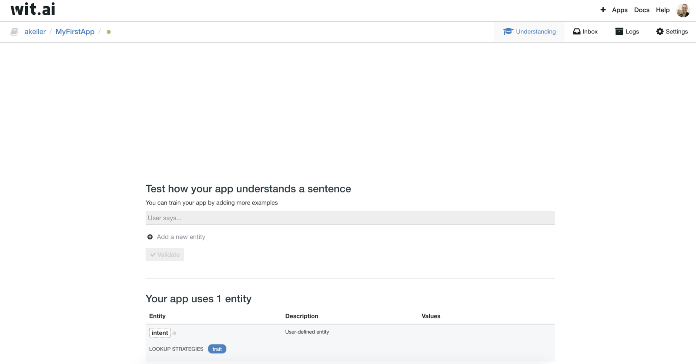
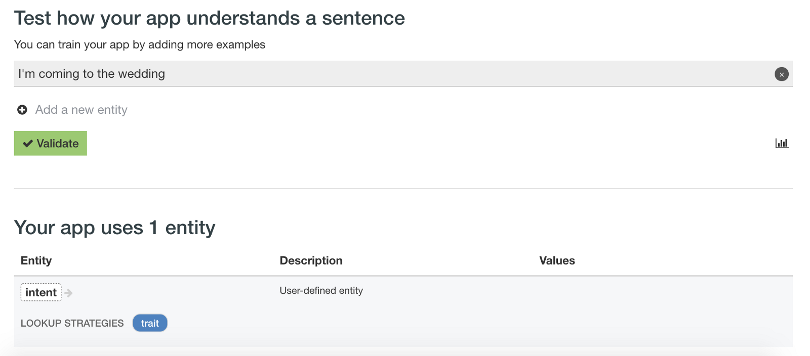
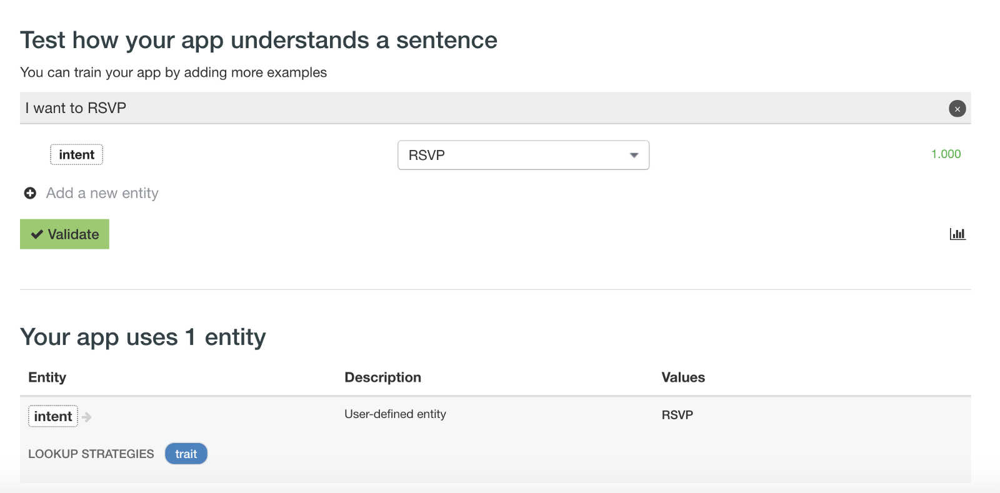
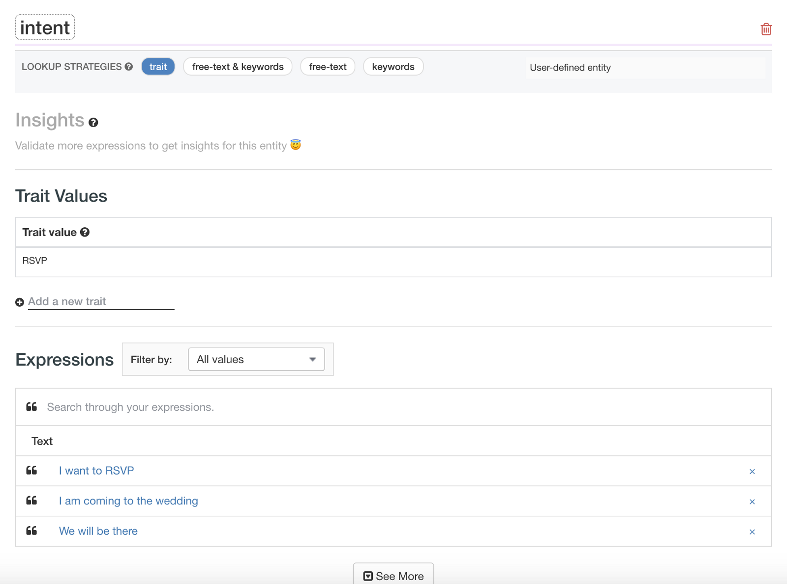
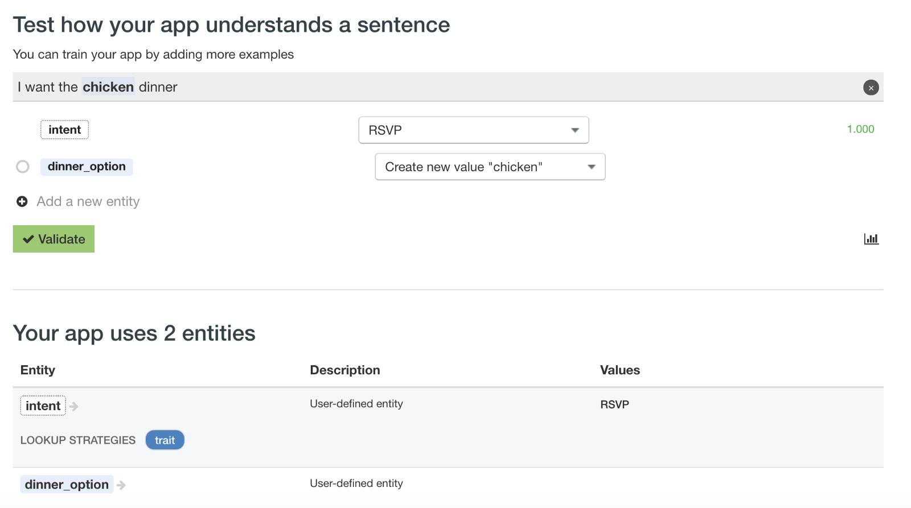
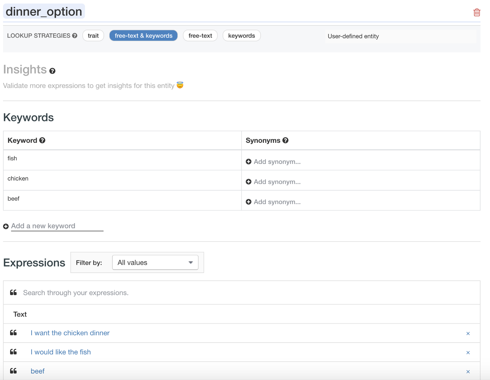

Need some context? Check out the [intro](https://medium.com/@MissAmaraKay/a-chatbot-on-every-platform-fe09ebd8e95e), the [first blog on Dialogflow](https://medium.com/@MissAmaraKay/first-chatbot-experience-with-dialogflow-61c5786c11e4), the [second blog on Azure](https://medium.com/@MissAmaraKay/first-chatbot-experience-on-azure-abeac3c410f7), or the third blog on [AWS](https://medium.com/@MissAmaraKay/first-chatbot-experience-with-aws-amazon-lex-677b63e35c70).

Same exercise, different platform. So same goals, but let’s recap:

1.  I want to be able to build my [Wedding Planner Chatbot example](https://github.com/akeller/Chatbots/blob/master/weddingplannerbot.json), with at least one intent to “RSVP”. This is essentially the fundamental task I need to perform on every framework while exploring the terminology for potential inconsistency.
2.  I want to see if there are pre-built domain specific examples I can tweak. This is a bonus, but intriguing for enterprise customers looking for reuse possibilities.
3.  Does it get exposed as an API? Can I use webhooks or call third party services?
4.  How do I deploy it somewhere or use it? One-click deploy?

### Before Beginning

I wrote this blog like 3 times at this point. I was having a really hard time navigating the UI in a methodical way and then articulating that in blog form. If Wit.ai is interesting to you, I highly recommend just reading all their documentation and looking at their recipes FIRST — they include gifs which make more sense than screenshots for this platform. I’m still not entirely sure this will be as comprehensive as the other blogs in this series.

### Getting Started

Signing up was pretty much GitHub or bust, which is great if its going to create a repo and save my source there. No idea if it will at this point.

You give your app a name and then you pretty much hit the ground running.

Maybe its just me, but my brain had a really hard time understanding this UI and making it work.

Obviously I want to create an intent with some user examples, but as I started typing a sentence and a green validate button appeared.

So I clicked that, and I’m not sure where it went or what really happened.

### Maybe Read the Docs Then Build An Intent

I pulled up the docs and found some recipes, including one that looks like what I’m trying to do: [https://wit.ai/docs/recipes#categorize-the-user-intent](https://wit.ai/docs/recipes#categorize-the-user-intent). Of course, it looks like I was doing something slightly wrong.

Following the instructions I was able to create an RSVP intent, so I decided to give it some more examples by repeating the same set of steps in the link above, but this time the intent and value auto-populated. Now I hit “Validate”.

Cool, this seems to be working!

I click “intent” to see if it shows any more information on this particular intent, and it does! I can see all the phrases I entered. Goal #1 complete.

Some of the information on this screen is till confusing though, like the lookup strategies shows “trait”. After reading through the docs, I see “it is called a trait entity when the sentence as a whole means intent=weather instead of one particular word”. I think this makes sense for my use case as a user may intend to RSVP but not necessarily use the exact word.

I’m also not sure what a trait value is, or why I would want to enter another. I think this is where I really, finally, understood what was happening.

### Everything is an entity

In Wit.ai, everything is an entity. This means when defining intents, you are really defining a special kind of entity that will fold your intents. This also means that the trait value is really an entity value.

How is this beneficial? Well, I’m still not really sure because this is quite different from my previously shaped chatbot building paradigm. What it does allow you to do is define intents and synonyms for the intent all within the same entity. I’m thinking this would be a cleaner implementation? That’s a question because I’m just a little uncomfortable with how this works.

### Keyword Entities

Heading back to the top level of the app, let’s figure out how to collect the information that we need as part of the RSVP process.

[Keyword entities](https://wit.ai/docs/recipes#extract-a-keyword-entity) appear to give me the same functionality as what I would have previously described as just a plain old entity on any other platform.

While I was creating the keyword entities, I did see a few options for pre-defined entities like age of person, duration, distance, email. We’ll call this sort of goal #2, even though I didn’t see a domain specific example you could drag in and modify. It’s nice that I won’t have to build something looking for email, for example, on my own.

I added a few more dinner options and clicked the entity at the bottom, just like I did with “intent”.

I can see my keywords and the ability to enter synonyms. In the expression you can also see I decided to not enter a full sentence and then highlight the keyword, but rather just enter the exact word. I’m not sure if that’s going to hurt me in the long run, but it worked.

### Integration

I was almost surprised to see a few options around integrating Wit.ai, including official clients like Node, Python, and Ruby.

[**Wit - _Recipes_**  
Recipeswit.ai](https://wit.ai/docs/recipes#integrate-into-my-app "https://wit.ai/docs/recipes#integrate-into-my-app")

My assumption was integration would only happen through Facebook Messenger, which does appear to be an option as well.

No option appears to be one-click deploy. So I’m going to give it goal #3, but I’m not sure about goal #4. There are options, but no real prescriptive guidance (and Facebook Messenger is constantly changing the config necessary to get your bot up and running). I’ll give it half points for goal #4.

### Summary

I couldn’t really test the chatbot within the Wit.ai interface, which was a bummer. I didn’t really want to budget the time to connect it to Facebook Messenger just to test it out. Facebook Messenger is not the easiest to configure and get going. Among other things you need a Page, which means your bot isn’t just a bot its treated more like a business. I tried it once and ended up giving up because unless I released it into the wild, I was the only one that could talk to it. Bummer.

I think you can build a simple chatbot with Wit.ai and maybe something special happens when you combine its powers with Facebook Messenger, but if felt like a lot of clicking and confusion to really build anything. I’m not sure how much I can stress reading the docs and watching the gifs in the docs whether you have chatbot experience or not. The UI, at least in my opinion, isn’t really going to hand hold you through the process.

---

For reference, I’ve been building chatbots with Watson for about 6 months now, on and off. I built this chatbot in Wit.ai, based on a previously designed bot example, in about 2 days (1 day for reading and studying the docs!).
