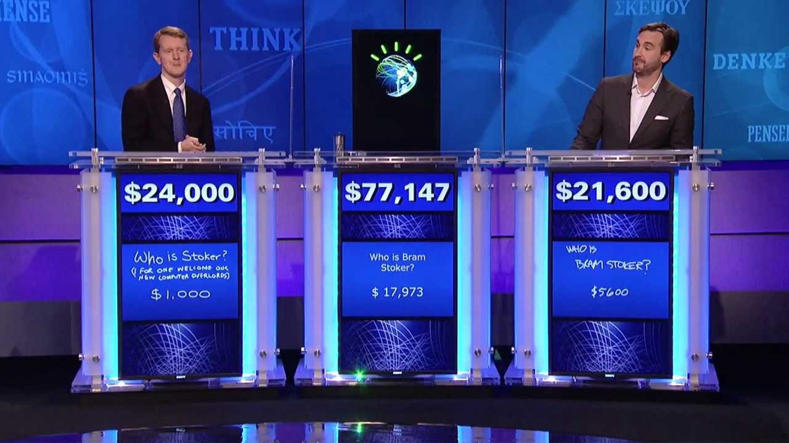

I’m celebrating about a month and a half of being an IBMer, and so far its going great! Like any new job, I was initially overwhelmed by just about anything and everything and now I’ve finally stepped out of that fog (not to be confused with San Francisco’s [Karl the Fog](https://medium.com/@karlthefog)). I have a couple talks coming up and I’ve been trying to just absorb as much information as possible to prepare. Eventually, I’ll host some workshops, so if you are in the Bay Area, stay tuned for those!

I want to introduce you to Watson and what I’ve been working on from the perspective of someone who is new to IBM, new to Watson, and new to this cognitive computing thing. I haven’t had time to get the “marketing pitch” from the Watson folks, so this is my way of thinking about it. At times I may oversimplify things, but I hope to arm you with enough information to know where Watson fits in this AI landscape. So, if you were looking for an academic dissertation, this is not it.

#### Who Are You?

One of the big things I knew I needed to tackle as early on as possible was Watson. I’ve been in analytics and AI for about two years now, but I have never quite understood the cognitive label applied to Watson, let alone what Watson can actually do. I know Watson is a great Jeopardy player, but what else? Do I need to be an enterprise customer to benefit? So here are some of the things I’ve learned so far.

Cognitive computing feels like the gentler introduction to mainstream AI, where the robots steal away all our jobs. Cognitive is going to focus on assisting humans to do their job better with natural language processing (NLP) and machine learning. For example, a doctor can’t possibly remember (or have time to read) every article on a specific disease, but a machine learning model can parse through the information and offer the most relevant articles. A doctor types in some keywords or a phrase in plain English, and the system uses NLP to query. This kind of use case has a very natural fit with Watson. And I think this is a lot less scary than having a computer, alone, give you information on a specific disease. We’ve all done web searches and ended up on WebMD thinking that pain in our side is cancer when really, it’s probably not. Pair a domain expert, like a doctor, with NLP + Machine Learning, like Watson, and now you are making educated searches.



Watson is many things, but for most developers new to Watson, it’s simply a set of APIs that make it easy to incorporate things like visual recognition, conversation, empathy, speech-to-text, text-to-speech, and other services to enhance applications with a REST call. Think pre-trained or fine-tuning, if you speak AI, exposed as a service. Grab credentials (no enterprise background needed!), make a REST call, and you are up and running. I find one of the easiest ways to learn is through hands-on experience, and luckily I got the [opportunity](https://medium.com/unsupervised-coding/tjbot-introduces-me-to-iot-watson-services-a8b6904e325e) through TJBot and Node-RED. Check out my coworker [JeanCarl Bisson](https://medium.com/@jeancarlbisson)’s blog [series](https://medium.com/@jeancarlbisson/how-to-train-your-tjbot-in-node-red-88bfb3bbe0ab) as he walks through step-by-step training TJBot using various Watson services.

Watson is also a set of platforms. Watson Knowledge Studio gives the ability to annotate text documents to build a model. This gives domain experts without a technical background the ability to identify what information is needed in a given document. Watson Discovery, while available through an API, is a platform for gaining insights from data — bring your own or use Watson Discovery News to query against a large data source. I’m digging more into the Discovery News offering too.

Watson is even a domain expert in healthcare, finance, and probably other things too. But I’m not quite there yet. So, when you see those commercials with [Watson under an airplane](https://www.youtube.com/watch?v=IdUEda1seoA) or [Watson predicting the weather for your wine](https://www.youtube.com/watch?v=7dSPP5hDs10), think domain expert in the making — not, “LOOK MOM A ROBOT IS TAKING MY JOB!” Jeopardy Watson falls into this category as it was a domain expert in Wikipedia.

#### Nice to Meet You!

So, what have I been focusing on? Well, a couple of things. As part of the San Francisco City Team of developer advocates, we need to be somewhat well rounded in a variety of technology as well as pick some specialties that we dive a little deeper on. I’ve been attending my coworkers’ presentations and meetups to try to get more experience with overall IBM efforts for developers.

One item I’ve been working on is new content for Watson Discovery News, a data set within Watson Discovery that is pre-enriched with cognitive insights. If you are interested in news trends or alerts, this becomes very powerful very quickly. Get 300,000 new articles and blogs, updated daily. No need to crawl the entire internet. There isn’t a ton of developer specific information out there on the web for Watson Discovery News (most of it is just lumped into Discovery, confusing for beginners), which is why I’ve been working on it! When it goes live, I’ll update this blog with a link to the developer content.

But for now, I’ll give you a sneak peak. You can query Discovery News with Natural Language or Discovery Query Language. Here’s an example of a URL I’m using to perform a simple GET:

```
https://gateway.watsonplatform.net/discovery/api/v1/environments/system/collections/news/query?version=2017-08-01&count=5&natural_language_query=IBM
```

If you have valid credentials for the Tone Analyzer API, this will return a JSON response of 5 items relevant to the search term, in natural language, IBM. If you don’t have credentials and want them, [check it out](https://www.ibm.com/watson/services/tone-analyzer/) (or log into your Bluemix account and create a Discovery service).

Or you could get a little more complex and query for the top 10 companies with the positive sentiment (greater than or equal to 0.8):

```
https://gateway.watsonplatform.net/discovery/api/v1/environments/system/collections/news/query?version=2017-08-01&count=&offset=&aggregation=nested%28enriched_text.entities%29.filter%28enriched_text.entities.type%3A%3ACompany%29.filter%28enriched_text.entities.sentiment.score%3E%3D0.8%29.term%28enriched_text.entities.text%29&filter=&passages=&highlight=true&return=&query=
```

The extra junk in there is escaped characters, but it’s mostly human readable. Keep in mind, the version number is required. Also keep in mind you want to be as specific as possible with your queries for the sake of your sanity.

#### Tell Me All Your Secrets!

Another focus item is a demo app using Watson’s empathy with the tone analyzer service. One of the most time consuming things I’ve worked on so far is hiding all the secret keys/tokens in the existing example so when I share my screen in front of a TON of people, no one takes my API keys. If you are building an app on Node.js this is a no brainer. I use [dotenv](https://www.npmjs.com/package/dotenv), but there are a number of similar open source libraries and packages out there that do something similar. So now I can do this:

```
var dotenv = require('dotenv').config();

var consumer_key = process.env.CONSUMER_KEY;
var consumer_secret = process.env.CONSUMER_SECRET;
var access_token_key = process.env.ACCESS_TOKEN_KEY;
var access_token_secret = process.env.ACCESS_TOKEN_SECRET;
```

I have a _.env_ file with a bunch of secrets in it that I make sure to add to my _.gitignore_. This is a production-worthy exercise if implemented correctly. If you are storing your secrets in plain text in your code, and storing your code on GitHub, you might as well have posted your secrets on Twitter.

You’ll notice that has nothing to do with the actual Watson service or the service credentials. But I wanted to make a point that the hardest part of using the tone analyzer service (for me) was hiding the secrets (in code the someone else started). With my secrets hidden, I can do this:

```
var client = new Twitter({
 consumer_key: consumer_key,
 consumer_secret: consumer_secret,
 access_token_key: access_token_key,
 access_token_secret: access_token_secret
});
```

I grab my tweets, send them to my microservice (PubNub) to call the tone analyzer, analyze them for … wait for it… tone, and then send it back a tone score for the tweets. And more importantly, I can demo to a crowd of thousands and not expect to get my API limit cut off. Get your own API keys!

I’ll do a more in-depth technical post when I’m done with this. Here’s the repo, WIP: [https://github.com/akeller/brandcomp-reboot](https://github.com/akeller/brandcomp-reboot)

#### Talk to You Later

Watson isn’t the only thing we are covering within the advocate teams across IBM. It just happens to be the biggest because Watson is many, many things.

If you are a developer looking for a visual recognition service, I recommend checking out Watson Visual Recognition. It gets you up and running without having to roll your own model, which is huge if you want to identify something Watson has already [classified](https://www.ibm.com/watson/developercloud/doc/visual-recognition/customizing.html#default-classifier-categories). Really, any of the Watson APIs are probably really good starting points, but it’s obviously up to you and the problem you are trying to solve.

Thanks for hanging in there as this post was a little all over the place, but its a pretty accurate representation of my day-to-day in the office context switching between APIs and events.
