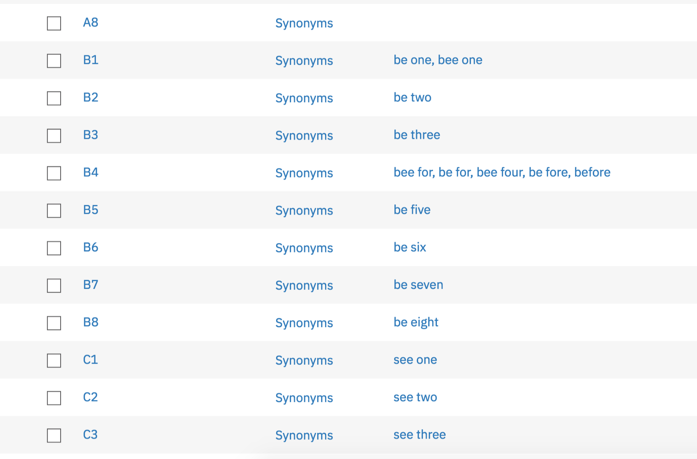

## When Watson Speech-to-Text Needs a Little Help Understanding Your Domain

 on [Unsplash](https://unsplash.com/search/photos/game-board?utm_source=unsplash&utm_medium=referral&utm_content=creditCopyText)](./asset-1.jpeg)

I have been building a Unity side project with a teammate across the pond using Watson Assistant, Speech-to-Text, and Text-to-Speech to play some virtual reality chess. With most of the basic functionality done, we noticed a little problem — Speech-to-Text just didn’t understand us when we referred to spaces on our grid, a fundamental part of our project. Instead of hearing “B4” it hears “be for”. In some cases it hears things that aren’t even English like “de for” instead of “D4”. And in between all this Watson, and my neighbors, are hearing me yell “COME ON” so we need to fix this as soon as possible.

### The Options

At first I thought I would just add synonyms to all the entity values for the entire grid. This wouldn’t exactly fix how Speech-to-Text was hearing us, but it would somewhat correct what Assistant was understanding. This was the route that would keep our project in the free tier of services but it would be annoying to maintain.

I ultimately decided it would be a good opportunity to build a [Watson Speech-to-Text Custom Language Model](https://console.bluemix.net/docs/services/speech-to-text/language-create.html#languageCreate), a feature available in the Standard tier of service, which is fee based. This would allow us to customize how Watson should expect to hear our grid space names and what to write them as. So if Watson hears “be for” we want it to understand or write “B4”. I thought this might be the more maintainable way to share our project in the future. We would still get all the goodness of the original model, but now we can reliably detect grid coordinates.

### The Implementation

I guess I thought building a Custom Language Model was going to require a ton of effort on my part. Once I understood what was going on, it was a 4-step process.

1.  Create custom language model, return a customization id
2.  Add custom words (from object)
3.  Train customization
4.  Use customization id to hit new model (not shown in below gist/snippet)

<Embed src="https://gist.github.com/akeller/4c45ab3fd4438667010c47f7f604d556.js" aspectRatio={0.357} caption="" />

You’ll see some pretty verbose references to things like “words” because our use case involves both Speech-to-Text and Text-to-Speech, and each contain their own “words”. This was a pretty good indicator that I may need to create a similar model for Text-to-Speech, but I haven’t looked closely at it. Plus Text-to-Speech is just regurgitating what my Assistant output text field says, which doesn’t include an example of making a reference to a grid space… yet.

What I cannot stress enough is how long it takes after each of these API calls is initiated for the model to be back in a ready state. Each one of the four steps requires the model to be in a pending state for some length of time. In the above gist (and in the Watson SDK for Unity) you will see a wait added to check the customization status to see if its ready.

### The Recommendation

Because of how long each step takes, I recommend you don’t actually include this code exactly in your experience. I recommend you create and train your model separately, outside of your core codebase, and just reference your customization id to actually use the model. Running the model is roughly the same speed as running the out-of-the-box model. Of course, if you are training on the fly because you are adding words as you go, you’ll absolutely need to figure out a way to wait for the model to be ready without punishing the user.
