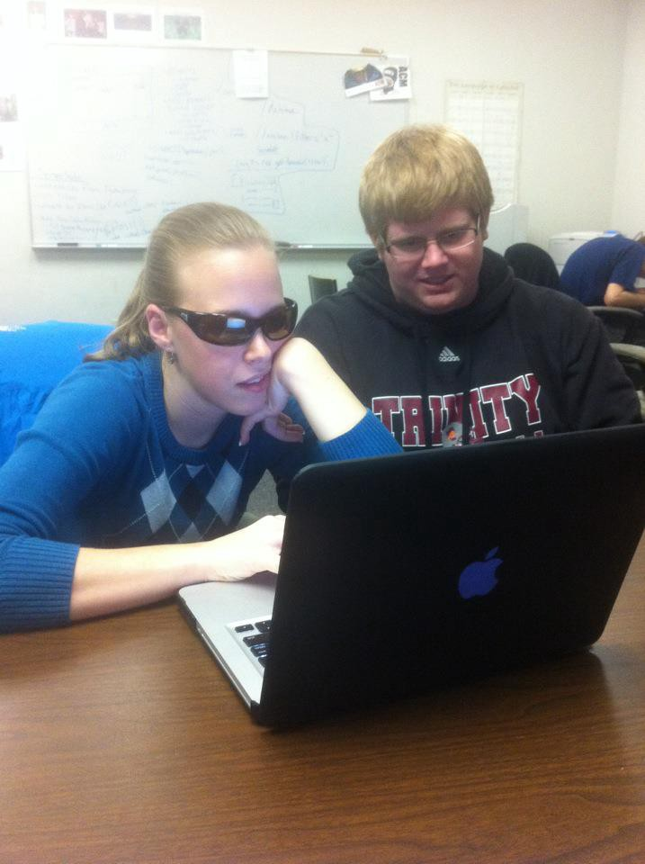

This post is going to be slightly different from others I’ve written, but just as important. You don’t have to be a developer advocate to learn something, but that’s my current role so naturally that will be the lens I’m looking through.

 on [Unsplash](https://unsplash.com/?utm_source=unsplash&utm_medium=referral&utm_content=creditCopyText)](./asset-1.jpeg)

Let’s kick this off with an inspirational quote from yours truly:

> I think everyone should have the pleasure of experiencing two things in life — a technical whiteboarding interview and a migraine.

I suffer from occasional [migraines](https://www.mayoclinic.org/diseases-conditions/migraine-headache/symptoms-causes/syc-20360201) which range from slightly annoying to absolutely debilitating and sometimes I can’t just hide away from the world and hope they go away. I’ve become that person that carries Ibuprofen, Aleve, and Excedrin Migraine with me at all times and often try to press my fist into my skull to alleviate the pain.

And sometimes nothing works and I have to keep it together. I can’t just not lead the workshop I’ve been working on for months or just abandon the conference booth. I can’t skip out on family events or vacation fun because my brain is like “nah, not today.” You can probably relate.

Here’s some of the things that I’ve learned and wanted to share with others.

### Learn Your Triggers

I used to get blindspots and [aura](https://en.wikipedia.org/wiki/Aura_%28symptom%29) (wave lines in my peripheral vision) accompanied with a headache when I was in middle school. I distinctly remember getting them in Spanish class, but I never really knew why. They didn’t last very long and I convinced myself it had to do with living in Texas and eating lunch outside in the hot sun. Spanish class was my first class after lunch so I’d just sit there, cool down, and be fine 5–15 minutes later.

Oddly enough, I don’t remember specifically experiencing anything similar in high school, but I did experience some aura events pre-migraine my first year or so of working post-college. But lets rewind a bit.

**My three triggers are light, dehydration, and my cycle.**

I got a MacBook Pro my junior year of college and almost immediately I was getting headaches regularly. Some would blossom into beautiful migraines, but if I caught it early I could typically take Ibuprofen and keep it manageable.

But if I didn’t catch it early enough, I was often down and out for the rest of the day, suffering from photosensitivity or sound sensitivity on top of nausea. Sometimes me talking would make me want to barf, and sometimes I couldn’t stand hearing anyone else talk. I asked my professors for extensions on assignments that required screen time (I was a computer science major, so that was pretty much everything) and often wore sunglasses inside because the combination of screen brightness and overheard lighting was brutal.

Which made me realize, it was bright screens and bright overhead lights that could easily trigger my migraines. My MacBook Pro was way brighter than my previous Dell machine.

I went on a quest to lower the brightness on every computer I interacted with. Just as suddenly as they appeared, the migraines and headaches were fewer and far between. _Tip — lower the brightness. Those settings are there for a reason._

I also need to break up my day and not stare at a computer for 8 hours. Moving from a pure software engineering role to a developer advocacy role helped with this. While I still write code, its often in chunks and not on a project deadline.

Another trigger is dehydration, which should be obvious, I know. Now I’m not talking about when I’m working out and sweating waterfalls, but when I’m at conferences or events that throw off my normal schedule. This includes traveling too, both of which tend to be key components of developer advocacy. I’m getting better at staying hydrated, but sometimes sucking down tons of water is just incredibly inconvenient when I’m supposed to stand at a booth for 4–8 hours. Usually its the day after that the miserable migraine appears to remind me how little non-caffeinated beverages I drank the previous day (or two). _Tip(s) — always tag team events with a teammate or learn to say “no”. You are allowed to take bathroom and food breaks. Coffee & soda are not substitutes for water._

My biggest and most obvious trigger, is my cycle (thanks Mom). Now I’m sure there are readers out there that are going to immediately tell me to get on birth control (I am). I’m here to tell you that its not that easy — sometimes birth control makes cycle-linked migraines better and sometimes it makes them worse. Hormones are magic like that.

Just like everything else in the wonderful world of pills and medicine, not everyone reacts the same way. This has been an ongoing battle for years and for the most part I’ve had success with reducing my migraines down by skipping my placebos in 3 packs, taking them on the 4th one, and only having 4 periods a year.

Again, everyone reacts differently, but I’m glad I had this conversation with my doctor. “If you get migraines every time you have your period, why not just have less per year?” What a concept! _Tip- if you know you have a migraine on the 4th day of your cycle, talk to your doctor and let them know you can pinpoint it. It’s probably cycle-linked and may help find a better BC for you._

### Learn Your Symptoms

I have 3 very obvious symptoms or precursors of what will eventually become a migraine. They have changed slightly over the years, but here’s roughly where I’m at now.

1.  Irritation — This is irritation (to the core of my being) to light, sound, sharp objects, or just keeping my eyes open accompanied with a dull pain that I wouldn’t even really describe as a headache. It sounds weird, but almost all of my migraines localize themselves to directly above one of my eyes so I feel like I get very squinty. At this point if I take Excedrin Migraine I can usually keep it manageable.
2.  Slightly slurred speech — This is one I usually try to tell at least one of my coworkers early on because it can seem a little scary. This symptom typically happens after the point of no return, but I’m fighting to keep working. It’s not working, I should just give up and go home. This also accompanies yawning as I try, and fail, to get more oxygen to my brain.
3.  Nausea — I would argue its only a bad headache until you feel nauseous. I feel like if I move too fast while walking or even moving from sitting to standing, I may get violently sick. I usually forego the pain medication at this point because my stomach is already over it and it usually won’t give me any sort of relief. This is where I start pressing on my head to try to relieve the pain and try to get horizontal as fast as possible.

### Self Care

It’s simple right, take care of yourself. Be a little selfish when it comes to your health — physical, mental, and anything else you believe in.

Honestly, this should be an obvious section, but sometimes I think I’m superhuman and can do anything. Which I’m sure is relatable too.

At one point or another it catches up with me and I’m like “where did this migraine come from?!”, so a few years ago I commit to 4 things. Of course life gets in the way and occasionally I slip up, but I know if I make an effort to do these things I will be a more pleasant person to be around.

**I need time to workout.** I know I’m a happier person when I workout. If you’ve seen Legally Blonde you know “endorphins make you happy!” I’ve been in roles where I’ve been told work/life balance isn’t possible and, not surprisingly, I’m no longer in those roles! I’m currently doing spin classes, lifting weights, and some generic cardio.

**I need 8 hours of sleep.** This goes along with the previous one. If I don’t have time to sleep, no one will enjoy my company. The less sleep I get, the more I swear I can feel my brain working. I often describe these headaches as “exhaustion headaches” and if I get a migraine, I need to immediately go to bed. More than 10 hours of sleep, unless I’m sick, can also be bad so I guess the pendulum swings both ways.

**I learned to say no.** Telling someone “I have plans” when those plans are just to go home or back to my hotel so I can continue to be a functional human the next day is ok. I often say no to after conference parties so I can recharge my social human batteries. I typically declined back-to-back events to be at my best.

**I learned to reschedule meetings.** I know exactly when my migraine has impacted my ability to think coherently and I try to let my coworkers know as soon as possible. If I sense a migraine day approaching, I try to block the entire day.

---

I’ve gotten over the fear of telling my coworkers, boss, or audience I’m not feeling well. “I’m having an off day,” or even “I’m low energy today” works well without feeling like you are oversharing. I think it was OSCON one year where a guy got to the podium for his talk and white-knuckled through it after introducing himself as “a man passing a kidney stone”. That’s really hardcore.

Most people have either had a migraine or know someone with migraines and understand its not just a headache. And if for whatever reason they don’t, I’ve been told I “look really miserable” during a migraine so I’m sure that helps get the point across.

 on [Unsplash](https://unsplash.com/search/photos/exhausted?utm_source=unsplash&utm_medium=referral&utm_content=creditCopyText)](./asset-3.jpeg)

Whether the migraine ends on its own or from Excedrin Migraine kicking in, I’m exhausted. Not a full body exhaustion, but like part of my brain hopped out of my body, climbed Everest and came back. In reality, I’ve been lying face down on the couch with my fist pressed into my head.

---

Do you get migraines? How do you work with or around them? Let me know in the comments.

Follow me on [Twitter](https://twitter.com/MissAmaraKay), I tweet about tech things and let you know when I’m experiencing a migraine because one day I’ll see if I can gain any new and interesting insights with ML or something.
