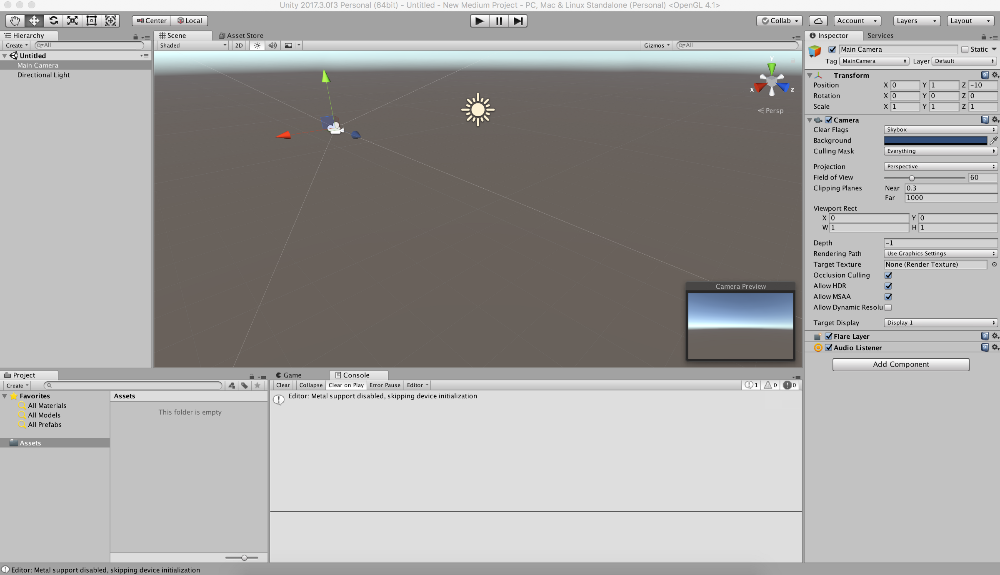

## While Your Office is Quiet Over the Holidays

I’ll let you in on a little secret. Shh, don’t tell anyone. My favorite part of the year is right now — when people go on vacation, the office gets quiet, and I get to dig myself out of the “TODO hole” I’ve created for myself over the course of the entire rest of the year.

Yes, I’ll take a little time off but honestly the most relaxing thing for me to do is stumble into and through new tech, programming languages, and other things I didn’t have a good enough excuse to invest a serious chunk of time on. Or I just literally didn’t have the time.

Enter Unity, a cross-platform 2D and 3D game engine that is not just for games. Perhaps it would be better referred to as an experience engine. Using a drag-n-drop editor and C# scripting, developers and designers are able to make experiences in enterprise, industry, and academic simulations too. This could include a way to visualize all your IoT sensors in a virtual twin, of sorts, or a way to watch a machine learning model train. Or it could be the viral game your pre-teen won’t stop mindlessly playing at the dinner table.

Unity recently introduced [Machine Learning agents,](https://blogs.unity3d.com/2017/09/19/introducing-unity-machine-learning-agents/) which are super cool and incredibly powerful but not necessarily for everyone and every use case. If you’ve heard any of my talks on AI, you know I’m a big believer in this democratization of AI effort happening right now. Let’s make AI available for a variety of developers building all sorts of things. Let’s add it to their toolbox like web or mobile frameworks and platforms. Let’s make AI services available to sprinkle in a little AI to that Unity experience.

Enter the Watson API services, a set of APIs complete with a number of SDKs available for developers to do exactly that, build with AI. There is a [Watson Unity SDK](https://github.com/watson-developer-cloud/unity-sdk) available in C# with working examples that allows Unity developers to pull in Watson as an asset. Unity meet Watson, Watson meet Unity.

Ok, let’s take a small step back. How did I ramp myself into a place where I could use Unity well enough to bring in an asset and actually make it work? And what’s an asset?

#### Learn Unity Editor

Thankfully, the Unity Community on average is exactly where I am — beginner, not “classically trained”, limited investment time. Now, that’s not to say there aren’t some incredibly seasoned Unity folks, because they absolutely exist, but a large portion of the Unity Community is a night-and-weekend Unity developer. This means they may work a day job, which may or may not be a development job, and Unity is a side project or a hobby. Which means the content created by and for this community is going to be lots of beginner, hand-holding content. Excellent!

When you download Unity you are given the option to include sample projects as part of your build. Additionally, when you open or create a project, the modal gives you a tab to see tutorials which give you step-by-step instructions to build a tangible something with the Unity Editor and script!

Every package of things (scripts, models, textures, etc.) is considered an asset. Assets can be found on the Unity Asset Store, GitHub, and pretty much anywhere you can package code things. Import an asset to use it in your project, either through the option in the Unity Editor, or dropping the asset into your project folder. The [Watson Unity SDK](https://github.com/watson-developer-cloud/unity-sdk) is available on GitHub.

The Unity Editor is a beast. When it loads its some combination of impressive and mortifying. I recommend working with the Unity Editor on the biggest screen you can get your hands on.

I’m going to save going through what I’ve learned about the editor so far and put it in a separate blog. I recommend checking out the [roll-a-ball tutorial](https://unity3d.com/learn/tutorials/s/roll-ball-tutorial) to get started with the Unity Editor.

#### (Re)Learn C#

Not everyone in the Unity Community is a developer, and they may never want to be. I’ve worked with C# once for like half a semester of school and immediately threw it out of my brain (needed space, buffer overload or something). Luckily, the tutorial referenced above includes scripting components and I was able to pick it up. I’m even remembering my professors beating into our heads private and public variables and scoping things appropriately.

I don’t have a very good suggestion for learning C# for a beginner, but I will say if you’ve worked with any other object-oriented programming language you should be good. I’m not inclined to call it a true scripting language through, so I’m not sure a scripting language background would make it as easy to pick up. If you’ve done this, let me know what language you came from in the comments.

I really don’t have a good suggestion for the folks who have no development background. I did find a tutorial that was supposed to be “[Coding in Unity For the Absolute Beginner](https://unity3d.com/learn/tutorials/topics/scripting/coding-unity-absolute-beginner)” but I found it very valuable and I don’t think I’ve been an absolute beginner in the coding space since I wrote my first HTML in 4th grade. Any true beginners out there, I’d love to hear if this video was beginner enough.

#### Read the Watson Unity SDK Code & Examples

I cannot stress the importance of looking at working code to learn how to write more working code, particularly when working with APIs. To make the service respond successfully requires knowing what it needs, and when you get a response you need to know what you are getting back. Or you can just guess on either end, but that’s incredibly annoying. Believe me, I had the pleasure of writing API documentation without really knowing all the details of the requests or responses.

The Watson Unity SDK comes with tons of documentation and examples. I’m also generating additional content, more on that below. I want to make sure I point out one thing though — there are multiple ways to do the same thing. In the scripting space it may come down to levels of abstractions, if you can use a pre-build widget and it works for you, go for it. If you need to access the lower level service calls because you need a little more customization, go for that then. This is particularly important when working with things like microphones for Text-to-Speech.

#### Build Snippets for Others to Use (Option 1)

Because building requires knowing and knowing makes teaching easier. That sounded much wiser in my head, but I think you get the point.

I’ve put together what I’m calling “Hello World” examples for a few of the services, but I plan on putting one together for each. They are the bare minimum to get your request fired off and a response parsed to the console. Is it the most beautiful code ever written — probably not. Is it going to get you up and running without beating your head on the table — probably yes.

For example, here’s the Conversation Gist:

<Embed src="https://gist.github.com/akeller/deb6b8e20841a6d3725298a534ccd273.js" aspectRatio={0.357} caption="" />

It’s a work in progress as I plan on doing a little more cleanup and commenting everything. All you would need to do is include the Watson Unity SDK in your Unity project and then copy this script into a new C# script and make the appropriate changes (like add your username, password, and workspace id plus change your class name if applicable) and attach it to the appropriate GameObject. If you don’t have a username and password, create one for [free](http://bluemix.net). Spin up a Conversation service or use the [Bot Asset Exchange](https://developer.ibm.com/code/exchanges/bots/).

#### Build a Something (Option 2)

The best way to learn is to build. So, of course, I built something overly complicated because why not! I decided instead of building off of the ball rolling tutorial, I was going to build something in AR.

Using [Vuforia](https://unity3d.com/partners/vuforia), I’m on my way to making a pizza ordering chatbot in VR. If the camera sees a rocky surface (ImageTarget) a CyberSoldier appears (identical to their [tutorial](https://library.vuforia.com/content/vuforia-library/en/articles/Training/getting-started-with-vuforia-in-unity-2017-2-beta.html)). The CyberSoldier has an attached script that calls the Watson Conversation service running the [pizza ordering code pattern](https://developer.ibm.com/code/patterns/assemble-a-pizza-ordering-chatbot-dialog/), and uses Watson Text-to-Speech and Speech-to-Text to help you with the ordering process.

I’m looking at possibly changing the dialog and maybe doing something other than ordering pizza and I’d also like to incorporate the Smart Terrain feature in Vuforia so instead of standing on rocks my CyberSoldier thing can stand on any flat surface like a table or the floor. Ideally, it can sit on my desk and tell me to stand up or drink water or something healthier than encouraging me to order pizza.

— — — — — — — — — — — — — —

Did you get time to do a little learning over the quiet weeks? What did you learn and how did you do it? I’d love to see what you’ve built. Let me know!
