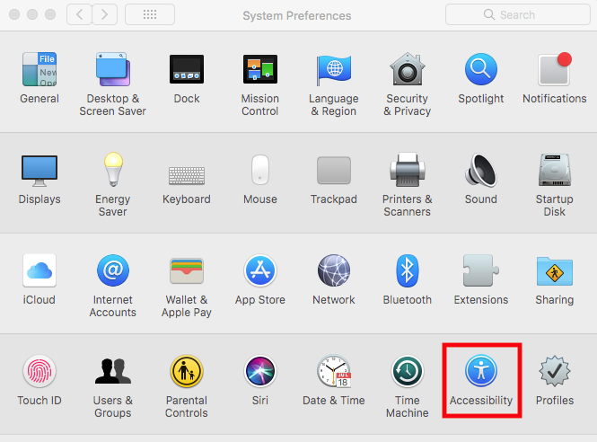
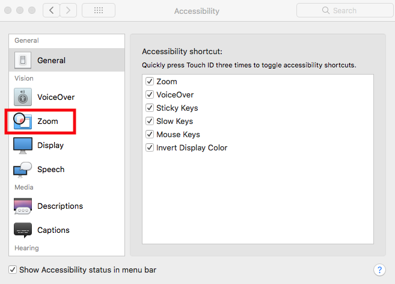
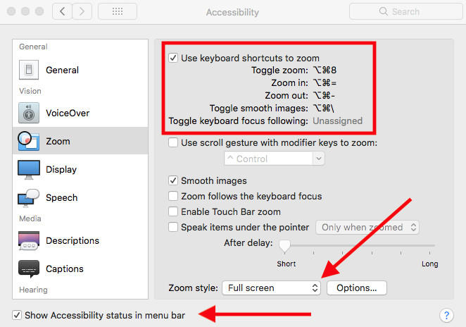
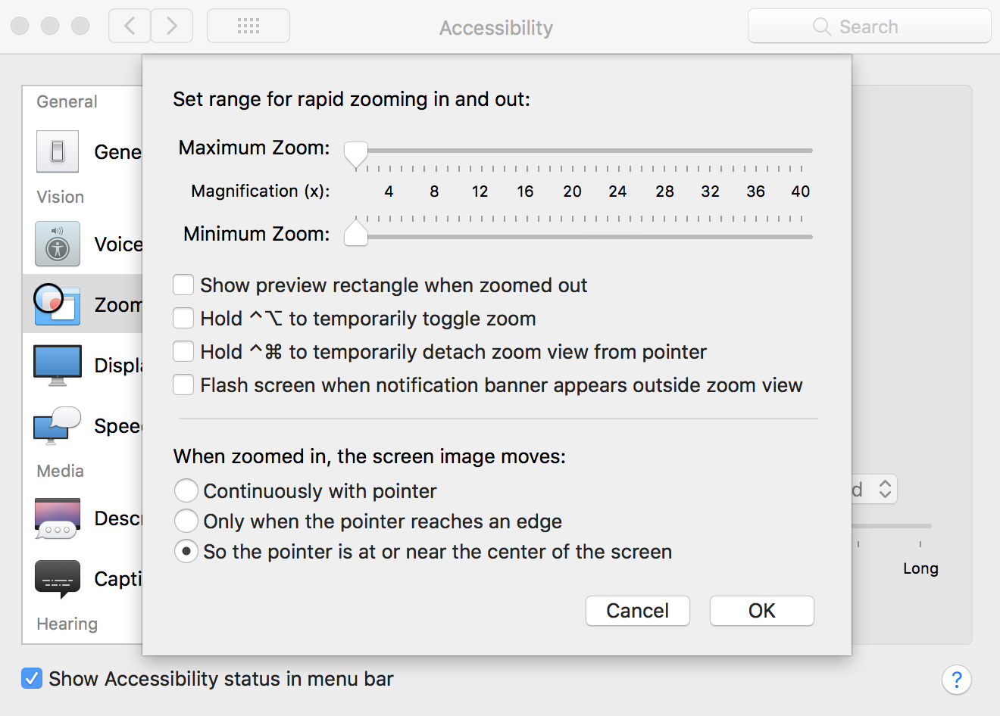

It’s not entirely uncommon for me to watch a meetup or workshop room fill from back to front. Or back to middle to front. Or middle to back to front. But never front first. Which means your content really shouldn’t be made for the people in the front, but for the rest of the room. Mainly for that person in the very back of the room that’s adjusting their trifocals, awkwardly tilting their head, craning their neck, and still squinting.

So here’s some of my tips for you, dear presenter, to make sure that individuals feels like they don’t have to leave early and make a call to their eye doctor.

1.  Use a light background or theme with dark text. Unless you know you are presenting in a low light situation on high-def projectors/monitors in which case maybe go the other way. If you can dim lights near the screen you can remove or reduce annoying glare.
2.  Know when to mirror your screen and when to extend your screen. If you find yourself looking over your shoulder over and over again, that’s the perfect time to mirror. If you have presenter notes, extend the screen so your presentation slides are on one and your notes are on the other.
3.  DON’T WRITE IN ALL CAPS. _Don’t write in all italics._ **Don’t write in all bold.** This holds true for any content really.
4.  Increase your font size and then make it uncomfortably big once or twice more. Try CMD +/- or Control +/- to increase and decrease your front size. If those hotkeys don’t work, check under View in the menu bar. If you don’t have an option to increase the text in, for example an IDE, abandon it and find an alternative. If you have a mouse wheel typically you can click and scroll up and down to increase and decrease the font size.
5.  Magnify your screen (zoom with accessibility shortcuts). Lets spend a little more time on this one by allowing me to show you how!

On a Mac, go to System Preferences. Fourth row, click “Accessibility”.

In the column on the left, click “ Zoom”.

Click the checkbox to enable zoom with keyboard shortcuts.

Learn the keyboard shortcuts, I recommend starting with “toggle zoom” and “zoom in”.

For your Zoom style, “Full screen” is probably the best for presenters. Picture-in-picture can still look a little small.

This next bit can be personal preference. Click “Options…” next to Zoom style. Because of the kind of content I was presenting recently, holding down the shortcuts to temporarily do anything didn’t really make any sense. But the bottom section, you can see I have it set to “So the pointer is at or near the center of the screen” which turned out to be very natural for someone who is new to zooming during a presentation.

I also recommend turning on the Accessibility icon status in the menu bar. Mostly so you can get back to the Accessibility preferences fast by clicking the icon and selecting the item in the menu.

Do you have more tips for presenting to the back of the room? Is there an IDE or app that you think really helps presenters and the audience? If you are on a Windows machine I’d love to hear similar ways to zoom. Linux too!

Leave me a comment, a few claps 👏, or share this with someone that could use a little help getting their code comfortably visible to the folks in the back. 👋
