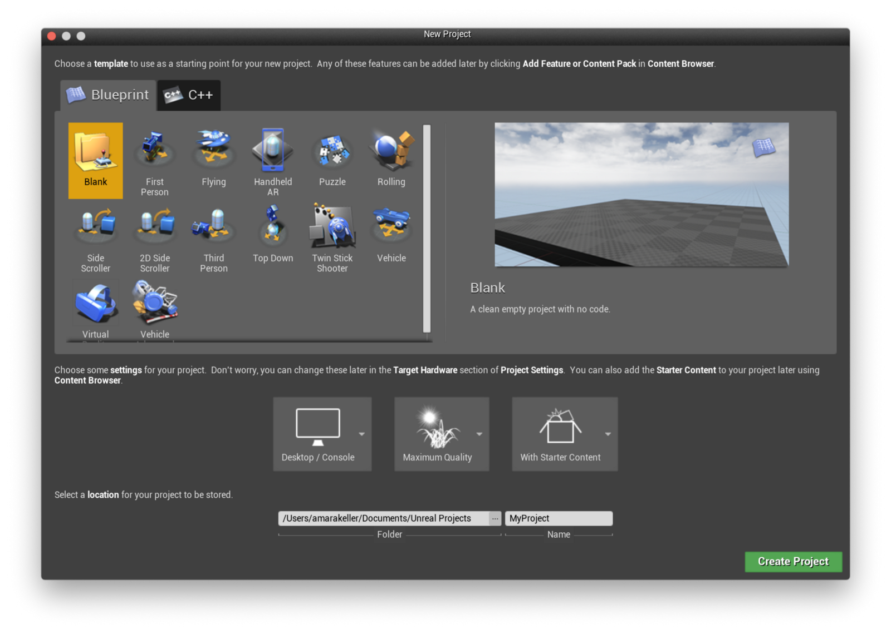
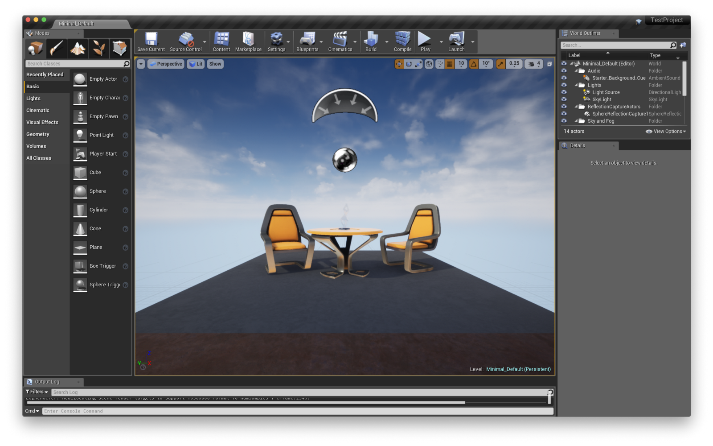
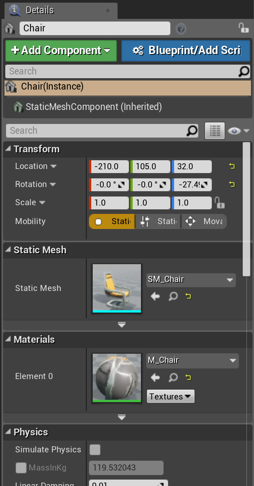
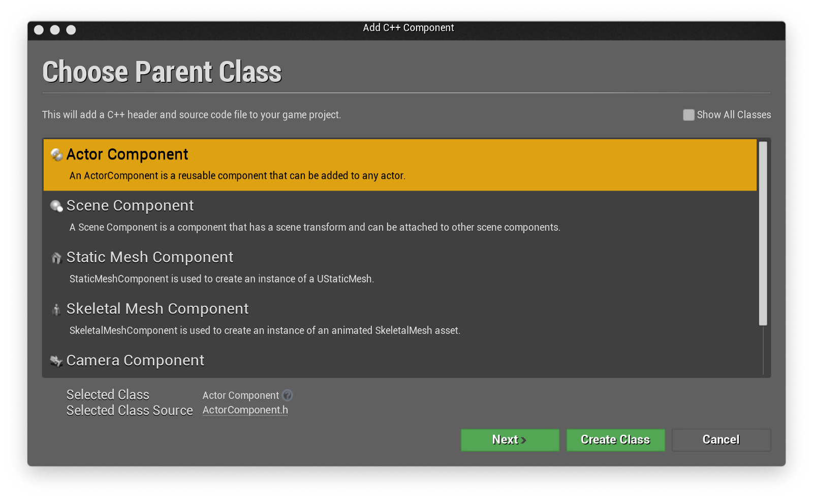
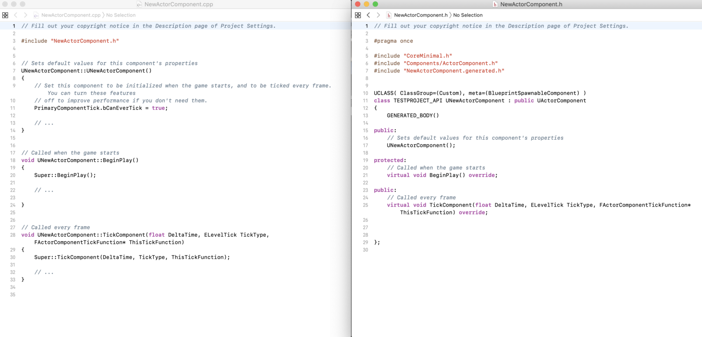
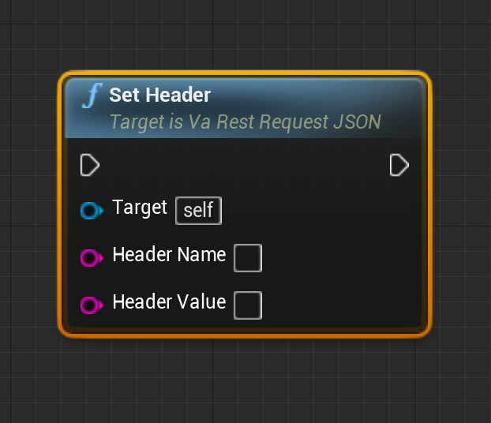
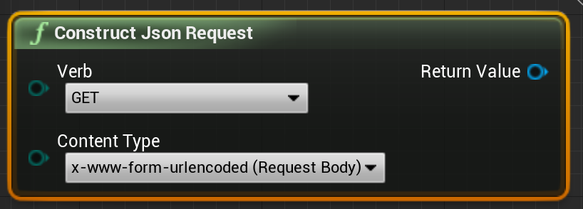
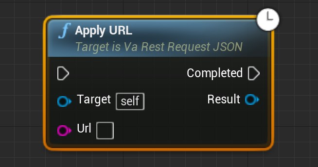
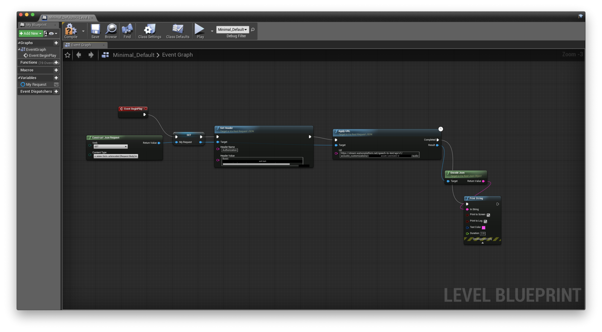
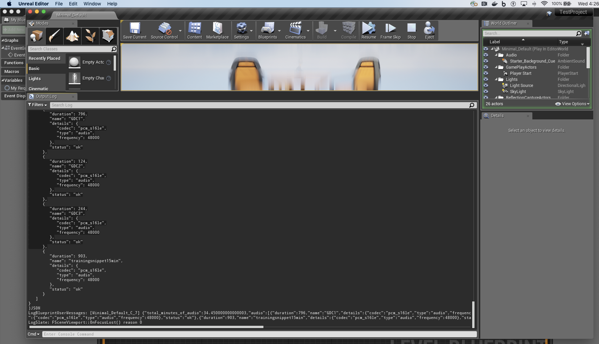

## Learning in Public — Using A Blueprint Plugin (no code!)

 on [Unsplash](https://unsplash.com/?utm_source=unsplash&utm_medium=referral&utm_content=creditCopyText)](./asset-1.jpeg)

I have absolutely no experience with the [Unreal Engine (UE4)](https://www.unrealengine.com/en-US/), but since I’ve done talks at meetups and conferences about my work with Unity (that I also had no experience in until about a year and a half ago) the most common question has been “will this work in Unreal?”.

So far, that answer has been “I don’t know” or “as a community member you can always build something and open source it!”. I know there was a small, grassroots effort at some point to build an Watson SDK for Unreal like the [Watson SDK for Unity](https://github.com/watson-developer-cloud/unity-sdk), but there is no official SDK for Unreal.

So, will the Watson SDK for Unity work in Unreal? No. But that doesn’t stop anyone from working with the Watson API services through basic REST consumption.

Maybe it is time to get something working.

#### Where to Start with Unreal

Unreal is a C++ engine and, of course, I haven’t written a line of C++ in _years_. So I did what any developer would do, I downloaded the engine and looked for some kind of sample project to open and figure out how and where I could write some C++ to call a REST API.



I started a new, blank, (apparently) Blueprint project because I didn’t even bother reading the UI and if we are being really honest, Unreal feels very busy. I’m sure Unity felt that way too at first, but this was one of the first screens I saw and was intimidated with the number of choices. It felt like I needed to make a lot of decisions about things I didn’t fully understand yet — like eventually I want to make an AR handheld experience, but I wasn’t ready to commit to that just yet.

Creating the new project and subsequently loading it up, I realized I had, at least, some very fundamental knowledge of how gaming engines work — they have a series of events that get fired as your game loads and progresses.

Knowing this, I wanted to figure out how to load my REST API call into the initial loading/ready/start event as it doesn’t depend on the scene being loaded or any of the objects being present or in a ready state.



I took screenshots late, but this is roughly what the project looked like with the sample included. I have a scene, some objects, something that looks like sun or gravity shining down, and some concept of where my eyeballs will be pointing(?).

So I do what any developer does, I start clicking around and trying to do things. I hit the play button to run the scene, and I hear some light outside bird chirping kind of noise. Neat!

#### Where the Code Go Tho?

Again, based on my fundamental idea of how game engines work, I knew I needed to add some sort of scripting component somewhere. More importantly, I need to be able to add it somewhere it will actually fire and not just sit there waiting to be triggered, a trigger that may not happen, causing debugging than may not actually need to happen.

I click one of the chairs, see a number of components and a way to add a component.



I get two options for scripting, one is a New Blueprint Script Component and the other is a new C++ Component.

I went with the C++ Component, and got a window about choosing a Parent Class.



If I had to guess, and I did, for my particular use case I could use either an Actor or a Scene Component. I don’t really have a need to attach it to anything specifically, but based on my Unity example I want to put the code on an Actor because I want the experience to feel like Watson is talking through a character, not the sky or some other scene item.

So I created a C++ component for an Actor and realized that I didn’t love this decision but it gave me a good glimpse into the functions of the game engine.



I knew I was going to need to place any code or calls to my REST API code in the BeingPlay() function so that as soon as the game starts (if not sooner) I would trigger my code and it wouldn’t just sit there idle.

#### Ok, But How Do You Call the Service?

I think this is the point where I realized, I had no idea how to call a REST service in C++. So I started some searching and somehow stumbled back on an Unreal forum post on Blueprint plugins. Blueprints are familiar… sort of.

[**JSON Query**  
_Hey guys! For the past couple of nights, while plowing through the codebase, I've been working on a plugin that allows…_forums.unrealengine.com](https://forums.unrealengine.com/community/released-projects/6382-json-query?7045-PLUGIN-JSON-Query= "https://forums.unrealengine.com/community/released-projects/6382-json-query?7045-PLUGIN-JSON-Query=")[](https://forums.unrealengine.com/community/released-projects/6382-json-query?7045-PLUGIN-JSON-Query=)

[**\[Plugin\] Http/s REST, blueprintable JSON and Parse REST API manager at once (VaRest)**  
_Discuss GitHub, using source code to modify the engine, and the creation of engine plugins._forums.unrealengine.com](https://forums.unrealengine.com/development-discussion/engine-source-github/9041-plugin-http-s-rest-blueprintable-json-and-parse-rest-api-manager-at-once-varest?13509= "https://forums.unrealengine.com/development-discussion/engine-source-github/9041-plugin-http-s-rest-blueprintable-json-and-parse-rest-api-manager-at-once-varest?13509=")[](https://forums.unrealengine.com/development-discussion/engine-source-github/9041-plugin-http-s-rest-blueprintable-json-and-parse-rest-api-manager-at-once-varest?13509=)

I found two promising plugins, VaRestPlugin and JSONQuery. Both showed promising screenshots, but I went to [VaRestPlugin](https://github.com/ufna/VaRest) and decided to give it a spin. But how do I Blueprint?

#### Working with Blueprints

This next bit is going to be more of an applied learning of Blueprints, so if you are looking for definitions might I recommend the [documentation](https://docs.unrealengine.com/en-us/Engine/Blueprints) which, of course, I didn’t read because why would I take the time to do that when I want to do a something.

Blueprints is listed on that main project view and provides a drop down. I chose “Open Level Blueprint” hoping that would get me in a place that would automatically trigger at the start of the game (or at least give me function options like I saw in the C++ component rather than creating a new Blueprint component and worrying it would never get called.

I stumble my way through the Blueprint UI trying to add new nodes. Right clicking on the UI does what I would expect it to, allow me to add new nodes. But between context sensitive and non-context sensitive nodes… I have SO MANY OPTIONS.

#### Building the Flow

Feeling overwhelmed I manage to get myself into the VaRestPlugin section. All I want to do so pull in nodes similar to a screenshot I saw to build a GET. Which should look something like this:

```
Fire BeingPlay(?) event > Build GET request (plus auth) > Fire GET request > Print JSON result
```

VaRestPlugin gives me everything I need, but I realize I’ll need to authenticate with basic authentication, with only a key/value pair situation in the header.



Non-issue really, I go pull my hashed auth header out of Postman, that I used for testing this particular GET to make sure the service isn’t throwing any weird errors as I’m building it out here.

I add “Authorization” to Header Name, and put my hashed auth header in “Value”.

Before I get set a header, I need to construct the request object, specifying the verb. I find the “Construct JSON Request” node.



I need a place to actually put the URL, so I start investigating “Apply URL” and “Process URL”. “Apply URL” seems to actually return something, where “Process URL” just initiates the request.



This one is pretty explanatory, the URL you want to hit goes in the URL field. But how do I print the request object result?Hmm.

#### Frustrating with Blueprints…

I get everything together except except the absolute easiest, most basic node “SET”, which I can only assume is what I need to build the overall request.

I give up for 2 days. I see no “SET” in the VaRestPlugin node section and I’m annoyed with myself.

I decide to read the Blueprint documentation, particularly the [Variables](https://docs.unrealengine.com/en-us/Engine/Blueprints/UserGuide/Variables) section.

I realize very quickly that I’m looking to create (and set) an object (variable). I also realize my event trigger is wrong too.

The “My Request” object becomes the target for all the request building nodes. But I’m still not sure about printing the response, but I end up finding some information about encoding the JSON and printing the string.

#### Succeeding with Blueprints!

Finally I build a GET for returning customized acoustic audio files I used to train my custom acoustic model for Watson Speech to Text.



I cross my fingers, save/compile and then hit the play button. It works!!! I see a list of my audio files in the console!



#### Now what?

I can’t really do a lot with this, but it does get me through the hurdle of just connecting to a REST service and getting back a response.

Now I can work on building a similar example to my [AR pattern in Unity](https://developer.ibm.com/patterns/build-an-ai-powered-ar-character-in-unity-with-arkit/). Interested in seeing that? Because I’m interested in building it if you are!

---

Are you building something in Unreal Engine that could leverage AI services? Let me know in the comments!
