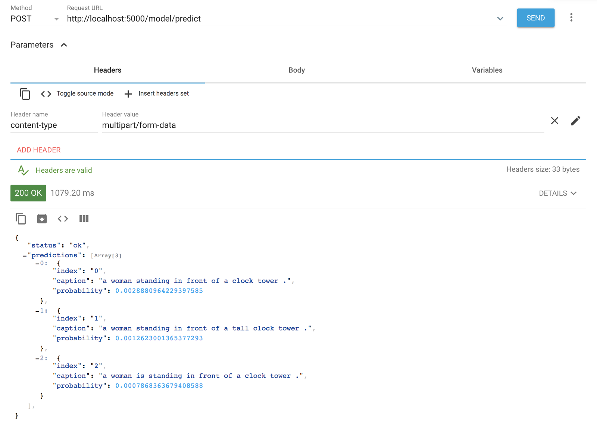
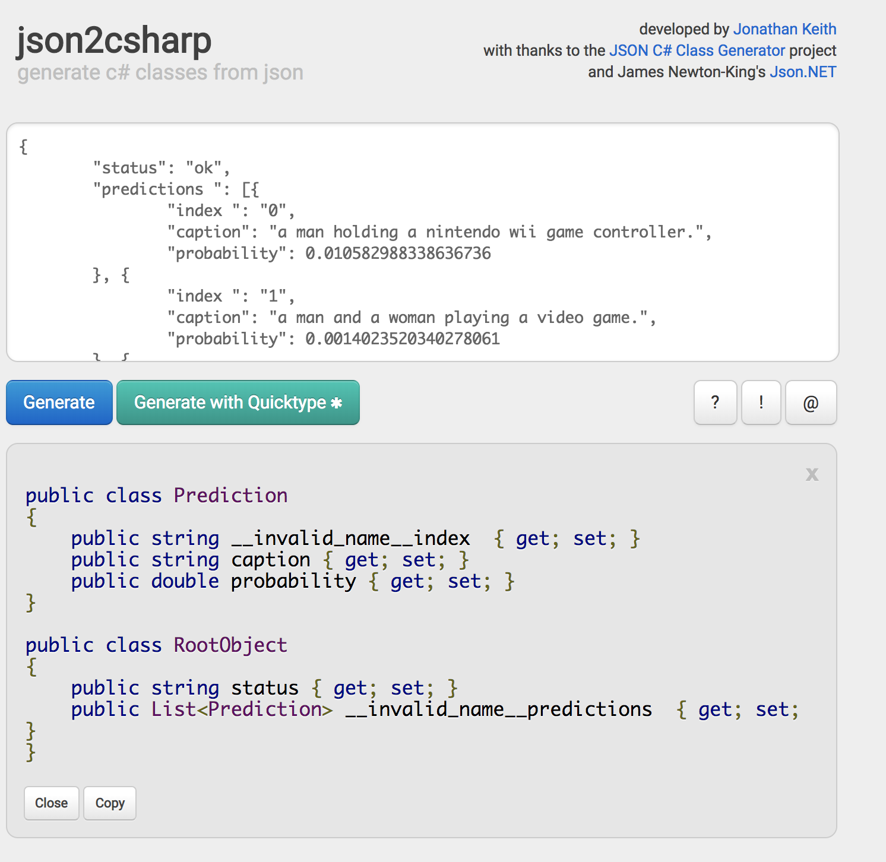
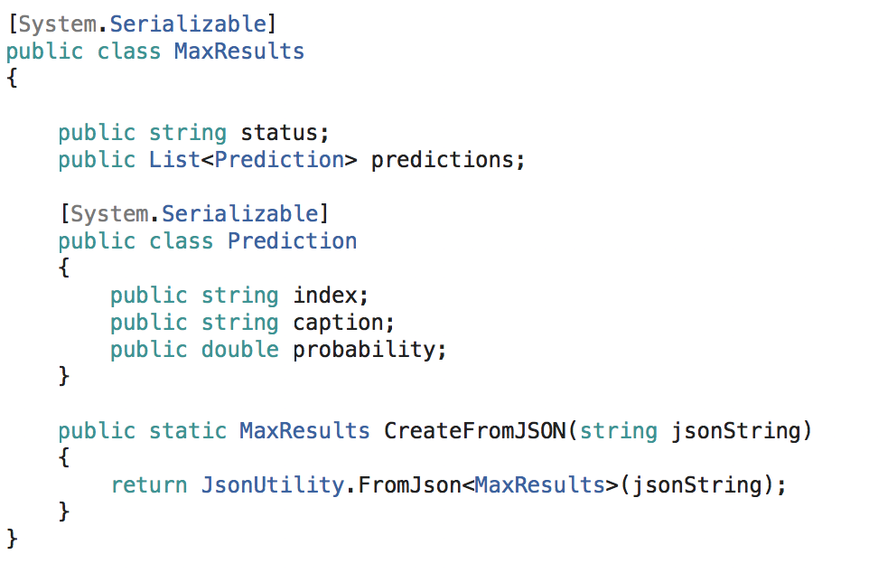
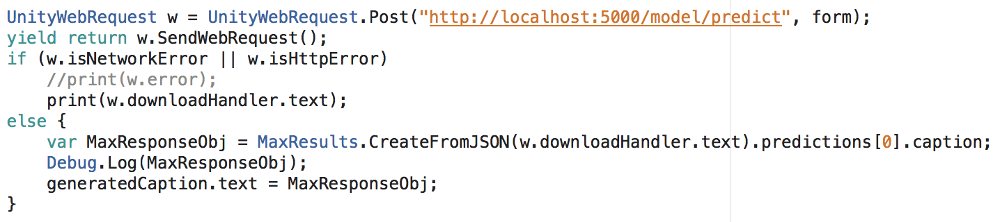
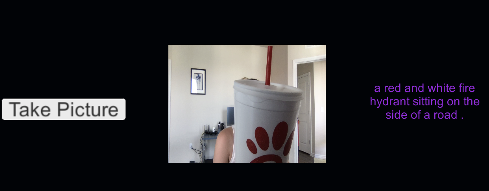

 on [Unsplash](https://unsplash.com/search/photos/coding?utm_source=unsplash&utm_medium=referral&utm_content=creditCopyText)](./asset-1)

In a world where almost everything is exposed with a REST API, JSON parsing becomes skill number 1 (unless you get helper/wrapper functions in an SDK or find some cheeky asset that does this for you, but this isn’t about that!). What happens if you have to do it by hand?

Here’s a quick walkthrough for parsing JSON into something you can work with in C# land (which happens to include Unity).

#### Call It

Using Postman or ARC (Advanced Rest Client) figure out what the response looks like. I use ARC for something like this.

Plug in the request URL, make sure the method says POST, supply the proper header and body info:

Now we have the response JSON.

#### \[Optional\] Validate It

Copy & paste sometimes backfires like it did to me and I had to use a JSON linter to realize my “ wasn’t a really a “. You might encounter other bad JSON things, so try something like [JSONLint](https://jsonlint.com/).

You may continue.

#### Tranform It

This JSON is pretty simple looking, but some of them are not. In order to use Unity’s built in [JsonUtility](https://docs.unity3d.com/ScriptReference/JsonUtility.html), I need to build a class (or classes) with my JSON structure.

Again, this is a simple JSON so this is partially overkill. I used [json2csharp](http://json2csharp.com/) to generate my classes.

Copy this.

#### Build It

Unity, specifically JsonUtility, is a special beast, so we can’t just copy over what json2csharp gave us, but we are close. Clean up the name “_\_\_invalid\_name\_\_index_” so it just says “index” and get ride of all the _{ get; set; }_ because those are going to give you nothing but trouble here.

“RootObject” made exactly no sense to me, so I renamed it MaxResults. I nested my classes as well.

#### Code It

Finally, we actually have to use this thing in the rest of the code, right? Right!

I take my response string, use _JsonUtility.FromJson_ to turn it into classes, and then use some sweet dot notation to get what I need, in this case the first prediction’s caption will do nicely.

#### Run It

Clearly, we nailed it. 🚒

See my [last post](https://blog.goodaudience.com/unity-max-model-asset-exchange-b4fc0a0f3f1d) if you are confused. I didn’t train this model.
