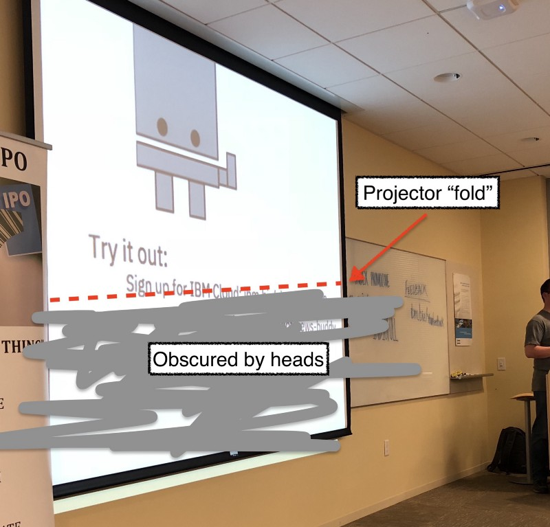

Read my [previous post](https://medium.com/@MissAmaraKay/how-to-show-code-to-the-back-of-a-room-344e23e1814f) before continuing.

Recently my teammate led a hands-on workshop. It was extremely well attended, which is the exact moment it became problematic. 80+ people shoved into a room with a projector that is probably 10 years old and only about 12 feet off the ground. 

A gentleman from the back approached me after the session and said he really couldn’t see any of the code shared. Little did he know (or maybe he did) that I’ve been on this recent kick of designing my presentations for the back of the room. I motioned to the screen and asked where he could see (not necessarily clearly). 

He couldn’t see the lower half of the projector screen. Like 45–55% of the screen for him might as well not have even existed. Awesome.

Naturally, having a conversation during the networking portion of the evening, someone chimed into the conversation with a silver bullet approach — “Just setup a screen share!”

Two things happen when you screen share.

-   You can obliterate the bandwidth, now the slides are lagging behind.
-   In a hands-on workshop, you are either hot-keying back and forth between screens. Or you give up and just follow along with the presenter because you are lost.
