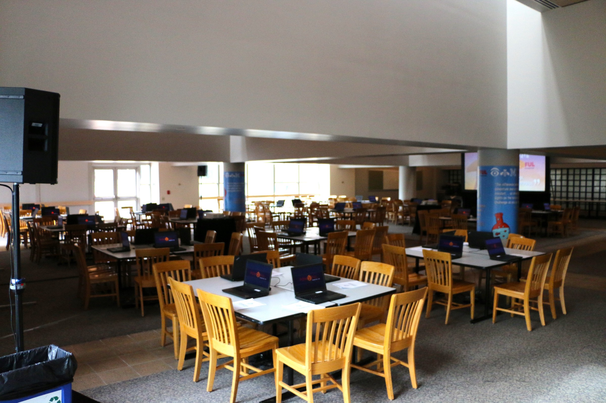
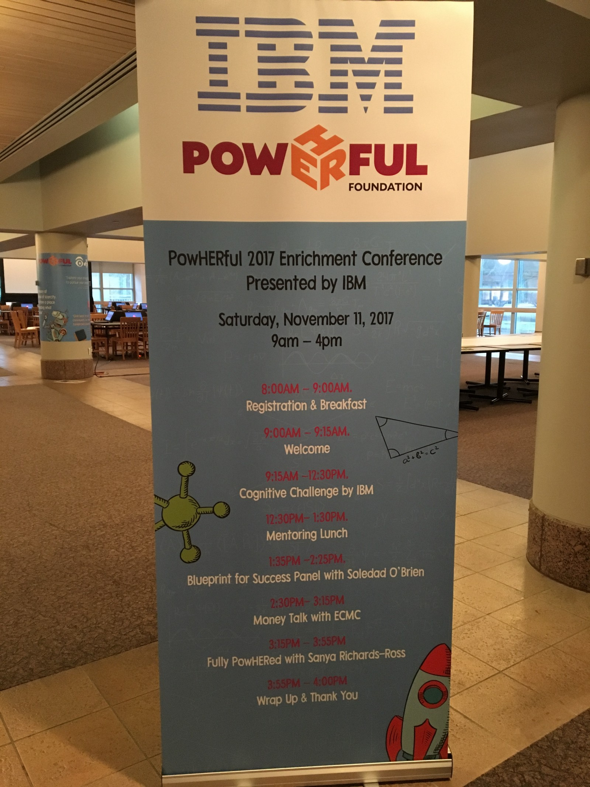
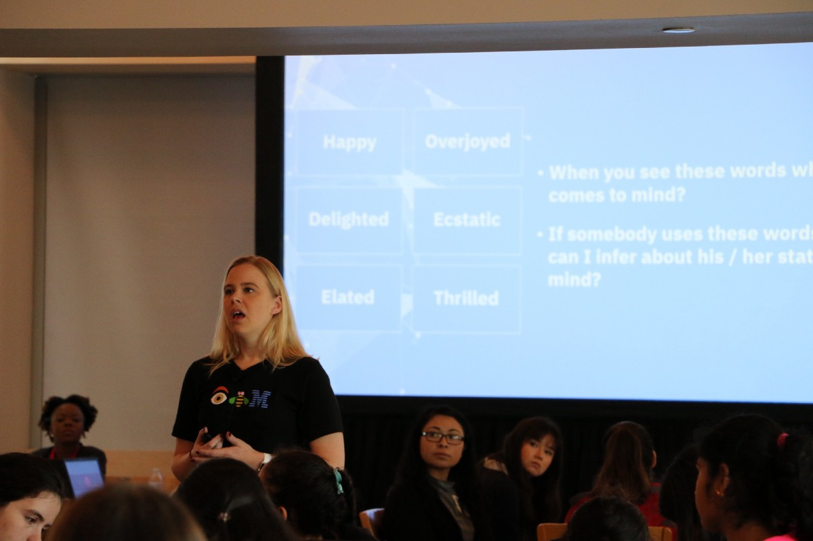
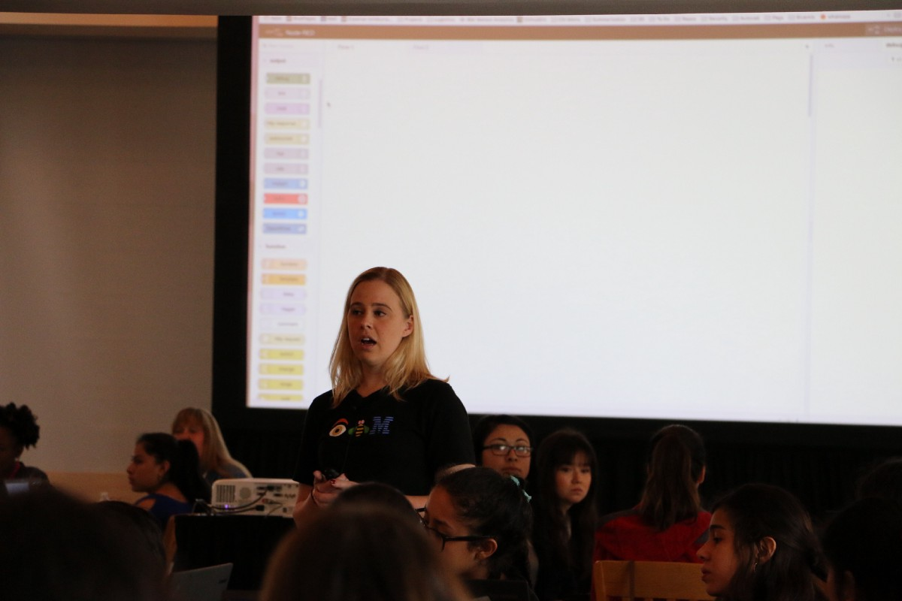
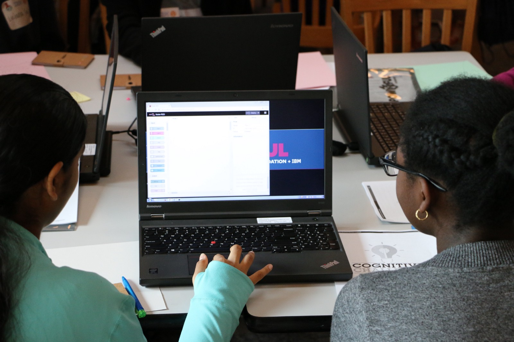
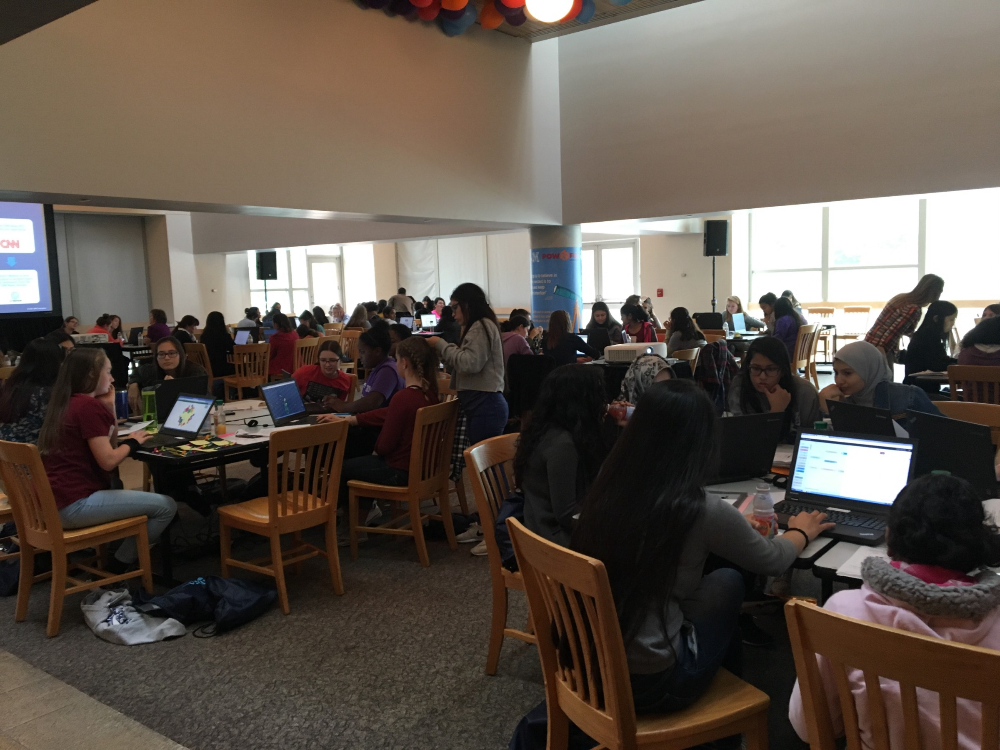
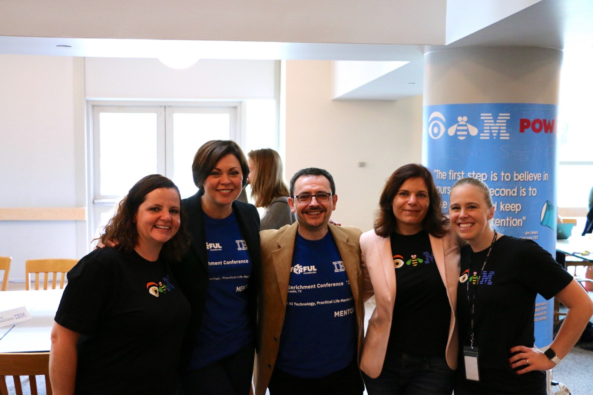

If you would have told me that I would spend a Saturday morning leading young women through a set of coding exercises, I would have called you crazy. And not young women like high schoolers, young women like girls. Mostly middle school aged girls.

Now, it’s not because I don’t see the value in teaching girls to code, because I absolutely do, but this is not my typical audience. In fact, I interact with exactly 0 kids on a daily basis. So the idea of distilling my content down to not only a beginner level, but a kid level, is just plain crazy. Have they done any sort of programming before? Do they know what machine learning is? Have they heard of Watson? Do they know how to C&P with keyboard shortcuts? Are they even remotely interested in being here?

Anxiety provoking questions in tow, I was thrust into a small team (read two people) trying to figure out a technical enough set of activities to not scare these young women away from coding forever as part of an entire Enrichment Conference put on by the PowHERful Foundation. Talk about the weight of the world.

This is where we found out we should expect about 100+ girls using 64 laptops. Is it just me, or is the world getting even heavier on top of my shoulders?

Enter Node-RED. The drag-n-drop graphical interface gives you the ability to build powerful apps with a variety of different integrations with mostly config. Coding without coding! Maybe some of the girls have even been exposed to Scratch. We can run it locally or in the IBM cloud with the Node-RED starter app. We get Watson services, databases, and other functions with a few clicks. This may just work!

The lab consisted of consuming an RSS feed from CNN, evaluating the sentiment with Watson Natural Language Understanding (NLU), and displaying it in a nice UI powered by D3.js. Nothing was stubbed so it was heavily reliant on the RSS feed, IBM Cloud, and network infrastructure all playing nice with each other. Please work!

The great thing about working with kids is they are curious and mostly tolerant to some small hiccups here and there without asking too many questions. This is the first time we had done something of this scale to an audience of non-developer kids so it wasn’t always smooth sailing. But kids are great at shrugging it off, “computers are like that sometimes!”

At the end of the 3 hours I was tired, sweaty, and overjoyed at the fact that some teams were making it through the exercises. Some even joyously declared they felt more confident at computing. They didn’t think they could code, they thought it was too hard, but here they were staring at a bubble filled UI showing them NLU scored news from an RSS feed. It worked!

10 hours of frantic laptop setup and crawling under cafeteria tables the day before seemed so worth it in the end. We gave 100 girls a positive interaction with computers and programming at IBM that I hope they remember when STEM feels hard. And I got introduced as “the real developer”. Hits me right in the feels.
