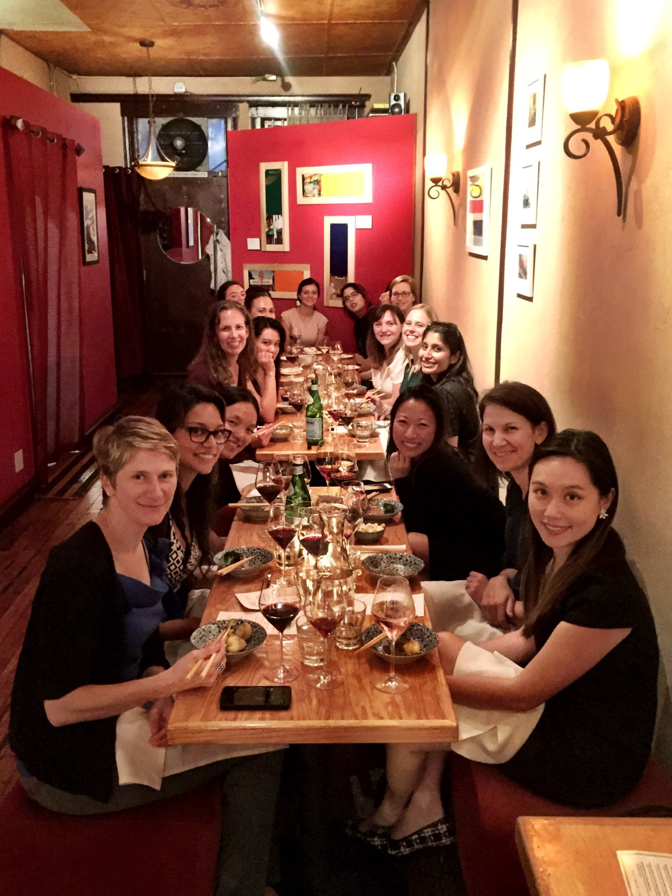
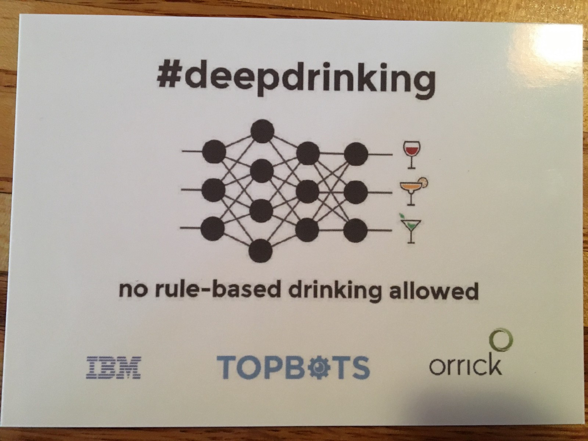
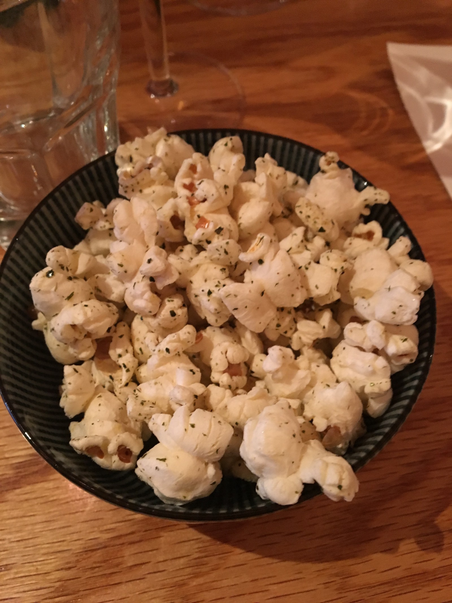
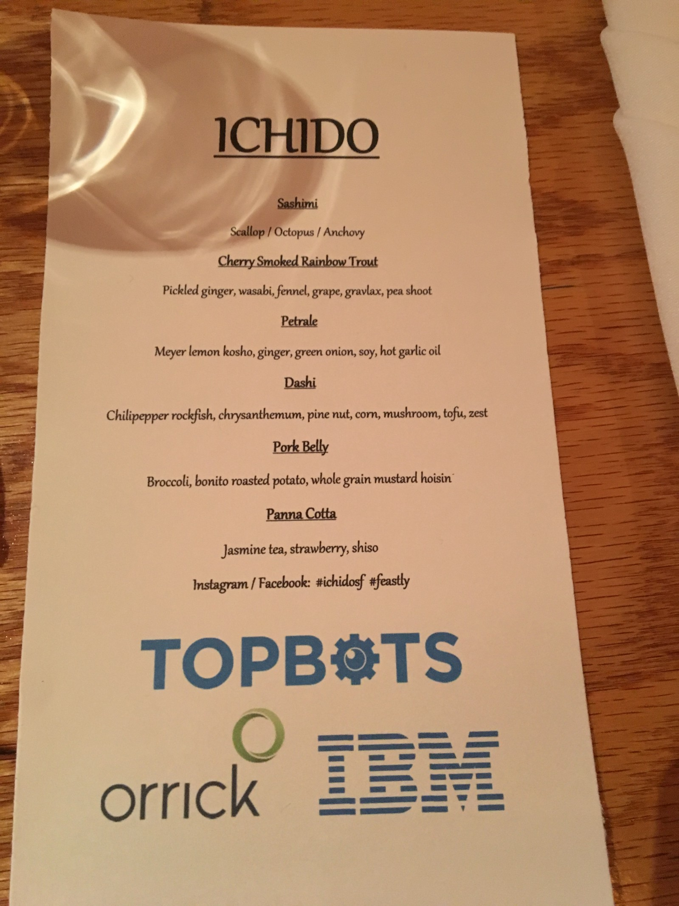
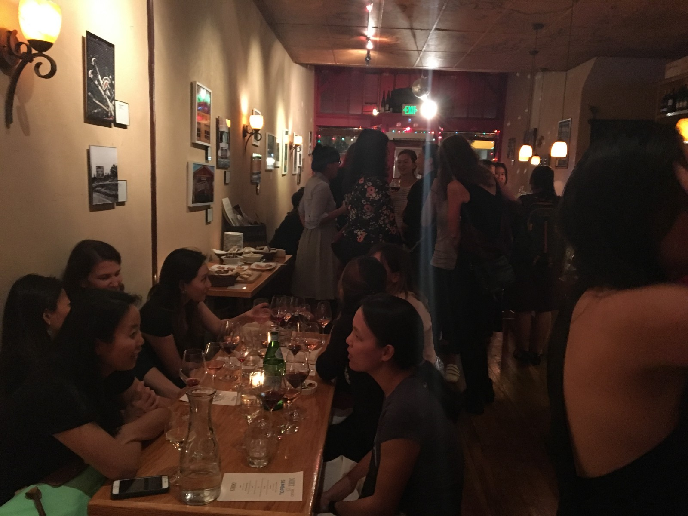

Last night, I attended the “Celebrating Women in AI” dinner, which brought together some of the brilliant female AI researchers and technologists in the Bay Area. I met women I followed on Twitter in person and listened to a small but supportive community appreciate each other’s work, sometimes by demanding, “… but seriously can you hurry up with those self-driving cars for the consumer market? PLEASE!”

The dinner was held at Etcetera Wine Bar, a small but “feminine” place, as described by one of the organizers, Mariya Yao, Head of R&D at TOPBOTS. I had the pleasure of sitting across from Mariya at dinner and she went on and on, almost endlessly, about how she couldn’t help but brag for the incredible women in the room. This absolutely resonated with me, and it’s one of the reasons I decided to venture into developer relations. I want the amazing things happening in tech today to be showcased. I’m constantly encouraging people to write blogs, submit papers and calls for proposals, and get out to meetups to talk about what they do!

#### But what about the food?!

We kicked off dinner with, easily, the fanciest popcorn my mouth has ever experienced. I would consider myself a popcorn connoisseur, second only to ice cream, and it was so good. I knew we were in for a treat for the next six courses.

The meal was artfully prepared by Chef Reed of [Ichido SF](http://www.ichidosf.com/). He made an appearance after every course was served to describe the flavors and ingredients. As someone who likes to cook, I was like “teach me your ways!” The whole grain mustard hoisin was a crowd favorite. We even requested more for the table!

I hope you have a good imagination of what each plate could have looked like because we were all terrible about taking pictures. Literally each plate was beyond Instagram worthy but it looked too delicious to take even three seconds to document it. Oops.

#### Did you get a chance to really talk to anyone in between the courses?

I had very some very thought-provoking conversations with a number of the women who attended. I’m not going to go into the nitty gritty details of each, but I want to list a few topics/questions below to get you thinking.

-   How do we know we are building AI solutions that aren’t so general or generic that they don’t work? For example, what’s the difference on social media between a threat and an insult? Or maybe, “I killed it today!” as a brag.
-   Why aren’t we focusing on AI that matters? Elderly care was one area that was brought up.
-   How do “big” personalities impact team dynamics? What’s the perfect sized team?
-   Just like localization experts or engineers were hired to help with content generation on webpages, will companies employ similar folks who can help “localize” AI solutions per country/region?
-   Bots or AI devices are female by default, sometimes with no option or alternative to be male. Does this change as home devices become cheaper or more popular?

Is your organization asking these questions? Or at least similar ones? If not, this could be a great example of how diversity might help. Diverse backgrounds offer diverse perspectives and may help ask or answer the questions that we need to move AI forward for the better.

---

If you are interested in learning more about **_some, not all,_** of the women in AI, checkout Mariya’s article: [https://www.forbes.com/sites/mariyayao/2017/05/18/meet-20-incredible-women-advancing-a-i-research](https://www.forbes.com/sites/mariyayao/2017/05/18/meet-20-incredible-women-advancing-a-i-research)
