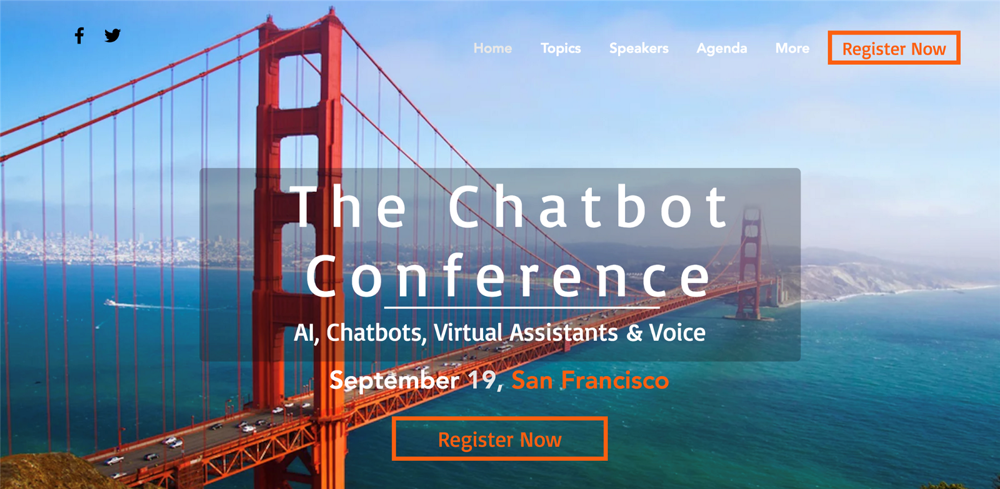
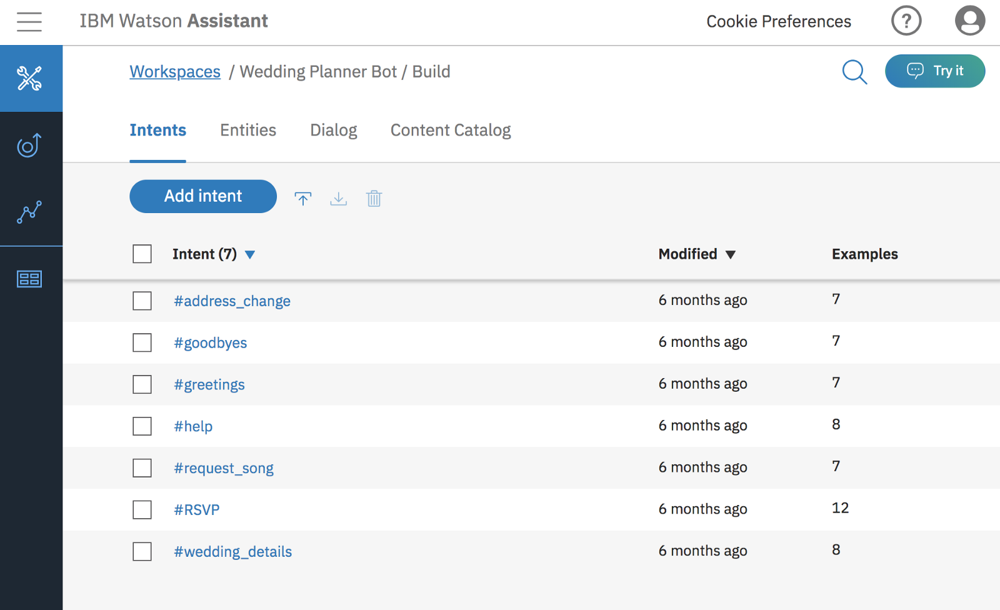
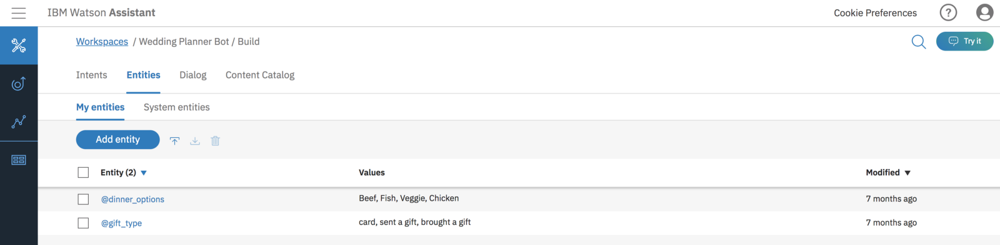
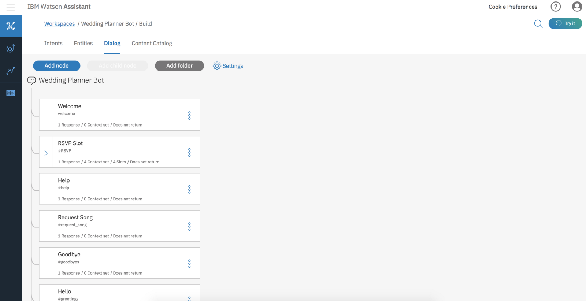
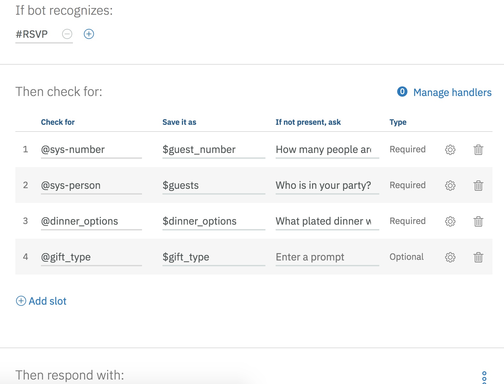
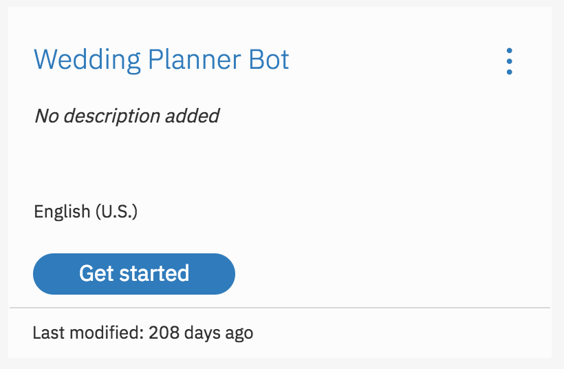
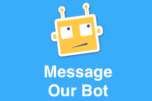
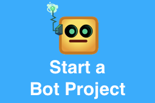

## And how I realized some of the best examples are the most personal.

 on [Unsplash](https://unsplash.com/search/photos/wedding?utm_source=unsplash&utm_medium=referral&utm_content=creditCopyText)](./asset-1.jpeg)

Weddings are the perfect storm of organized chaos meets family reunion. And I’m not just talking about the day of, I’m talking about the whole darn thing. Wedding planning is an exercise in communication, user research, and hoping all your vendors write down the correct date and time. What a great way to start off your marriage!

My (now) husband proposed to me right before I started my job with IBM as a developer advocate. So I was learning a new company, new technology, and a new commute while planning a wedding in a state I didn’t currently live in. To be incredibly fair to new hubby, he was very involved and very helpful with wedding planning and that has to be the only reason I didn’t absolutely lose my mind.

### The Lead Up

At one point I remember my coworker asking me what demo I was thinking about building. “Food truck tracker” came out of my mouth because I had been literally hunting them and striking out constantly. I started building it in React until I realized the SF City data was garbage and some food trucks were actually multiple carts/trucks and could be in like 6 different places at the same time and while some were permitted for certain locations, construction inevitably pushed them somewhere else. Too much data cleansing needed. I grew bored (and too hungry to continue).

On a commute home, I started thinking more about the dreaded RSVP and table assignment tasks that would be approaching in the not so distant future.

> If I could write up a narrative of potential family drama and have an algorithm spit out the most optimal configuration of guests, that could be life saving. Maybe too scandalous.

> How can I help my family members RSVP quickly and effectively? How can I prevent my guests from bothering me about what to wear and where to go and what to eat and how to get there?

> HOW CAN I MAKE THIS INTO A CHATBOT AND DO WEDDING PLANNING AND WORK AT THE SAME TIME?!

And here we are, a year later I’ve taken my wedding planner chatbot example to meetups, workshops, and conferences.

Did I implement this in my actual wedding? No. Apparently my family had a hard enough time realizing our wedding website link was not just pictures of us but all of the details around hotel blocks, registries, and venue location.

Did I build out a fully working example? Also no. But it was a great example to talk through because it was so compelling, personal, and like I said earlier, everyone has had some experience with attending a wedding, wedding planning, or maybe just watching a show on TLC.

### Top Articles on How Businesses are using Bots:

> [1\. What is Conversational Marketing & Why Is It a Big Deal?](https://chatbotslife.com/what-is-conversational-marketing-why-is-it-a-big-deal-5ac32ee4bff4)

> [2\. The Future of Law, Lawyers and Law Professors… And the Exponential Growth of Disruptive Technology](https://chatbotslife.com/the-future-of-law-lawyers-and-law-professors-and-the-exponential-growth-of-disruptive-technology-b5c979608c9c)

> [3\. Why Chatbots Are Key to the Future of Business Intelligence](https://chatbotslife.com/why-chatbots-are-key-to-the-future-of-business-intelligence-cf0f4baa2d56)

> [4\. AI & NLP Workshop](https://chatbotslife.com/ai-nlp-workshop-fa39e2eac049)

### The Tech Bits

My Wedding Planner Bot started in Watson Conversation (now Assistant) as a way to demo the slot functionality, making a cleaner implementation when working with the dialog while walking through the design process of building your first [chatbot](https://chatbotslife.com/).

It contained a number of intents, focusing mostly on the #RSVP intent because I felt like it would be the easiest to build out a narrative around that everyone would understand.

The number of entities has gone up and down over the course of the chatbot’s life. I settled on having 2 entities, one to capture dinner options and one to capture the gift type. Many of the other original entities shifted over to a mix of system entities and context variables.

The dialog remained incredibly simple, mostly due to the fact that introducing folks to the design process was lengthy. I probably presented this content to roughly 600 people, maybe more, and none of them had made a chatbot before.

The slot implementation was even fairly simple. It checked for 3 required context variables, with one optional one. This allowed me to talk about the system entities and demonstrate the context variables in the built-in tester panel.

### The Retirement

A lot of things have changed in Watson Assistant, even just in the past few months. You can now return an image, instead of just text. You can call IBM Cloud Functions (in beta at the writing of this post) to programmatically call other services straight from Watson Assistant dialog, a huge ask from the community today.

Of course I’m now more well acquainted with Watson Assistant and some of the other Watson services too, but that’s not the only thing I gained from this experience. I was initially really scared, like mortified, to tell anyone I worked with about my bot idea. I thought they would think it was a trivial, sorry excuse for mixing work with wedding planning. I thought meetup attendees and conference goers would write me off as being ditzy or self-obsessed. But it was nothing like that. My coworkers thought it was seriously the next great startup idea. The reception I received after every presentation was incredible! People left inspired and finally understanding how chatbots could bring efficiency and a more immersive UX than forms or a search bar on a static page.

Our wedding photos have arrived, my chatbot screenshots are mostly out of date in every presentation and tutorial, and next month we are headed to our honeymoon, so its the perfect time to say goodbye to the bot that got me through so many speaking sessions, workshops, meetups, and conferences. Bye friend! 👋

<Embed src="https://upscri.be/3e59ef?as_embed=true" aspectRatio={undefined} caption="" />

