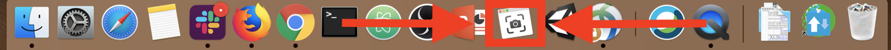
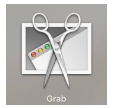

## Available in Mojave (OS X 10.14)

 on [Unsplash](https://unsplash.com/search/photos/macbook?utm_source=unsplash&utm_medium=referral&utm_content=creditCopyText)](./asset-1)

I was dragging my feet after seeing my coworkers and internet friends get “Mojaved”, a catch-all term for issues experienced after upgrading to the latest, greatest MacOS. Ain’t nobody got time for that.

So far, so good, but right away I noticed something different in my menu bar.

I take screen grabs all the time. Full screen, windows, partials, all of the above. I’ve used MacOS’s “Grab” since I started using a MacBook Pro in college. But now it looks like I have a new app — “[Screenshot](https://support.apple.com/en-us/HT201361#mojave)”.

Screenshot has all the same features as Grab, plus more! Not only can you take pictures, you can record your entire screen or a portion of your screen, something I typically did in QuickTime Player or a Webex/Zoom meeting by myself.

If you are looking for Screenshot, it’s probably in your Applications > Utilities > Screenshot.

Bye Grab, I’ll miss you. ❤️

