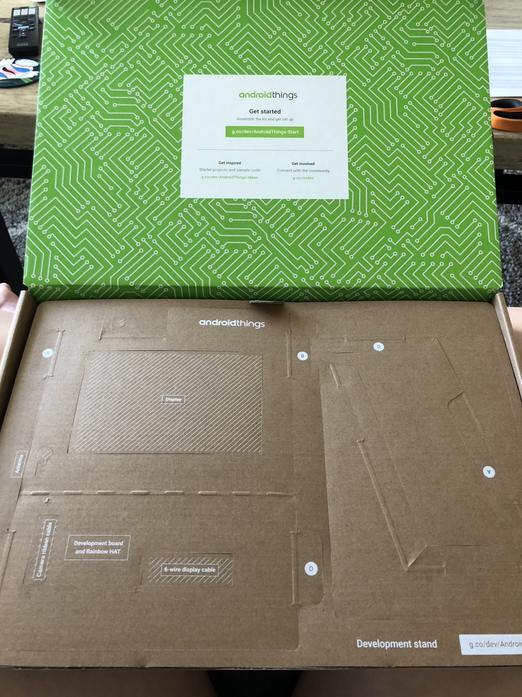
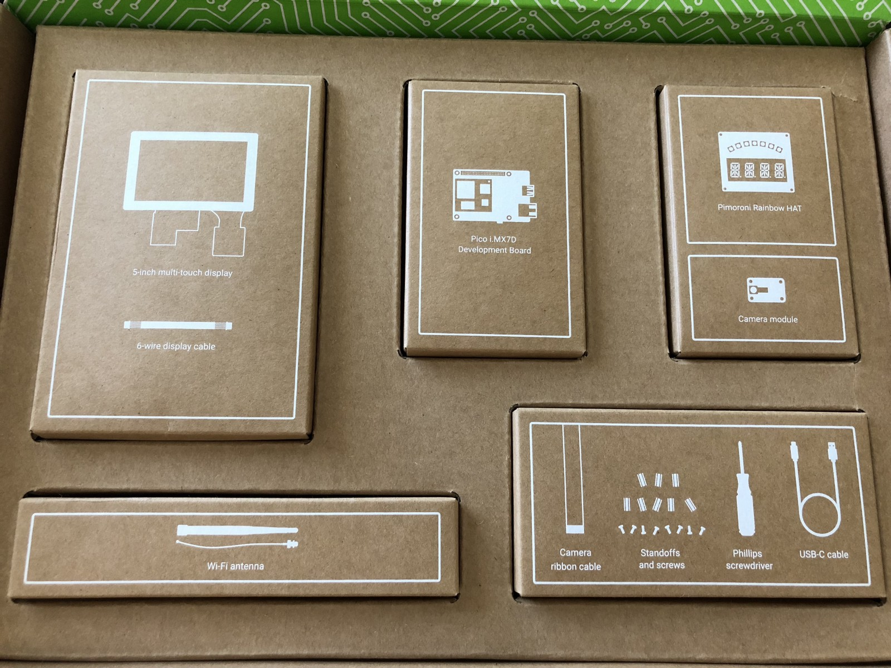
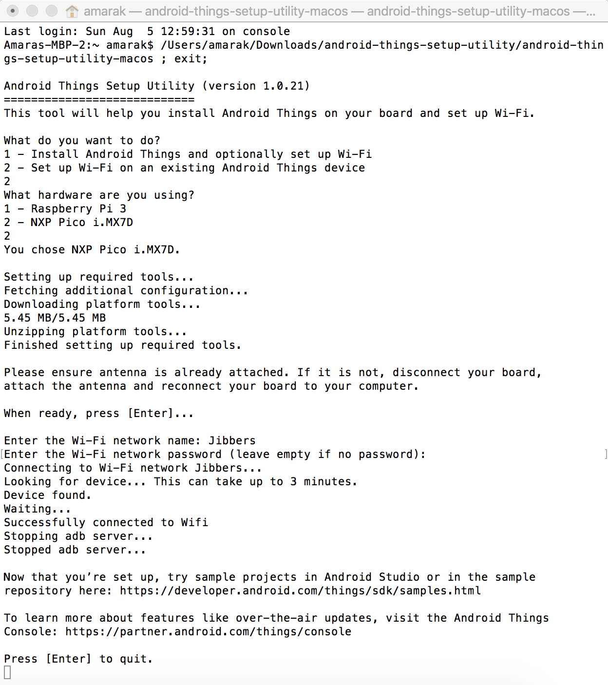
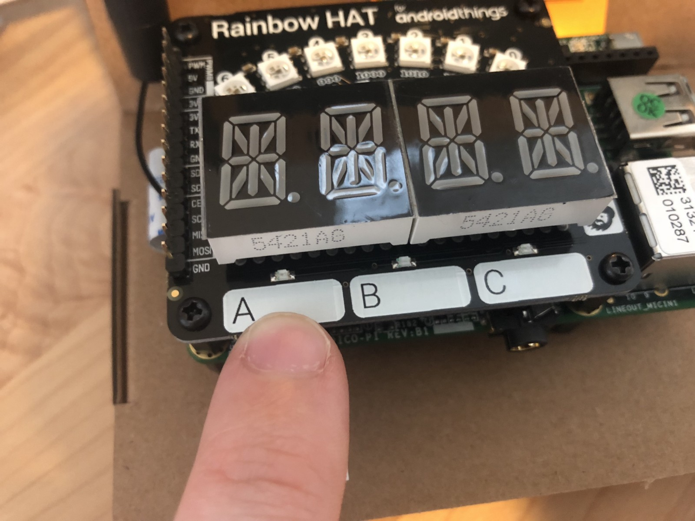

I received an [Android Things Starter kit](https://androidthings.withgoogle.com/#!/kits/starter-kit) from a Women Techmakers event for International Women’s Day at Google earlier this year and shortly after that moved across the country. I finally found some time to open the box and play around with it.

Almost immediately I’m told to download the Android Things Toolkit, available in the Google Play Store. But I’m on a Mac and I have an iPhone.

Now I know what you are thinking, Android and MacOS don’t always play nice together, and you are right! But they can, they just need a few extra steps. **If you have done nothing Android related on your Mac, you’ve come to the right place to get your Android Things Starter kit up and running.** Let’s go through them below.

#### Boot Up

One you get the [hardware setup](https://androidthings.withgoogle.com/#!/#connect-the-parts), plug in the USB cable to your Mac. Your Android Things should boot up almost immediately.

Thankfully I was greeted with a screen that showed my device was (mostly) current. The screen seemed to indicate I needed to pair the device, but I doing have anything Android. But the next step was greyed out to connect to wifi and all I could

#### Plug in to Router for Updates (optional)

Once I realized I couldn’t get my Wifi setup, I figured plugging an ethernet cable in directly wouldn’t hurt. I was able to get the device to update, but still couldn’t do anything else.

#### Android Things Console, Android Things Setup Utility

Navigate to the Android Things Console. You may have to agree to some developer user agreements, but once you get to the dashboard, find the Tools. Download the Android Things Setup Utility. Run it.

#### Wait…

Wait for things to update, run. May take a bit. Eventually you’ll progress to an overview page showing details of your device.

#### Prepare Your Mac to Run Samples

Let’s attempt to run the first sample, [Blink an LED](https://androidthings.withgoogle.com/#!/#blink-an-led).

1.  Download the project zip. Unzip. Remember where you put it.
2.  Download Android Studio. Install.
3.  Open sample project from java directory in Android Studio. If you just open it from the root, you will not be successful. Believe me, I tried.
4.  Let gradle build, fail, click link to add Android SDK. _Wonder why it wasn’t included in the horrendously long time it took Android Studio to install._
5.  Let gradle build, fail again, click link to add Build Tools. _Wonder why it wasn’t included in the horrendously long time it took Android Studio and Android SDK to install. Realize you were also downloading and installing a MacOS updates. Whoops._

#### Run App (sample-button)

Once the gradle build silently seems pleased with itself, go to Run > Run ‘app’. This is pretty fast now that you have mastered the art of waiting.

Here is the trickiest part. Identifying the button on your device. I’ll give you a hint, its marked with “A” and doesn’t look like a button.

Press the button that doesn’t look like “A” button. _GET IT?_

Your LED should go on when your finger is on the button, turn off when you let go. Or your finger just glows red because its in the way.

<Embed src="https://www.youtube.com/embed/gi4DcYp4dx8?feature=oembed" aspectRatio={undefined} caption="" />

#### Next Steps

I’ll probably run the demo with the camera next, and then play around with different models. I may do additional things with the Rainbow Hat since its got a spiffy set of features too.

What would you build? Do you have an Android Things Starter Kit? Some other IoT project in the works? Let me know below!
