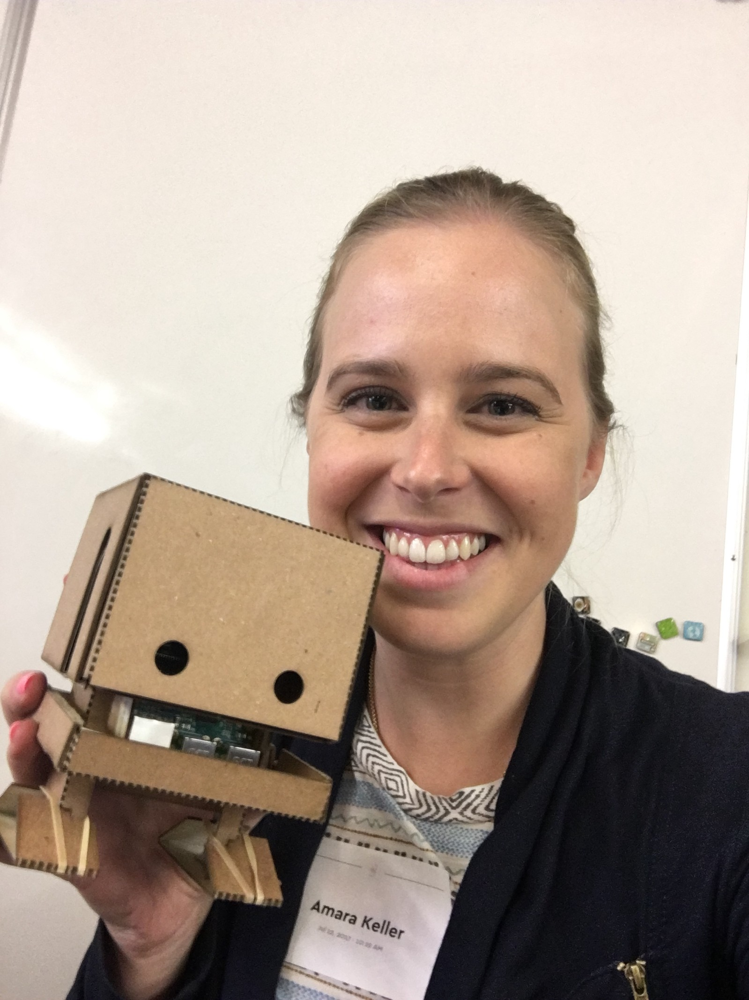
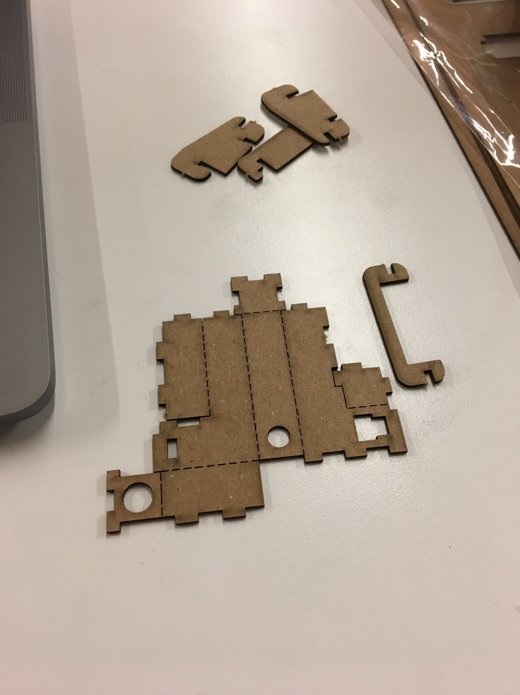

Hello, world! Today marks Day 9 of my employment with IBM as a developer advocate. I’m badge official, have a computer, and I know like five people by face **and** name. Excellent progress, I know! Now let’s get technical.

Last week, I had the opportunity to build a [TJBot](https://ibmtjbot.github.io/) from scratch with the [Girls Who Code](https://girlswhocode.com/) interns at IBM. I celebrated a couple of firsts!

#### This was my first experience building anything IoT.

I blame this partially on lack of opportunity and lack of trying. Shortly after my first experience with Node.js, I heard you could run it on devices like a Raspberry PI. This was particularly appealing because I was neck deep in everything JavaScript. But it was all for browser-based experiences.

TJBot was a great introduction to IoT because everything is so nicely packaged. I did not have to make a decision about hardware. Examples were everywhere and we got to play with ones that were already capable.

Another huge bonus was [Node-RED](https://nodered.org/), a visual coding environment, that already contained the TJBot services for a drag-and-drop experience.

#### This was not my first time working with a visual coding environment.

I was part of an REU (Research Experience of Undergraduates) at Trinity University in Multi-Agent Systems and attempted to build a visual coding environment based roughly on a [Scratch](https://scratch.mit.edu/)\-style implementation in Scala. I thought it was a bit silly anyone would opt to program with boxes and lines. Fast forward to building and maintaining enterprise apps. Visual coding + config = enterprise $$$.

<Embed src="https://www.youtube.com/embed/HTLesZEVJso?feature=oembed" aspectRatio={undefined} caption="High quality phone video of TJBot switching a light with NodeRed config" />

I don’t know how much experience the Girls Who Code had, but Node-RED offered visual cues that made things like loop structures pretty obvious. Dragging and dropping new functionality for testing was also great. We had a lot of “I don’t know exactly how this will work, but I think it will do ‘X’” conversations which are my favorite. One-click deploy was super fast, so this kind of experimenting made sense.

#### This was my first time interacting with Girls Who Code.

I’ve been a member, lead, and speaker with [Women Who Code](https://www.womenwhocode.com/), but I’ve never found an opportunity to work with Girls Who Code and to be quite honest I’m pretty jealous I didn’t have the experiences they are having when I was younger. They are getting immersive experiences as high schoolers. It probably would have prevented me from rolling my eyes so hard when my biology academic advisor in college suggested I take PAD1 (Principles of Algorithm Design 1). And it probably would have prevented me from being in that situation in the first place, because I clearly was fated to get a degree in computer science and not biology so I would have been assigned a different advisor to begin with. But I digress.

I was fortunate to be raised by chemists, so STEM was never “not for girls,” but other kids (and their parents!) constantly told me that I was smart or “too smart.” Had an organization like Girls Who Code been available for me, I probably would have made faster decisions about my education and focus. I desperately wanted to find other girls who thought computers were cool, and that didn’t happen until closer to college graduation.

The closest thing I had was my mom encouraging me to apply to an engineering camp for girls, but it was too vague and required me to come up with a design idea to “solve a real-world problem.” I came up with a dishwasher drain catch so I didn’t have to scrape or rinse the dishes and I knew the idea was lame, but I really wanted to go to theater camp instead. Now, had the engineering camp clearly involved computers or video games, I probably would have tried a little harder. Sorry, Mom!

#### What’s next?

I plan on playing around more with TJBot, particularly with the speech-to-text analyzer. Ideally, I want a personal assistant to help me when I cook — keeping track of my progress in the recipe and even prompting me to add something to my grocery list. A huge bonus would be detecting an additional person and offering them tasks concurrently. When a guest says, “how can I help,” it would be great to have the TJBot respond with something to do while I stay on track.

While TJBot is super cute, its a great example for kids **and** adults to see how Watson Services run on a small, physical something. From the developer’s perspective, the barrier to entry is fairly low and it’s also easy to see the services working together via Node-RED.

What was your first IoT project? Have you worked with TJBot or Watson Services? I’m definitely interested in your experiences. Or maybe there has been something stopping you (like my lack of experience with IoT scared me away from anything IoT related, too intimidating). Let me know!
