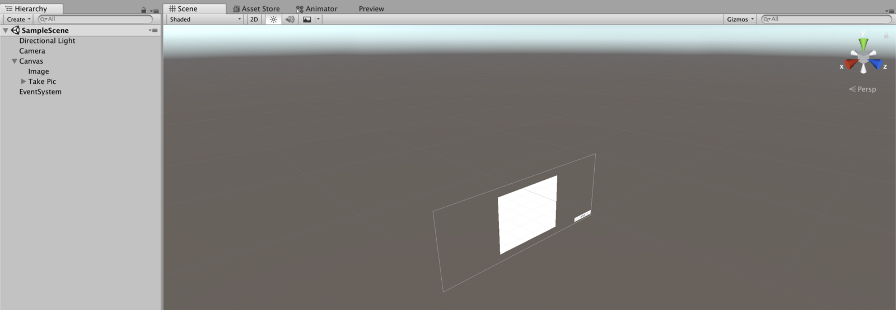
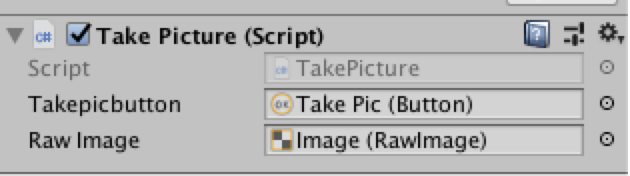
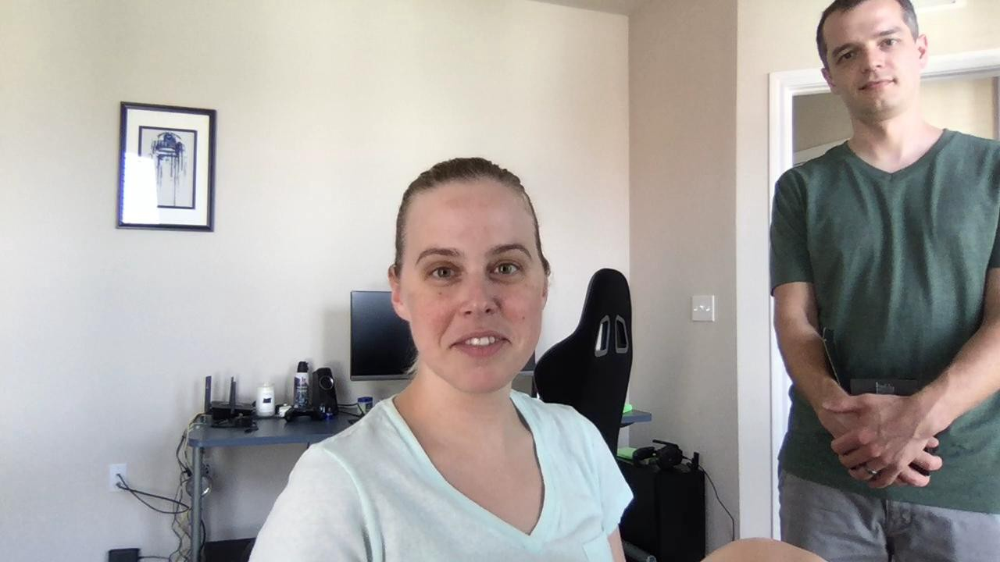

## Featured guest, Kubernetes!

Ever sat down at your computer and thought “I’d really like to use deep learning to solve this problem but I don’t have the {insert something here} to do it”. Maybe its the huge data set or the deep learning skills or the time and compute to train a model. It could even be all of the above!

Enter [Model Asset Exchange](https://developer.ibm.com/code/exchanges/models/) (MAX), a collection of free and open source deep learning models. This means they are ready to go with an API call or two. Let me walk you through it.

#### The Setup

I chose the [image caption generator](https://github.com/IBM/MAX-Image-Caption-Generator) because I thought this would be the easiest model to get started with, particularly in Unity. I could pull in a stream, pause it to grab a snapshot, and send it to the service. Let’s make this a little easier to test and instead of a stream, take a picture from my webcam.

#### Spin Up the Service (MAX + Kubernetes)

At the time of writing this blog, MAX is still fairly new. So I found a few existing examples from the team.

[**Using a model from the Model Asset eXchange (MAX) in a web application**  
_Use an open source image caption generator deep learning model to filter images based on their content in a web…_developer.ibm.com](https://developer.ibm.com/code/2018/07/12/using-a-model-from-the-model-asset-exchange-max-in-a-web-application/ "https://developer.ibm.com/code/2018/07/12/using-a-model-from-the-model-asset-exchange-max-in-a-web-application/")

[**Create a web app to interact with machine learning generated image captions**  
_Use an open source image caption generator deep learning model to filter images based on their content in a web…_developer.ibm.com](https://developer.ibm.com/code/patterns/create-web-app-interact-machine-learning-generated-image-captions/ "https://developer.ibm.com/code/patterns/create-web-app-interact-machine-learning-generated-image-captions/")

[**IBM/MAX-Image-Caption-Generator-Web-App**  
_MAX-Image-Caption-Generator-Web-App - Create a web app to interact with machine learning generated image captions_github.com](https://github.com/IBM/MAX-Image-Caption-Generator-Web-App "https://github.com/IBM/MAX-Image-Caption-Generator-Web-App")

After deploying the web app and playing around with it, I wanted to sub out the web app for Unity. I used the [steps to deploy to Kubernetes](https://github.com/IBM/MAX-Image-Caption-Generator-Web-App#deploy-on-kubernetes) (my first Kubernetes cluster I’ve ever deployed!). It did take a little time as the repo suggested, but it was a matter of minutes not hours or anything. The IBM Cloud UI did a pretty good job of telling me where I was at in the process too so I knew it was still chugging along rather than getting hung up somewhere.

#### Consume MAX in Unity

Once you deploy the model to Kubernetes, you call it like any other web service. But we need to setup the scene first.

I created this project as a 3D project somewhat on accident. In hindsight, once I realized what I wanted to do its more like a 2D use case but I got lazy and here we are. I added a canvas with an image and a button so I could see the stream (web cam) and click a button to take the picture (which would also be seen on the canvas).

In my script component, I made sure to associate the button and the image so I could use it in my script.

<Embed src="https://gist.github.com/akeller/b865717cd5163679503653ced99c4554.js" aspectRatio={0.357} caption="" />

I could clean this code up a little more to remove the counter (not really being used at this point) and saving the picture. I saved the picture for testing after having some issue with the size of the texture and the size of the image not being the same and distorting the image. Could easily remote that too.

I’m also only printing the return response instead of putting it on the UI, but you get the idea.

#### Testing, testing… 1,2,3

It works, but the output hasn’t been super great so far. Its understandable that I might not get super accurate results because I can’t imagine they trained the model with a bunch of images of a person sitting in their home office. Also remember, its not my job as the consumer of the model to train up the accuracy. At least not today.

So here’s some of the results I got on my first two tries.

> {“status”: “ok”, “predictions”: \[{“index”: “0”, “caption”: “a man in a black shirt is holding a cell phone .”, “probability”: 1.0133837741339382e-05}, {“index”: “1”, “caption”: “a man in a black shirt is holding a cellphone”, “probability”: 9.919402704432485e-06}, {“index”: “2”, “caption”: “a man in a black shirt is holding a cell phone”, “probability”: 4.715694963630836e-06}\]}

> {“status”: “ok”, “predictions”: \[{“index”: “0”, “caption”: “a man holding a nintendo wii game controller .”, “probability”: 0.010582988338636736}, {“index”: “1”, “caption”: “a man and a woman playing a video game .”, “probability”: 0.0014023520340278061}, {“index”: “2”, “caption”: “a man and a woman playing a video game”, “probability”: 0.0006979840878526617}\]}

---

Is this where I get on my soapbox and talk about how AI is still an evolving field and models are only as perfect as the data you use to train and test them? And that one-size fits all models are still in need of some serious work? Probably. But they are certainly better than nothing and if that’s what you are looking for, then it works great! 👍

---

For next steps, I’ll deploy this to my phone and see if I can take better pictures in the real world and yield better captioned results. Stay tuned!

<Embed src="https://upscri.be/7b0181?as_embed=true" aspectRatio={undefined} caption="**Connect with the Raven team on** [**Telegram**](https://t.me/ravenprotocol)" />
