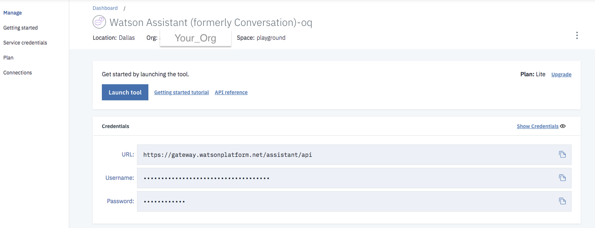
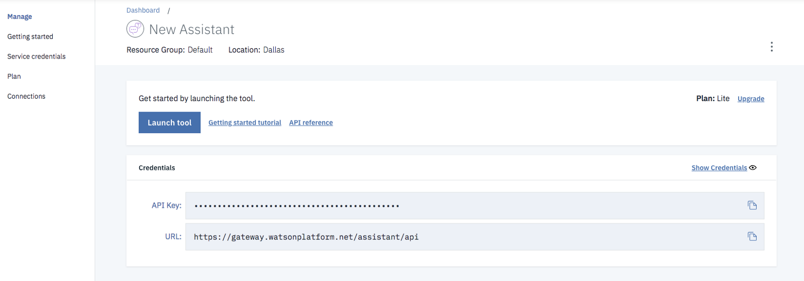
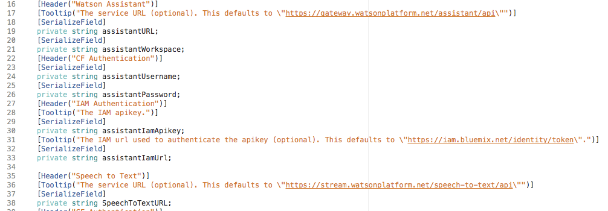
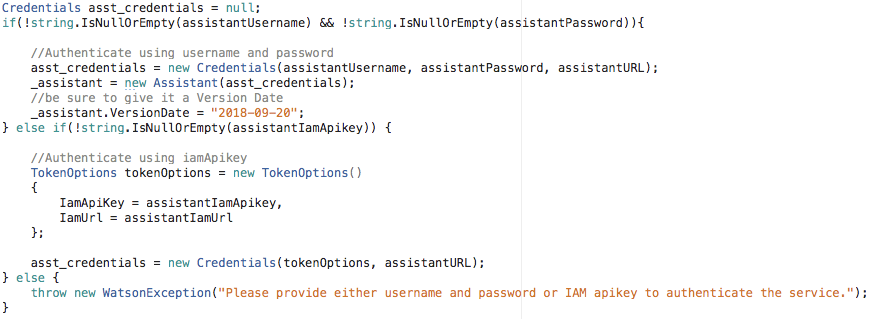

Hi there developer friend!

I want to start by apologizing for not getting this post out earlier. I know there has been a ton of confusion in this space and I’m incredibly sorry for that. I feel some responsibility as a developer advocate who makes code snippets available through blogs, articles, code patterns, gists, and repos. **I am sorry.**

A little context — the teams behind the Watson Services have been slowly converting each service from username/password based auth to API key (IAM token) based auth. Not only are they going service by service, they were also going region by region.

Just like you, I’ve created a new service only to be surprised to see a new set of credentials on the manage page. And then I get frustrated that the code I’m referencing is out of date or stale because it uses credentials I don’t seem to have. Then I get confused when a user asks for help and references the older style of credentials. **What is going on?!?1?**

#### The Good News

The good news is we are actively updating all the code on [IBM Developer](https://developer.ibm.com/) as fast as we can `git commit` and `git push`to handle both sets of credentials. The better news is we are working to make sure the SDKs and sample code do as well. Most of the work I’ve been doing has been with Unity and the Watson SDK for Unity, so checkout this recently published [pattern](https://developer.ibm.com/patterns/build-an-ai-powered-ar-character-in-unity-with-arkit/).

When you open up the pattern in Unity after cloning or downloading the repo it should look like this (when the DefaultAvatar is selected):

> You’ll see a set of credentials for either username/password auth or API key auth. **Use the set you have, just one!**

You may encounter a situation where you have a username and password for only one service, but the rest are API keys. All the services I’ve been using recently are old so I have only username/password credentials available to me.

Dig into the WatsonLogic code and you’ll see I check for the values and try to prompt you with tooltips. Keep scrolling for a gist for C&P!

#### The Bad News

Which isn’t really bad news. You may have to update your code if you create a new service. You may also encounter stale looking code if you are working with a new service. Let me know! If my team owns it, I’ll try to get it fixed. Or you can submit a PR! 😄

Here’s some code to C&P if you are working in Unity with Assistant. Sub in Speech to Text or Text to Speech and most of the code is applicable.

<Embed src="https://gist.github.com/akeller/2d7b8913308401495afed257a74a7f28.js" aspectRatio={0.357} caption="" />

For more information on Authentication, please see the docs (you maybe need to login to your IBM Cloud account to see these pages):

-   [Watson Assistant](https://cloud.ibm.com/apidocs/assistant#authentication)
-   [Speech to Text](https://cloud.ibm.com/apidocs/speech-to-text#authentication)
-   [Text to Speech](https://cloud.ibm.com/apidocs/text-to-speech#authentication)
-   Anything else (Watson Services are under AI): [https://cloud.ibm.com/apidocs](https://cloud.ibm.com/apidocs)

Again, if you see stale code out there, please submit a PR or comment below with the link. If my team owns it, I’ll make sure we get it on the list to update!
