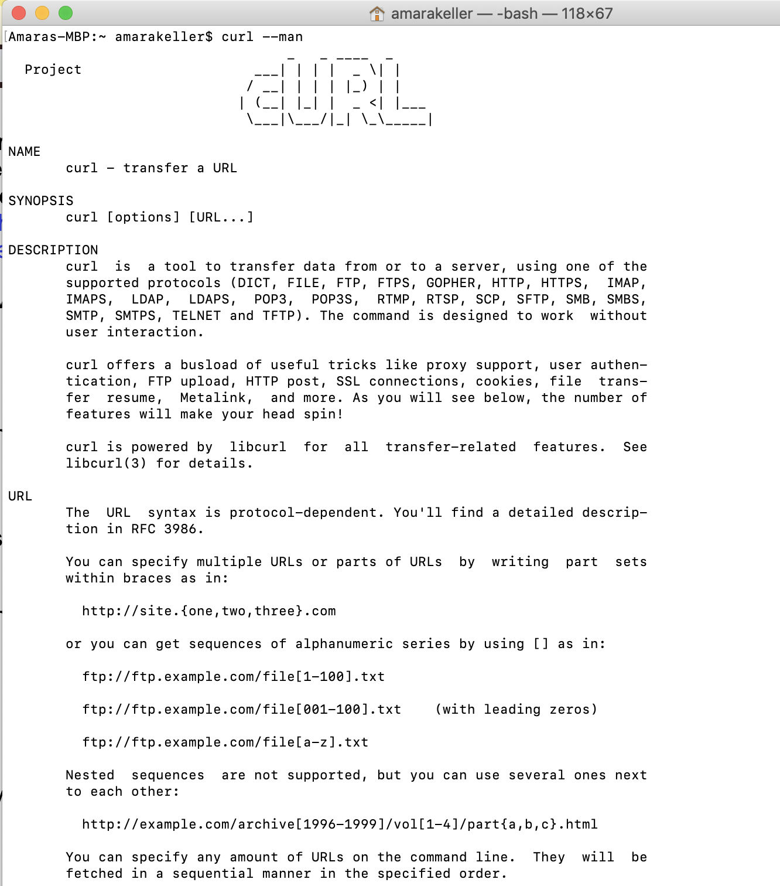
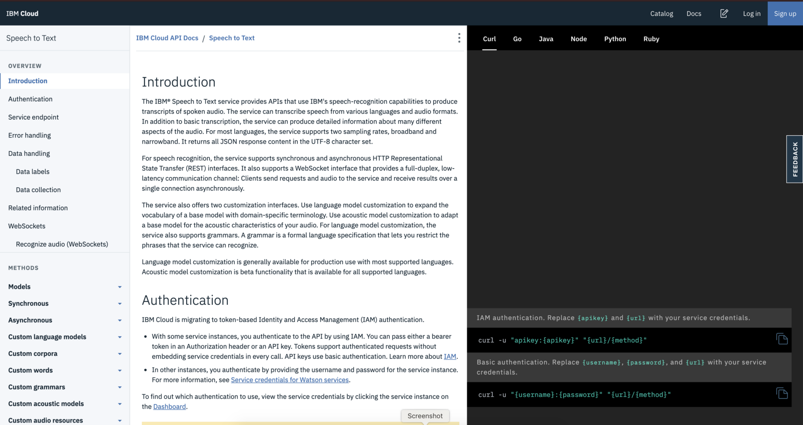
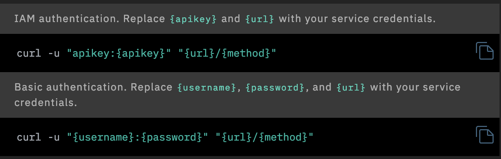
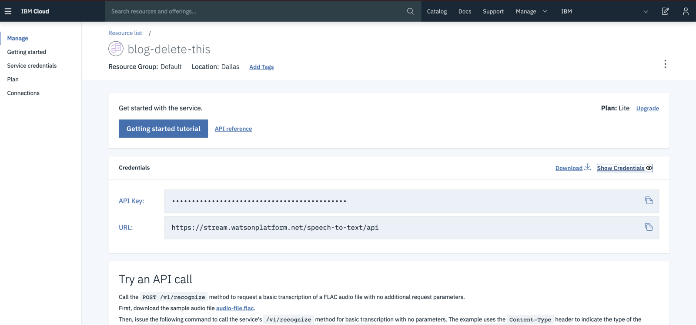
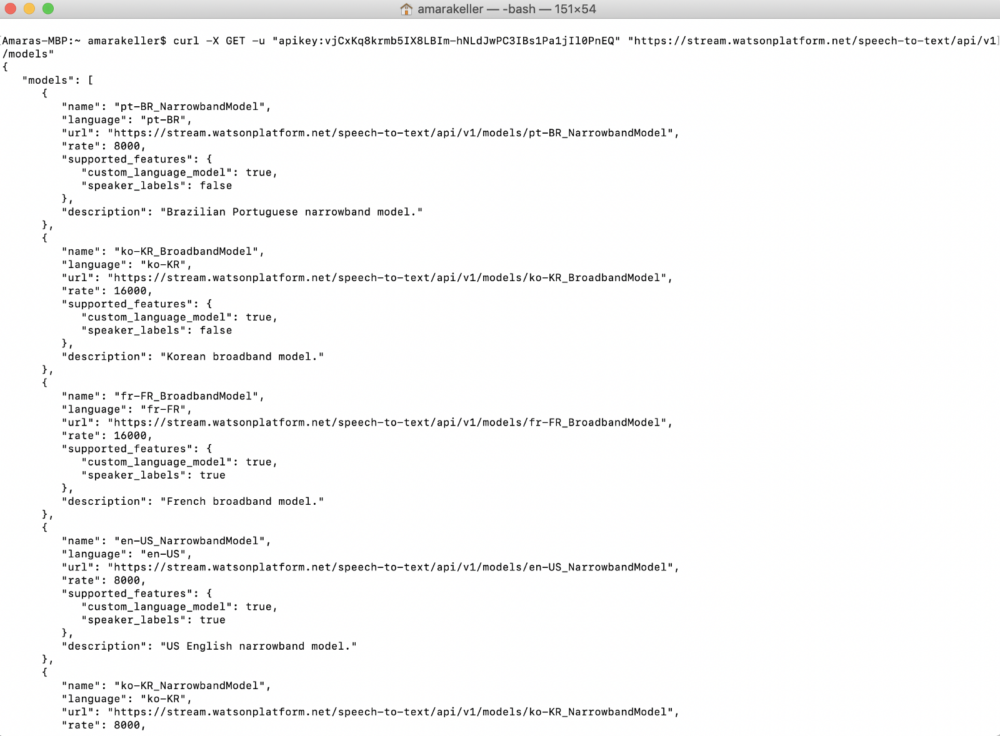

 on [Unsplash](https://unsplash.com/search/photos/web-development?utm_source=unsplash&utm_medium=referral&utm_content=creditCopyText)](./asset-1.jpeg)

I don’t know what your corner of the internet looks like, but mine looks something like this:

> “I just want to use Python, why does the docs tell me to use curl.”

> “Am I supposed to do something in curl? I’ve never used it before.”

> “Where do I use curl?”

> “Can someone tell me exactly how to use curl for node project?”

Now its been a while since I took computer science classes, but even then I’m not sure I was explicitly taught what cURL was or how to use it. So let’s do that now.

#### What is cURL?

[cURL](https://curl.haxx.se/), which stands for client URL and can be written as curl (which I’ll do for the remainder of the blog because I’m lazy), is a command line tool for file transfer with a URL syntax. It supports a number of protocols including HTTP, HTTPS, FTP, and many more. HTTP/HTTPS makes it a great candidate for interacting with APIs!

curl can be used on just about any platform on any hardware that exists today. This means, regardless of what you are running and where, the most basic curl commands should just work. None of the usual “it doesn’t work on my machine”.

#### Where do I use cURL?

You use curl in a terminal or command prompt, but you need to make sure your system already has it installed.

If you are running **OS X** that isn’t 10 years old, you probably have curl already installed. You can pull up the “man pages” or manual by doing `curl --man`in a terminal.

If you’d rather read the docs in a browser, you have that [option](https://curl.haxx.se/docs/manpage.html) as well.

Running **Windows**? Depending on what version you are running or what you may have downloaded (like Git for Windows and other dev tools) you may already have curl. Take a look at [this post](https://stackoverflow.com/questions/9507353/how-do-i-install-and-use-curl-on-windows) for more info.

Running in a command prompt you can also do the man page sanity check,`curl --man`.

If you are running **Linux**, I have a feeling you know what curl is and you probably already have it installed. 😄

#### How do I use cURL?

Now that we know you have curl installed, you are probably wondering how you actually use it.

Let’s reference how you probably got here in the first place, someone’s API docs. I’ll use [Watson Speech-to-Text](https://cloud.ibm.com/apidocs/speech-to-text) on IBM Cloud just because I’ve spent a lot of time there recently, and since we are all friends here, they pay me a nice salary.

Some docs include snippets in a variety of programming languages, and this one is no different, but the first one is curl which is probably intimidating as its not a programming language and certainly doesn’t look like one.

This first set of curl commands you see is just an example of what the rest will look like, a formula for creating them. So if this doesn’t make any sense to you, keep scrolling.

I always try to find a very simple “GET” that requires a minimal amount of information (ie, no parameters) just so I can see if the endpoint is working and I get a status code back that doesn’t indicate that I’m doing something terrible wrong. It’s like a confidence building activity with a new API. Depending on the auth requirements for an API, I might even try to pull this off in a browser since that is just a GET anyway.

Looking at the methods in Speech-to-Text I find “List models”, which requires no parameters and even if I have no models should still respond with the basic “out of the box” models or nothing, who knows. Excellent, let’s work with that one.

In the docs I see an example of what a response should look like.

Navigating to my Speech to Text service, I need my api key (or username/password if I was running an old service) which I can grab from the Manage page. I’ll copy the API key.

In my terminal I’ll need to build something that looks like the example request:

`curl -X GET -u “apikey:{apikey}” “[https://stream.watsonplatform.net/speech-to-text/api/v1/models](https://stream.watsonplatform.net/speech-to-text/api/v1/models)"`

Don’t get excited, this API key and entire service has already been deleted.

`curl -X GET -u “apikey:vjCxKq8krmb5IX8LBIm-hNLdJwPC3IBs1Pa1jIl0PnEQ” “https://stream.watsonplatform.net/speech-to-text/api/v1/models"`

Looks like I get some information on the basic models for each language. Neat! It’s not empty and its successful!

Pay really close attention here, your API key is just a string value. DO NOT LEAVE THE BRACKETS IN. If you do, you’ll get an “unauthorized” and be very sad/confused.

The response is correct in that you are unauthorized because your API key probably doesn’t include a bracket on the front and the back.

#### Why would I use cURL and not Postman? ARC? Or insert favorite client?

No one is telling you what you can and cannot use, but as referenced above, curl is fairly standard in its functionality and available across tons of platforms. There is no UI to get lost in for basic commands with authentication and you can see exactly what’s going on. But if you find a UI more comforting and familiar, by all means go for it.

To be honest, you don’t even have to use curl. It’s just there as an option. Just like the snippets in Go, Python, Java, etc.

Once you are comfortable working with the API, you can start writing the actual code that consumes the API, which for all I know might be some other language entirely.

Whatever you do, let me know when you are building! Do you use curl? Do you have a favorite API? Do you have a method for learning a new API? Share your tips and tricks below.
