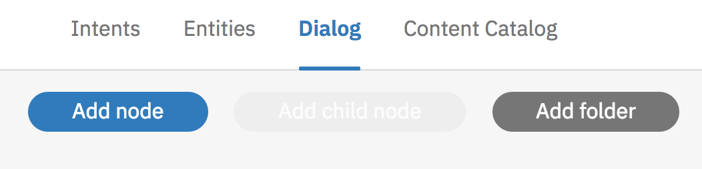

 on [Unsplash](https://unsplash.com/search/photos/bot?utm_source=unsplash&utm_medium=referral&utm_content=creditCopyText)](./asset-1.)

Y’all, we made it through the [chatbot series](https://medium.com/@MissAmaraKay/a-chatbot-on-every-platform-fe09ebd8e95e). And while parts were a struggle, I’d like to do a super brief recap of what stuck out in my mind without dwelling on the bad.

-   In Dialogflow, you create an agent with intents and everything is tied to an intent, effectively making your intents into you dialog.
-   Use the Microsoft Azure Bot Framework with the Bot Builder SDK and LUIS to create a chatbot with NLU. Don’t need NLU? Don’t use LUIS!
-   Amazon Lex is a voice first enabled bot experience, so when developing you are asked to enable your mic early on.
-   Everything is an entity in Wit.ai. Everything!
-   Watson Assistant gives you a step-by-step backend building experience within the UI.

### More on Watson Assistant

Let’s spend a little more time reviewing some of the things I noticed that are different from Watson Assistant and its previous incarnation, Watson Conversation.

#### Content Catalog

A new tab appeared next to our old friends Intents, Entities, and Dialog — Content Catalog. This came from Watson Virtual Assistant, or the more proprietary/enterprisey version that was more of a domain-specific config-style service. As you can see, each of those categories can be considered a different domain, with a number of intents already there for you. This, coupled with the [Bot Asset Exchange](https://developer.ibm.com/code/exchanges/bots/), makes it really easy to get up and running.

#### Folders

While building out your dialog, you now have the option to group nodes into folders.

I don’t have an example of folders yet, but you can read more about them here: [https://console.bluemix.net/docs/services/conversation/dialog-build.html#folders](https://console.bluemix.net/docs/services/conversation/dialog-build.html#folders)

### Changes to the IBM Watson SDK for Unity

More specifically, if you are using the IBM Watson SDK for Unity there were some changes to the SDK that impacted my existing code so I couldn’t just change the name from “conversation” to “assistant” and expect everything to work. I haven’t played around with the other SDKs recently, but it may be worth a quick look if you are migrating code over to Assistant.

Keep in mind, this SDK sees changes as fast as once a week. Be sure to star the [GitHub repo](https://github.com/watson-developer-cloud/unity-sdk) directly, even if you got the SDK from the Unity Asset Store.

#### Assistant message abstraction no longer takes simple string inputs; message needs to be put in an object.

<Embed src="https://gist.github.com/akeller/a7f5b41720bab384e7951dadee417e3e.js" aspectRatio={0.357} caption="" />

#### MessageResponse parses into dictionaries.

You don’t have to do it this way, but if you look for the SDK examples and snippets for help, this is what you are going to see. (Scroll to the OnMessage function.)

[**watson-developer-cloud/unity-sdk**  
_unity-sdk - :video\_game: Unity SDK to use the IBM Watson services._github.com](https://github.com/watson-developer-cloud/unity-sdk/blob/develop/Examples/ServiceExamples/Scripts/ExampleAssistant.cs "https://github.com/watson-developer-cloud/unity-sdk/blob/develop/Examples/ServiceExamples/Scripts/ExampleAssistant.cs")

I think this implementation is possibly a little cleaner if you are going to be saving the context.

### Last Thoughts

I hope you enjoyed this little series on chatbots. I think I have a way better understanding of the landscape across all the platforms and frameworks. I may have even learned a few things along the way!

If nothing else, I think when you make a choice where to build you chatbot you are going to factor in language support and where it gets deployed (maybe how its deployed, or how much it costs to get deployed).

While I do think you can learn one platform or framework and pick up the next fairly quickly, I highly recommend reading the documentation. I didn’t expect the UIs to be so unintuitive and I definitely didn’t expect to experience challenges just finding the competing product pieces on each cloud.

Thanks for reading! Give it a 👏 if you enjoyed it. That’s a wrap for now! 🎬
