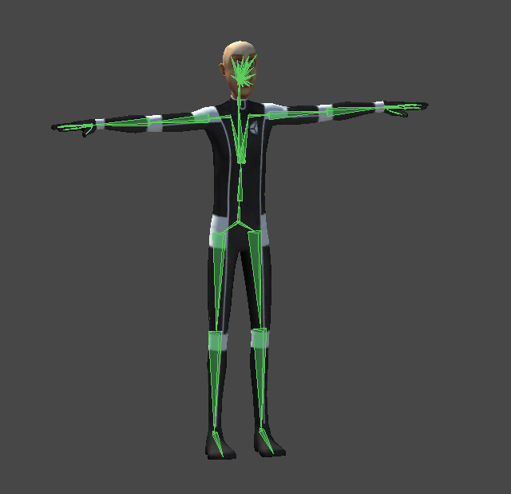
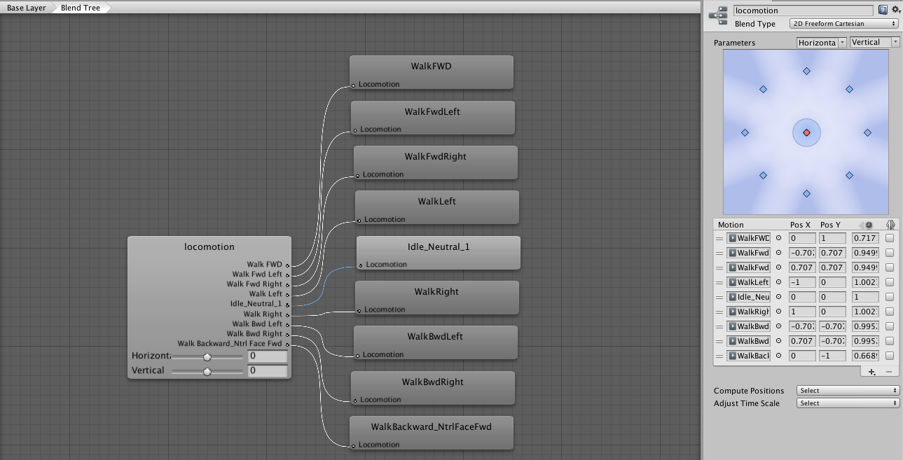
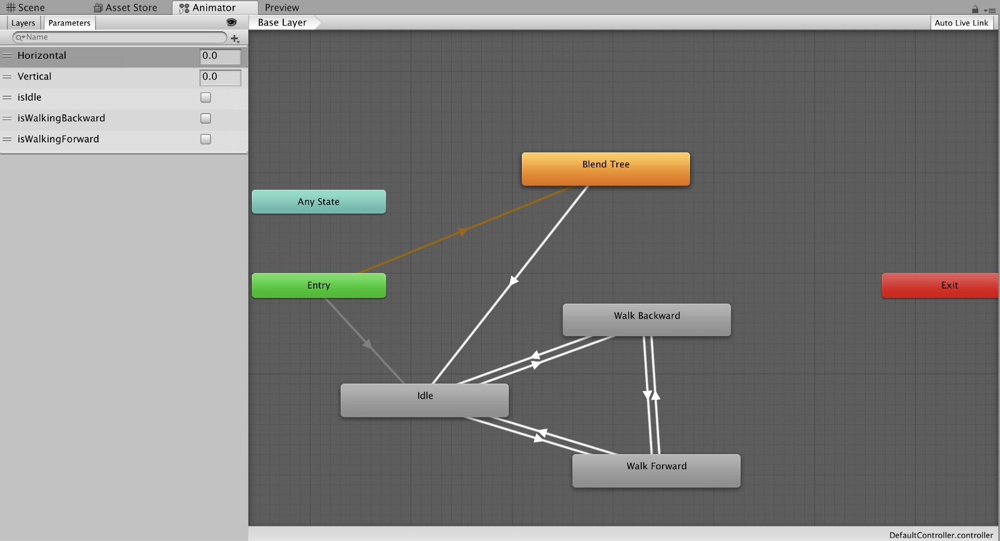
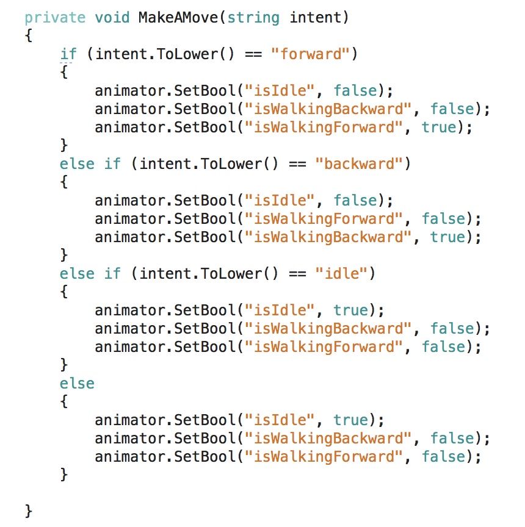

## And stumbling all along the way.

I made an AR AI app late last year, maybe you even read the post or attend a talk or meetup I did earlier this year about how to build it. My colleague in Germany [Niklas Heidloff](https://medium.com/@nheidloff) recently used it to ramp into the wonderful world of Unity. Which got me thinking, I should probably refresh it and get it working with my new skills (like working with the animator!) and new version of the IBM Watson SDK for Unity.

> Goal — Revamp old project/tutorial.

And then I gave up trying to fight the existing project’s errors and package issues and just started from scratch. Feel free to follow along.

> New Goal — Get something working in animation. Eventually turn it into tutorial.

In no way is this a tutorial at this point, but I did want to put something together to show what I’ve been working on to update my previous tutorial. You can go ahead and file the under light rambling.

#### Import From Asset Store

Previously, you had to drag and drop the SDK from GitHub, but earlier this year the IBM Watson SDK for Unity made its way into the asset store. This means you can stay within the Unity Editor to add Watson to your project. Just search for “Watson”.

Additionally, with the latest version, you get a pop up to immediately get bounced out to the IBM Cloud site to create an account and start creating services. This is particularly helpful when a lot of the feedback I’ve see was around making the examples work. You need those service credentials!

I already have existing services for Watson Speech-to-Text, Text-to-Speech, and Assistant (previously Conversation) so I clicked out of the pop up. The Watson item in the upper menu bar also has a link to sign up for IBM Cloud in case you need to do that.

#### Spinning Up Watson Assistant

A few changes were made to how Watson Assistant works in the SDK.

Typically, I would initiate the service with a simple string of “hello”. But now the SDK wants an entire object, which makes sense for pretty much all of my subsequent calls. It would also make sense if you were passing in a context object initially, which I am not.

<Embed src="https://gist.github.com/akeller/a7f5b41720bab384e7951dadee417e3e.js" aspectRatio={0.357} caption="" />

Parsing the messageResponse from Assistant was a little different too, at least in the examples within the [SDK](https://github.com/watson-developer-cloud/unity-sdk/blob/develop/Examples/ServiceExamples/Scripts/ExampleAssistant.cs).

#### Vuforia

Of course Vuforia proved to be its own beast. It was so easy to work with for my previous tutorial! This time it wasn’t compatible with iOS 11 so it would just render a black screen which is not ideal for doing much of anything. Additionally, I wanted to incorporate [ground plane detection](https://library.vuforia.com/articles/Solution/ground-plane-guide.html) and that just straight up doesn’t work through my computer’s FaceTime camera.

After digging through some forums and GitHub issues I was able to find a way to download the latest Vuforia version with an update to fix this issue. Sounds like it should be patched with the next version of Unity since Vuforia is available directly in Unity now.

Right now every time I tap the screen it renders an additional character on the screen so that’s probably not ideal when my Watson script is attached to each one.

#### Making the Avatar Move

Is not always as easy as it sounds and quite frankly I need to put in a little more work here.

I needed to find a properly rigged avatar in a T-pose, which I didn’t even know was a thing before I started, and even though I thought I would be able to get the Cyber Soldier working, my efforts were futile. Bummer.

This was a great opportunity to learn about all the things that go into animation, modeling, and rigging and an even greater opportunity to understand why some companies devote entire teams to exactly that.

Using the Raw Mopac Data asset provided by Unity, I was able to play around a bit with an avatar that was correctly rigged. This was important not only because it was going to work correctly, but it was also going to teach me all the new jargon around animators and animation. Like literally anything else I’ve been working with the biggest hurdle to overcome seems to be learning the jargon.

#### Blend Trees

I followed a [Unity tutorial](https://unity3d.com/learn/tutorials/modules/intermediate/live-training-archive/character-animation-setup?playlist=17099) to build a blend tree, which works really great for moving the avatar with the arrow keys. By taking the Raw Mocap Data, I was able to create clips I wanted for each of the actions from the, often, much longer mocap recordings. I tweaked the offsets to make sure everything looked a little better and smoother. But I couldn’t figure out how to make the avatar move programmatically.

#### States

In another project, I was able to fumble through triggering movement with states and transitions of a fully rigged avatar. I decided to do something similar, so I created 3 states to see what I could do.

By adding parameters to each of the transition arrows between Idle, Walk Backward, and Walk Forward I was able to create a sketchy looking avatar hobbling across my screen by triggering the boolean parameters in a script. It’s not beautifully implemented or designed, but he’s MOVING!

The video below is shaky because I’m trying with my entire being not to laugh at myself and the mess I made. I’m also holding a phone in each hand, recording with one and AR-ing with the other so I’m not about to apologize for capturing video in vertical.

<Embed src="https://www.youtube.com/embed/AJJOz00QCGg?feature=oembed" aspectRatio={undefined} caption="A short demo using Watson Speech-to-Text, Text-to-Speech, and Assistant with Vuforia Ground Plane detection." />

#### Next?

I mean honestly I want to clean it up and turn it into a tutorial. I wanted to add some arm animation but its not available in the Raw Mocap Data from Unity so maybe I’ll look for another free asset to play with. I need to invest some more time in the animation space in general, but honestly I’m more interested in the scripting side of things so I’ll continue to play around with how I can call things from the animator programmatically. My transitions look like trash compared to the blend tree so I’m adding [this](https://docs.unity3d.com/Manual/class-Transition.html) to my reading list.
